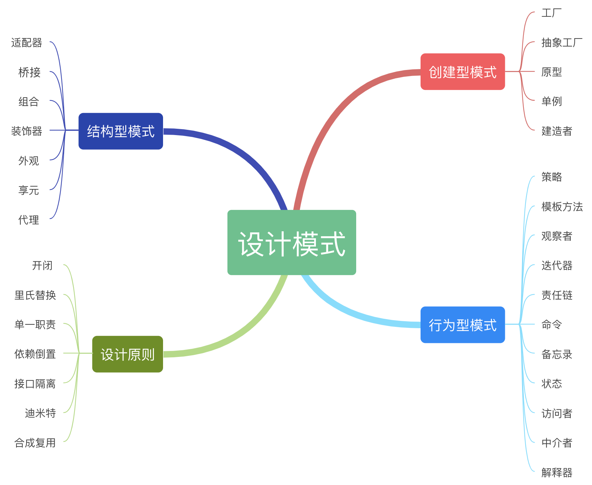

# Design Pattern 23种经典设计模式源码详解

23种经典设计模式，结合实际场景，源码详解，充分注释说明，每一行代码都经过检验，确保可靠。

用不同语言来实现，包括Java/JS/Python/TypeScript/Go等。
    
Including 23 source code examples of classic design patterns, which are fully annotated in combination with actual scenarios. Every line of code has been verified to ensure reliability.

Implemented in different languages, including Java/JS/Python/TypeScript/Go, etc.

## 设计模式结构图

## 源码例子

### 创建型
- **[工厂模式（Factory Pattern） ](./factory-pattern)**，由工厂类提供统一的创建对象的方法。
[Java](./factory-pattern/java) | [JavaScript](./factory-pattern/js) | [Python](./factory-pattern/python) | [TypeScript](./factory-pattern/ts)  | [Go](./factory-pattern/go)

- **[抽象工厂模式（Abstract Factory Pattern） ](./abstract-factory)**，是一个超级工厂，用来创建其他工厂方法。
[Java](./abstract-factory/java) | [JavaScript](./abstract-factory/js) | [Python](./abstract-factory) | [TypeScript](./abstract-factory/ts)  | [Go](./abstract-factory/go)

- **[原型模式（Prototype Pattern） ](./prototype-pattern)**，利用clone()复制已有对象的实例。
[Java](./prototype-pattern/java) | [JavaScript](./prototype-pattern/js) | [Python](./prototype-pattern/python) | [TypeScript](./prototype-pattern/ts)  | [Go](./prototype-pattern/go)

- **[建造者模式（Builder Pattern） ](./builder-pattern)**，利用多个简单对象逐步构建一个复杂对象，类似建造房子。
[Java](./builder-pattern/java) | [JavaScript](./builder-pattern/js) | [Python](./builder-pattern/python) | [TypeScript](./builder-pattern/ts)  | [Go](./builder-pattern/go)

- **[单例模式（Singleton Pattern） ](./singleton-pattern)**，保证创建的类只有一个实例，并提供一个访问该实例的全局节点。
[Java](./singleton-pattern/java) | [JavaScript](./singleton-pattern/js) | [Python](./singleton-pattern/python) | [TypeScript](./singleton-pattern/ts)  | [Go](./singleton-pattern/go)

### 结构型
- **[适配器模式（Adapter Pattern） ](./adapter-pattern)**，为两个不兼容的接口提供专门兼容方案。
[Java](./adapter-pattern/java) | [JavaScript](./adapter-pattern/js) | [Python](./adapter-pattern/python) | [TypeScript](./adapter-pattern/ts)  | [Go](./adapter-pattern/go)

- **[桥接模式（Bridge Pattern） ](./bridge-pattern)**，将类拆分为抽象和实现两个独立的层次结构进行解耦。
[Java](./bridge-pattern/java) | [JavaScript](./bridge-pattern/js) | [Python](./bridge-pattern/python) | [TypeScript](./bridge-pattern/ts)  | [Go](./bridge-pattern/go)

- **[组合模式（Composite Pattern） ](./composite-pattern)**，依据树形结构来组合对象，用不同组件来构建某个部分或整体对象。
[Java](./composite-pattern/java) | [JavaScript](./composite-pattern/js) | [Python](./composite-pattern/python) | [TypeScript](./composite-pattern/ts)  | [Go](./composite-pattern/go)

- **[装饰器模式（Decorator Pattern） ](./decorator-pattern)**，将对象放入到一个特殊封装的对象中，赋予其新的能力。
[Java](./decorator-pattern/java) | [JavaScript](./decorator-pattern/js) | [Python](./decorator-pattern/python) | [TypeScript](./decorator-pattern/ts)  | [Go](./decorator-pattern/go)

- **[外观模式（Facade Pattern） ](./facade-pattern)**，给现有的系统添加一个高层接口，隐藏子系统的复杂性。
[Java](./facade-pattern/java) | [JavaScript](./facade-pattern/js) | [Python](./facade-pattern/python) | [TypeScript](./facade-pattern/ts)  | [Go](./facade-pattern/go)

- **[享元模式（Flyweight Pattern） ](./flyweight-pattern)**，通过共享多个对象的相同状态，让有限的内存容量载入更多对象。
[Java](./flyweight-pattern/java) | [JavaScript](./flyweight-pattern/js) | [Python](./flyweight-pattern/python) | [TypeScript](./flyweight-pattern/ts)  | [Go](./flyweight-pattern/go)

- **[代理模式（Proxy Pattern） ](./proxy-pattern)**，用一个类来代理另一个类或几个类的功能。
[Java](./proxy-pattern/java) | [JavaScript](./proxy-pattern/js) | [Python](./proxy-pattern/python) | [TypeScript](./proxy-pattern/ts)  | [Go](./proxy-pattern/go)

- **[过滤器模式（Filter Pattern） ](./filter-pattern)**，使用不同的标准条件来过滤一组对象，并通过逻辑运算的方式把各条件连接起来。
[Java](./filter-pattern/java) | [JavaScript](./filter-pattern/js) | [Python](./filter-pattern/python) | [TypeScript](./filter-pattern/ts)  | [Go](./filter-pattern/go)

### 行为型
- **[策略模式（Strategy Pattern） ](./strategy-pattern)**，将每一个算法策略封装到接口中，根据需要设定策略，使具体实现和策略解耦。
[Java](./strategy-pattern/java) | [JavaScript](./strategy-pattern/js) | [Python](./strategy-pattern/python) | [TypeScript](./strategy-pattern/ts)  | [Go](./strategy-pattern/go)

- **[观察者模式（Observer Pattern） ](./observer-pattern)**，当主题对象的状态发生改变时，所有依赖对象都得到通知并被自动更新。
[Java](./observer-pattern/java) | [JavaScript](./observer-pattern/js) | [Python](./observer-pattern/python) | [TypeScript](./observer-pattern/ts)  | [Go](./observer-pattern/go)

- **[迭代器模式（Iterator Pattern） ](./iterator-pattern)**，给数据对象构建一套按顺序访问集合对象元素的方式。
[Java](./iterator-pattern/java) | [JavaScript](./iterator-pattern/js) | [Python](./iterator-pattern/python) | [TypeScript](./iterator-pattern/ts)  | [Go](./iterator-pattern/go)

- **[模板方法模式（Template Method Pattern） ](./template-pattern)**，定义了一个抽象公开类，包含基本的算法骨架，而将一些步骤延迟到子类中。
[Java](./template-pattern/java) | [JavaScript](./template-pattern/js) | [Python](./template-pattern/python) | [TypeScript](./template-pattern/ts)  | [Go](./template-pattern/go)

- **[责任链模式（Chain of Responsibility Pattern） ](./chain-responsibility)**，为请求创建了一个接收者对象的链，请求沿着处理者链进行发送和处理。
[Java](./chain-responsibility/java) | [JavaScript](./chain-responsibility/js) | [Python](./chain-responsibility/python) | [TypeScript](./techain-responsibility/ts)  | [Go](./chain-responsibility/go)

- **[命令模式（Command Pattern） ](./command-pattern)**，把请求以命令的形式包裹在对象中，并传给调用对象。
[Java](./command-pattern/java) | [JavaScript](./command-pattern/js) | [Python](./command-pattern/python) | [TypeScript](./command-pattern/ts)  | [Go](./command-pattern/go)

- **[备忘录模式（Memento Pattern） ](./memento-pattern)**，将对象的状态捕捉住，并以备忘录的形式存储起来，以便合适的时候还原。
[Java](./memento-pattern/java) | [JavaScript](./memento-pattern/js) | [Python](./memento-pattern/python) | [TypeScript](./memento-pattern/ts)  | [Go](./memento-pattern/go)

- **[状态模式（State Pattern） ](./state-pattern)**，类的行为是基于它的状态改变的，不同的状态下有不同的行为。
[Java](./state-pattern/java) | [JavaScript](./state-pattern/js) | [Python](./state-pattern/python) | [TypeScript](./state-pattern/ts)  | [Go](./state-pattern/go)

- **[访问者模式（Visitor Pattern） ](./visitor-pattern)**，封装访问者类，把各元素类的操作集合起来，目的是将数据结构与数据操作分离。
[Java](./visitor-pattern/java) | [JavaScript](./visitor-pattern/js) | [Python](./visitor-pattern/python) | [TypeScript](./visitor-pattern/ts)  | [Go](./visitor-pattern/go)

- **[中介者模式（Mediator Pattern） ](./mediator-pattern)**，它用一个中介对象来封装一系列的动作，以让对象之间进行交流。
[Java](./mediator-pattern/java) | [JavaScript](./mediator-pattern/js) | [Python](./mediator-pattern/python) | [TypeScript](./mediator-pattern/ts)  | [Go](./mediator-pattern/go)

- **[解释器模式（Interpreter Pattern） ](./interpreter-pattern)**，实现了一个表达式接口，并能解释特定的上下文里面的变量和语句。
[Java](./interpreter-pattern/java) | [JavaScript](./interpreter-pattern/js) | [Python](./interpreter-pattern/python) | [TypeScript](./interpreter-pattern/ts)  | [Go](./interpreter-pattern/go)

### 设计思想
- MVC  [演示例子](./mvx/mvc)
- MVP  [演示例子](./mvx/mvp)
- MVVM [演示例子](./mvx/mvvm)
- OOP [演示例子](./oop)

### [查看全部源码](https://microwind.github.io/design-pattern/)

### Contact 联系
欢迎共建 Welcome to join
- Wechat:  **springbuild**
- QQ: **12263529**