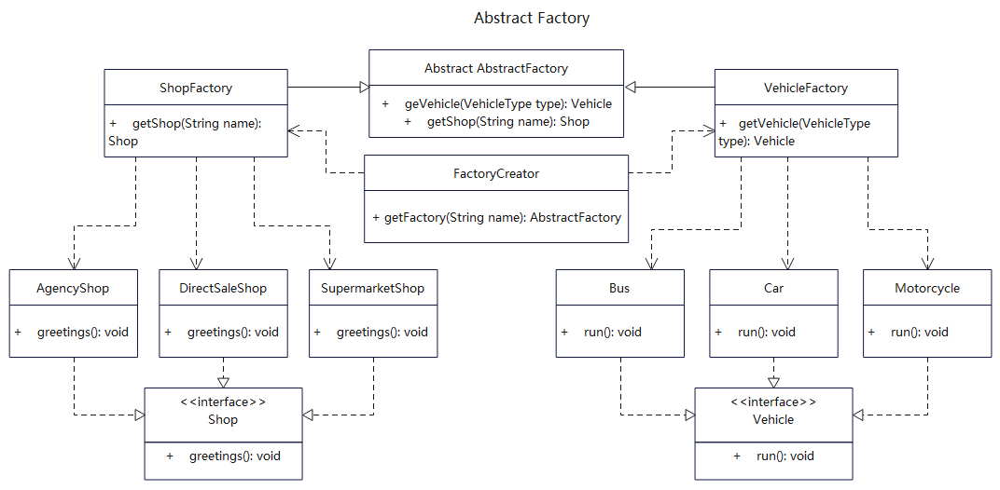

# 【抽象工厂设计模式详解】C/Java/JS/Go/Python/TS不同语言实现
# 简介
抽象工厂模式（Abstract Factory Pattern）属于创建者模式，是一个超级工厂，主要用来创建其他的工厂。工厂方法是一个具体工厂，用来创建对象，而抽象工厂则是用来创建工厂的类。

它为访问类提供一个创建一组相互依赖对象的接口，且访问类无须指定具体类就能得到同类下不同等级的对象的模式。在抽象工厂模式中，接口是负责创建一个相关对象的工厂，不需要显式指定它们的类。每个生成的工厂都能按照工厂模式提供对象。

如果代码需要与多个不同系列的相关产品交互，但是无法提前获取产品信息， 出于对未来扩展的考虑，不希望代码基于产品的具体实现进行构建，这时可以使用抽象工厂。

# 作用
1. 工厂的创建和调用解耦，便于不同系列产品之间的关联调用。
2. 屏蔽复杂的对象创建逻辑，交由统一的工厂方法，工厂本身也由工厂创建。
3. 采用统一的方式来实例化，还可以防止内存中实例对象不断增多。

# 实现步骤
1. 建立抽象工厂类，用于创建产品工厂类。
2. 建立系列产品工厂类，继承自抽象工厂类，负责具体产品的创建。
3. 新建不同系列具体产品类，实现具体产品的接口类。
4. 想要获取具体产品对象时，先生成产品工厂，再实例化产品对象。

# UML


# 代码

## 基础工厂类
```java
// AbstractFactory.java 定义工厂基本规范，抽象类或是接口
public abstract class AbstractFactory {
  public abstract Vehicle getVehicle(VehicleType type);
  public abstract Shop getShop(String name);
}
```

## 具体工厂类，可以多个，继承或实现基础工厂类
```java
// VehicleFactory.java，车辆创建类，继承自抽象工厂基类
public class VehicleFactory extends AbstractFactory {
  @Override
  public Vehicle getVehicle(VehicleType type) {
    switch (type) {
      case BUS:
        return new Bus();
      case CAR:
        return new Car();
      case MOTORCYCLE:
        return new Motorcycle();
      case VAN:
        return new Van();
      default:
        return null;
    }

  }

  @Override
  public Shop getShop(String name) {
    return null;
  }
}
```

```java
// ShopFactory.java，商店创建类，继承自抽象工厂
public class ShopFactory extends AbstractFactory {
  @Override
  public Shop getShop(String name) {
    if (name.equals("AgencyShop")) {
      return new AgencyShop();
    } else if (name.equals("DirectSaleShop")) {
      return new DirectSaleShop();
    } else if (name.equals("SupermarketShop")) {
      return new SupermarketShop();
    } else {
      return null;
    }
  }

  @Override
  public Vehicle getVehicle(VehicleType type) {
    return null;
  }
}
```

## 工厂创建者类
```java
// AbstractFactory.java，工厂创建者，用来创建不同的工厂
public class FactoryCreator {
  public static AbstractFactory getFactory(String name) {
    switch (name) {
      // 车辆工厂
      case "vehicle":
        return new VehicleFactory();
      // 商店工厂
      case "shop":
        return new ShopFactory();
      default:
        return null;
    }
  }
}
```


## 具体产品类接口，分为shop和vehicle两类
```java
// Shop.java，商店类接口，约束具体产品的行为
public interface Shop {
  void greetings();
}
```

```java
// Vehicle.java，商店类接口，约束具体产品的行为
public interface Vehicle {
  void run();
}
```

## 具体产品类，分为shop和vehicle两种
```java
// SupermarketShop.java，具体某个商店，存在多个不同类型
public class SupermarketShop implements Shop {
  @Override
  public void greetings() {
     System.out.println("SupermarketShop::greetings().");
  }
}
```

```java
// Bus.java，具体某个车辆，存在多个同步类型
public class Bus implements Vehicle {
 
  @Override
  public void run() {
     System.out.println("Bus::run().");
  }
}
```

## 测试调用
```java

    /**
     * 抽象工厂就是把生产产品的工厂也根据统一的抽象工厂来创建，
     * 这样不同类型的工厂可以在统一的约束下，整体上看更新加清晰。
     * 当声明工厂时可以通过抽象类型或具体工厂来声明，然后依据工厂来生产不同的产品。
     */

    // 声明一个汽车工厂
    AbstractFactory vehicleFactory = FactoryCreator.getFactory("vehicle");
    // 从汽车工厂获取Bus对象，并调用它的 run 方法
    Vehicle bus = vehicleFactory.getVehicle(VehicleType.BUS);
    bus.run();

    // 获取Car对象，类型强转，并调用它的 run 方法
    Vehicle car = vehicleFactory.getVehicle(VehicleType.CAR);
    Car car1 = (Car) car;
    car1.run();

    /*********************** 分割线 ******************************************/

    // 声明商店工厂
    AbstractFactory shopFactory = FactoryCreator.getFactory("shop");
    // 从商店工厂获取商店对象
    Shop shop = shopFactory.getShop("SupermarketShop");
    // 调用商店的方法
    shop.greetings();

    // 声明时强转
    AgencyShop agencyShop = (AgencyShop) shopFactory.getShop("AgencyShop");
    // 调用商店的方法
    agencyShop.greetings();

    /*********************** 分割线 ******************************************/

    // 再声明一个商店工厂
    AbstractFactory shopFactory2 = FactoryCreator.getFactory("shop");
    Shop directSaleShop = shopFactory2.getShop("DirectSaleShop");
    directSaleShop.greetings();
    // Shop接口没有welcome方法，故调用失败
    // directSaleShop.welcome();

    // 类型转换测试，将Shop接口类强转为DirectSaleShop实现类
    DirectSaleShop directSaleShop2 = (DirectSaleShop) directSaleShop;
    directSaleShop2.greetings();
    // 通过类型转换就可以调用welcome了
    directSaleShop2.welcome();
```

## 更多语言版本
不同语言设计模式源码：[https://github.com/microwind/design-pattern](https://github.com/microwind/design-pattern)
