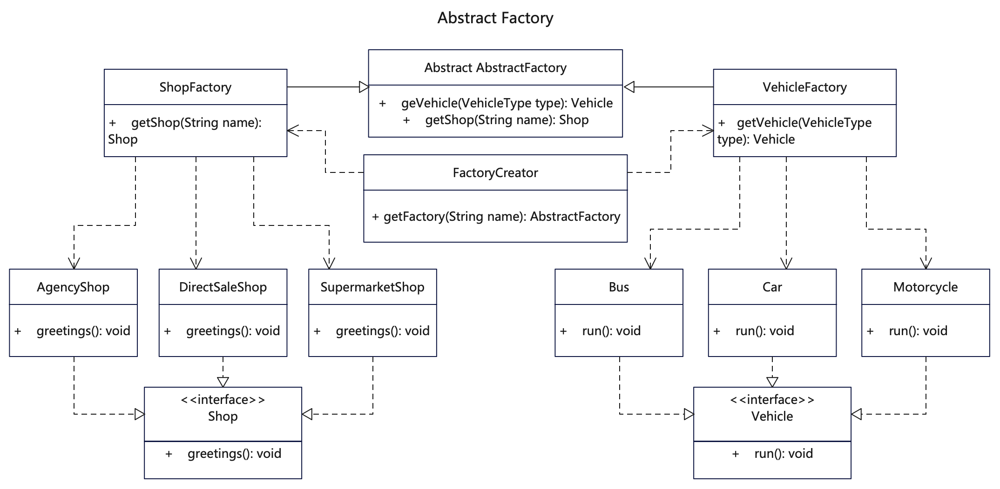

# 简介
抽象工厂模式（Abstract Factory Pattern）是一个超级工厂，用来创建其他的工厂。
工厂方法是一个具体工厂，用来创建对象，而抽象工厂则是用来创建工厂的类。

抽象工厂属于创建型模式，它为访问类提供一个创建一组相互依赖对象的接口，且访问类无须指定具体类就能得到同类下不同等级的对象的模式。在抽象工厂模式中，接口是负责创建一个相关对象的工厂，不需要显式指定它们的类。每个生成的工厂都能按照工厂模式提供对象。

如果代码需要与多个不同系列的相关产品交互，但是无法提前获取产品信息， 出于对未来扩展的考虑，不希望代码基于产品的具体实现进行构建，这时可以使用抽象工厂。

# 作用
1. 工厂的创建和调用解耦，便于不同系列产品之间的关联调用。
2. 屏蔽复杂的对象创建逻辑，交由统一的工厂方法，工厂本身也由工厂创建。
3. 采用统一的方式来实例化，还可以防止内存中实例对象不断增多。

# 实现步骤
1. 建立抽象工厂类，用于创建产品工厂类。
2. 建立系列产品工厂类，继承自抽象工厂类，负责具体产品的创建。
3. 新建不同系列具体产品类，实现具体产品的接口类。
4. 想要获取具体产品对象时，先生成产品工厂，再实例化产品对象。

# UML

