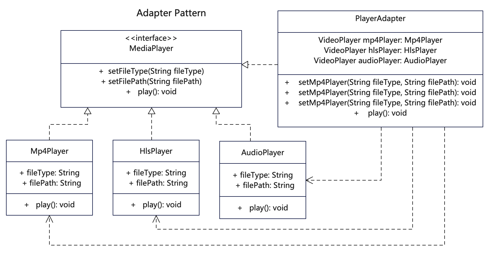

# 【适配器设计模式详解】C/Java/JS/Go/Python/TS不同语言实现

# 简介
适配器模式（Adapter Pattern）是一种结构型设计模式，为两个不兼容的接口之间架设桥梁，使不兼容的对象能够相互合作。

当你希望使用某个类，但是其接口与其他代码不兼容时，可以使用适配器类。当你需要复用类的共同方法，但是这些共同的方法不是所有子类的共性，你可以通过适配器模式来兼容。

# 作用
1. 将一个类的接口转换成另外一个接口。
2. 使得原本不兼容的接口也能一同工作。

# 实现步骤
1. 有一些可以重复使用的类，这些类不一定有一致的接口。
2. 建立接口转换类，将不同的类插入到转换类中。
3. 通过转换类来实现（继承或依赖）不同接口的调用。

# UML


# 代码

## 基础接口类
```java
// MediaPlayer.java 定义视频/音频的格式播放接口
public interface MediaPlayer {
  public void play();
  public void setFileType(String fileType);
  public void setFilePath(String filePath);
}
```

## 具体播放器实现类，可以多个
```java
// AudioPlayer.java 支持多种音频格式播放，相对简单，不区分格式
public class AudioPlayer implements MediaPlayer {
  private String fileType;
  private String filePath;

  public AudioPlayer(String fileType, String filePath) {
    this.fileType = fileType;
    this.filePath = filePath;
  }

  public void play() {
    System.out.println("AudioPlayer fileType:" + fileType + " | filePath:" + filePath);
    if (fileType.equals("mp3")) {
      System.out.println("AudioPlayer::play() mp3");
    } else if (fileType.equals("mp4")) {
      System.out.println("AudioPlayer::play() mp4");
    }
  }
}
```
```java
// HlsPlayer.java 播放器实现了视频接口
public class HlsPlayer implements MediaPlayer {
  private String fileType;
  private String filePath;

  public HlsPlayer(String fileType, String filePath) {
    this.fileType = fileType;
    this.filePath = filePath;
  }

  public void play() {
    System.out.println("HlsPlayer fileType:" + fileType + " | filePath:" + filePath);
    System.out.println("HlsPlayer::play()");
  }
}
```

```java
// Mp4Player.java 播放器实现了视频接口
public class Mp4Player implements MediaPlayer {
  private String fileType;
  private String filePath;

  public Mp4Player(String fileType, String filePath) {
    this.fileType = fileType;
    this.filePath = filePath;
  }

  public void play() {
    System.out.println("Mp4Player fileType:" + fileType + " | filePath:" + filePath);
    System.out.println("Mp4Player::play()");
  }
}
```

## 适配器类
```java
// PlayerAdapter.java 适配器类，可以播放各种音频和视频，外部调用方式一样。适配器也可以实现基础播放接口
public class PlayerAdapter implements MediaPlayer {

  private String mediaType;
  private String fileType;
  private String filePath;
  private MediaPlayer mp4Player;
  private MediaPlayer hlsPlayer;
  private MediaPlayer audioPlayer;

  public PlayerAdapter(String mediaType, String fileType, String filePath) {
    this.mediaType = mediaType;
    this.fileType = fileType;
    if (mediaType.equals("video")) {
      if (fileType.equals("mp4")) {
        setMp4Player(fileType, filePath);
      } else if (fileType.equals("hls")) {
        setHlsPlayer(fileType, filePath);
      }
    } else if (mediaType.equals("audio")) {
      setAudioPlayer(fileType, filePath);
    }
  }

  public void setMp4Player(String fileType, String filePath) {
    if (mp4Player == null) {
      mp4Player = new Mp4Player(fileType, filePath);
    } else {
      mp4Player.setFileType(fileType);
      mp4Player.setFilePath(filePath);
    }
  }

  public void setHlsPlayer(String fileType, String filePath) {
    if (hlsPlayer == null) {
      hlsPlayer = new HlsPlayer(fileType, filePath);
    } else {
      hlsPlayer.setFileType(fileType);
      hlsPlayer.setFilePath(filePath);
    }
  }

  public void setAudioPlayer(String fileType, String filePath) {
    if (audioPlayer == null) {
      audioPlayer = new AudioPlayer(fileType, filePath);
    } else {
      audioPlayer.setFileType(fileType);
      audioPlayer.setFilePath(filePath);
    }
  }

  // 通用的适配接口
  public void play() {
    if (this.mediaType.equals("audio")) {
      audioPlayer.play();
    } else if (this.mediaType.equals("video")) {
      if (this.fileType.equals("mp4")) {
        mp4Player.play();
      } else if (this.fileType.equals("hls")) {
        hlsPlayer.play();
      }
    }
  }

  public void setFileType(String fileType) {
    this.fileType = fileType;
  }

  public String getFileType() {
    return fileType;
  }

  public void setFilePath(String filePath) {
    this.filePath = filePath;
  }

  public String getFilePath() {
    return filePath;
  }
}
```

## 测试调用
```java

    /**
     * 适配器模式是当调用方需需调用不同功能，但接口并不兼容时，
     * 这时候可通过一个适配器类来做适配，让调用方通过适配类再去调用各个对象的功能。
     * 调用方只知道适配器，而不知道后面的其他对象。
     */

    // mp4播放
    PlayerAdapter playerAdapter1 = new PlayerAdapter("video", "mp4", "d:/video.mp4");
    playerAdapter1.play();
    // 复用实例播音频
    playerAdapter1.play("audio", "mp4", "d:/audio.mp4");

    // hls播放
    PlayerAdapter playerAdapter2 = new PlayerAdapter("video", "hls", "http://video.m3u8");
    playerAdapter2.play();

    // mp3播放
    PlayerAdapter playerAdapter3 = new PlayerAdapter("audio", "mp3", "d:/audio.mp3");
    playerAdapter3.play();

    // mp4音频播放
    PlayerAdapter playerAdapter4 = new PlayerAdapter("audio", "mp4", "d:/audio.mp4");
    playerAdapter4.play();
    // 复用实例播视频
    playerAdapter4.play("video", "hls", "d:/video.m3u8");
```

## 更多语言版本
不同语言设计模式源码：[https://github.com/microwind/design-pattern](https://github.com/microwind/design-pattern)
