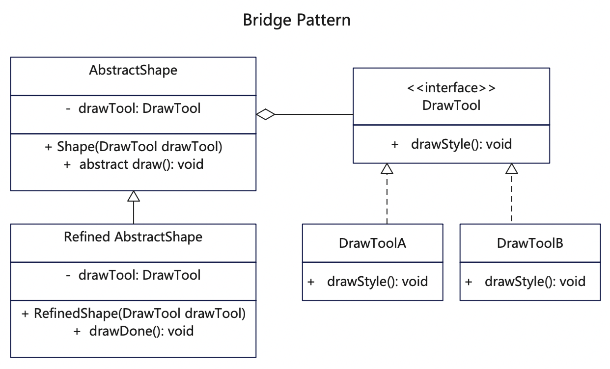

# 【桥接设计模式详解】Java/JS/Go/Python/TS不同语言实现

# 简介
桥接模式（Bridge Pattern）是一种结构型设计模式，它将一个大类或一系列紧密相关的类拆分为抽象和实现两个独立的层次结构，来实现二者的解耦。参与桥接的接口是稳定的，用户可以扩展和修改桥接中的类，但是不能改变接口。桥接模式通过接口继承实现或者类继承实现功能扩展。

如果你希望在几个独立维度上扩展一个类，或者你想要拆分、重组一个具有多重功能的复杂类（例如能与多个数据库服务器进行交互的类），或者你想在运行时切换不同的实现方法，可以使用桥接模式。

# 作用
1. 在有多种可能会变化的情况下，用继承扩展起来不灵活，桥接可以解决类似问题。
2. 桥接模式提高了系统的可扩展性，在两个变化维度中任意扩展一个维度，都不需要修改原有系统。

# 实现步骤
1. 定义一个工具接口，供不同工具类来实现。
2. 建立多个具体工具类实现基础工具接口，这些工具是负责具体能力实现。
3. 定义一个基础抽象类，里面聚合了工具接口，相当于桥接器。
4. 建立具体对象类，继承自基础抽象类，调用工具类里的方法来实现具体功能。

# UML



# 代码

## 基础抽象类
```java
// AbstractShape.java 定义抽象桥接器，关联图形操作接口
public abstract class AbstractShape {s
   protected DrawTool drawTool;

   protected AbstractShape(DrawTool drawTool) {
      this.drawTool = drawTool;
   }

   public abstract void draw(int x, int y, int radius);
}
```

## 具体桥接器实现类
```java
// RefinedShape.java 具体桥接类，继承抽象桥接类，扩充了自己的方法
public class RefinedShape extends AbstractShape {
   public RefinedShape(DrawTool drawTool) {
      super(drawTool);
   }

  @Override
  public void draw(int x, int y, int radius) {
      System.out.println(String.format("RefinedShape::draw() [x=%s y=%s radius=%s]", x, y, radius));
      // 通过工具类实际绘制
      drawTool.drawStyle();
  }

   // 新增的方法，可作为工具类的补充
   public void drawDone() {
      System.out.println("RefinedShape::drawDone(), 执行的drawTool是: " + drawTool.getClass().getSimpleName());
   }
}
```

## 定义工具接口类
```java
// DrawTool.java 图形操作基础接口
public interface DrawTool {
  public void drawStyle();
}
```

## 定义工具实现类，可以多个
```java
// 画圆A，实现了图画基础API
public class DrawStyeA implements DrawTool {
   @Override
   public void drawStyle() {
      System.out.println("DrawStyleA:drawStyle()");
   }
}
```

```java
// 画圆B，实现了图画基础API
public class DrawStyleB implements DrawTool {
   @Override
   public void drawStyle() {
      System.out.println("DrawStyleB:drawStyle()");
   }
}
```

## 测试调用
```java

    /**
     * 桥接模式是将基础抽象类作为桥接器，用来连接业务对象和具体动作，将两者充分解耦。
     * 具体对象以抽象对象为父类，实现父类方法。
     * 具体工具类实现统一的工具接口，为抽象桥接对象服务
     * 使用时，声明具体对象同时传入具体工具，使得具体对象可以使用具体工具的动作。
     */

    // 用抽象类来声明具体对象，并指定具体工具
    AbstractShape shape = new RefinedShape(new DrawStyeA());
    // 调用对象的方法，里面执行了工具类的方法
    shape.draw(10, 20, 50);
    RefinedShape shape1 = (RefinedShape) shape;
    // 类型强转为具体业务类，调用具体类的方法
    shape1.drawDone();

    // /*********************** 分割线 ******************************************/

    // 直接用具体类来声明对象，并指定另外的工具
    RefinedShape shape2 = new RefinedShape(new DrawStyleB());
    // 调用对象的方法，里面执行了工具类的方法
    shape2.draw(11, 22, 33);
    shape2.drawDone();
```

## 更多语言版本
不同语言实现设计模式：[https://github.com/microwind/design-pattern](https://github.com/microwind/design-pattern)
