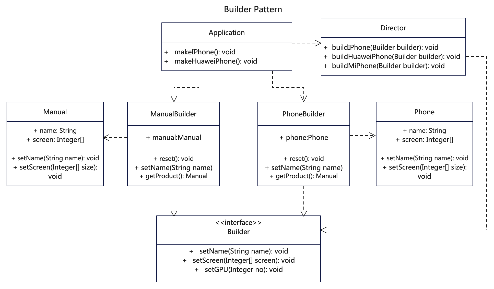

# 【建造者设计模式详解】C/Java/JS/Go/Python/TS不同语言实现

# 简介
建造者模式（Builder Pattern），也叫生成器模式，属于创建型模式。它使用多个简单的对象一步一步构建成一个复杂的对象。它允许你使用相同的创建代码生成不同类型和形式的对象。

调用建造者构建产品部件时，可以实现链式调用，但这个是可选的。关键在于指挥者隔离需求，通过建造者来逐步创建产品。

当你希望使用代码创建不同形式的产品 （例如各种商品和订单） 时， 一些基本部件不会变，而其组合经常变化的时候，就可以考虑建造者模式。

# 作用
1. 当需要创建复杂对象的时候，由各个部分的子对象来逐步构建，以适应复杂多变的情况。
2. 具体的建造者类之间是相互独立的，这有利于系统的扩展。
3. 将变与不变分离开。主管类隐藏了产品构造细节， 客户端只需要将一个生成器与主管类关联，就能从生成器处构造对象。

# 实现步骤
1. 定义主管类，可以制造所有形式的产品。
2. 在基本生成器接口中声明创建产品的步骤。
3. 为每个形式的产品创建具体生成器类，并实现其构造步骤。
4. 客户端同时创建生成器和主管类，所有产品都遵循相同的接口，构造结果通过主管类获取。

# UML



# Java代码

## 创建建造者接口
```java
// Builder.java 建造者接口，定义基本建造方法
public interface Builder {
  public void reset();
  public Builder setName(String name);
  public Builder setScreen(Integer[] screen);
  public Builder setGPU(Integer no); 
}
```

## 具体建造者类，可以多个
```java
// ManualBuilder.java 使用手册建造者类也实现了建造者接口
public class ManualBuilder implements Builder {
  private Manual manual;

  public void reset() {
    this.manual = new Manual();
  }

  public Builder setName(String name) {
    this.manual.setName(name);
    return this;
  }

  public Builder setScreen(Integer[] screen) {
    this.manual.setScreen(screen);
    return this;
  }

  public Builder setGPU(Integer no) {
    this.manual.setGpuType(no);
    return this;
  }

  public Manual getProduct() {
    return this.manual;
  }
}
```

```java
// PhoneBuilder.java 手机建造者实现了建造者接口
public class PhoneBuilder implements Builder {
  private Phone phone;

  public void reset() {
    this.phone = new Phone();
  }

  public Builder setName(String name) {
    this.phone.setName(name);
    return this;
  }

  public Builder setScreen(Integer[] screen) {
    this.phone.setScreen(screen);
    return this;
  }

  public Builder setGPU(Integer no) {
    this.phone.setGpuType(no);
    return this;
  }

  public Phone getProduct() {
    return this.phone;
  }
}
```

## 定义具体产品类，不同建造者建造不同产品
```java
// Manual.java 手册产品类
public class Manual {
  private String name = "PhoneManualName";
  private Integer[] screen = { 0, 0 };
  private Integer gpuType = 0;
  private Integer pages = 0;

  public void setName(String name) {
    this.name = name;
  }

  public String getName() {
    return this.name;
  }

  public void setScreen(Integer[] screen) {
    this.screen = screen;
  }

  public Integer[] getScreen() {
    return this.screen;
  }

  public void setGpuType(Integer type) {
    this.gpuType = type;
  }

  public Integer getGpuType() {
    return this.gpuType;
  }

  public void setPages(Integer pages) {
    this.pages = pages;
  }

  public Integer getPages() {
    return this.pages;
  }

  public String toString() {
    return "[name=" + name + ", screen=" + Arrays.toString(screen) + ", gpuType=" + gpuType + "]";
  }

}
```

```java
// Phone.java 手机产品类
public class Phone {
  private String name = "PhoneName";
  private Integer[] screen = { 0, 0 };
  private Integer gpuType = 0;

  public void setName(String name) {
    this.name = name;
  }

  public String getName() {
    return this.name;
  }

  public void setScreen(Integer[] screen) {
    this.screen = screen;
  }

  public Integer[] getScreen() {
    return this.screen;
  }

  public void setGpuType(Integer type) {
    this.gpuType = type;
  }

  public Integer getGpuType() {
    return this.gpuType;
  }

  public String toString() {
    return "[name=" + name + ", screen=" + Arrays.toString(screen) + ", gpuType=" + gpuType + "]";
  }

}
```

## 指挥调度类
```java
// Director.java 指挥调度类，负责利用建造者建造产品，隔离需求与功能
public class Director {

  // 建造phone1
  public void buildIPhone(Builder builder) {
    builder.reset();
    Integer[] screen = { 120, 500 };
    builder.setName("iPhone");
    builder.setScreen(screen);
    builder.setGPU(100);
  }

  // 建造phone2
  public void buildHuaweiPhone(Builder builder) {
    builder.reset();
    Integer[] screen = { 130, 600 };
    // 也可以链式调用
    builder.setName("HuaweiPhone")
    .setScreen(screen)
    .setGPU(102);
  }

  // 建造phone3
  public void buildMiPhone(Builder builder) {
    builder.reset();
    Integer[] screen = { 120, 650 };
    builder.setName("MiPhone");
    builder.setScreen(screen);
    builder.setGPU(103);
  }

}
```

## 测试调用
```java
public class Test {

  public static void start() {
    /**
     * 建造者模式是使用多个简单的对象一步一步构建出一个复杂的对象来。
     * 分为主管类和建造者类，主管类负责具体指挥调度，建造负责具体实施。
     * 主管类通过一步一步调用各种建造者实现复杂对象。
     */

    Application.makeIPhone();

    Application.makeHuaweiPhone();

    // *********************** 分割线 ******************************************/

    // 声明指挥者
    Director director = new Director();
    // 创建手机
    PhoneBuilder phoneBuilder = new PhoneBuilder();
    director.buildMiPhone(phoneBuilder);
    Phone miPhone = phoneBuilder.getProduct();
    System.out.println("miPhone:" + miPhone.getName() + " | " + miPhone.getGpuType().toString());
    // 创建手册
    ManualBuilder manualBuilder = new ManualBuilder();
    director.buildMiPhone(manualBuilder);
    Manual manual = manualBuilder.getProduct();
    System.out.println("manual:" + manual.getName() + " | " + manual.getGpuType().toString());

  }

  public static void main(String[] args) {
    System.out.println("test start:");
    start();
  }

}
```

# TypeScript代码

## 创建建造者接口
```js
// Builder.ts 建造者接口，定义基本建造方法
export interface Builder {
  reset(): void
  setName(name: string): Builder
  setScreen(size: number[]): Builder
  setGPU(no: number): Builder
}
```

## 具体建造者类，可以多个
```js
// ManualBuilder.ts 使用手册建造者类也实现了建造者接口
import { Builder } from './Builder.js'
import { Manual } from './Manual.js'

export class ManualBuilder implements Builder {
  manual: Manual | any
  constructor() {
    // this.reset()
  }

  reset() {
    this.manual = new Manual()
  }

  setName(name: string): ManualBuilder {
    this.manual.setName(name)
    return this
  }

  setScreen(screen: []): ManualBuilder {
    this.manual.setScreen(screen)
    return this
  }

  setGPU(no: number): ManualBuilder {
    this.manual.setGpuType(no)
    return this
  }

  getProduct() {
    return this.manual
  }
}

```

```js
// PhoneBuilder.ts 手机建造者实现了建造者接口
import { Builder } from './Builder.js'
import { Phone } from './Phone.js'

export class PhoneBuilder implements Builder {
  phone: Phone | any
  constructor() {
    // this.reset()
  }

  reset() {
    this.phone = new Phone()
  }

  setName(name: string): PhoneBuilder {
    this.phone.setName(name)
    return this
  }

  setScreen(screen: []): PhoneBuilder {
    this.phone.setScreen(screen)
    return this
  }

  setGPU(no: number): PhoneBuilder {
    this.phone.setGpuType(no)
    return this
  }

  getProduct() {
    return this.phone
  }
}

```

## 定义具体产品类，不同建造者建造不同产品
```js
// Manual.ts 手册产品类
export class Manual {
  name: string
  __name__: string
  screen: number[]
  gpuType: number
  constructor() {
    this.name = 'PhoneName'
    this.__name__ = 'Manual'
    this.screen = [0, 0]
    this.gpuType = 0
  }

  setName(name: string) {
    this.name = name
  }

  getName() {
    return this.name
  }

  setScreen(screen: number[]) {
    this.screen = screen
  }

  getScreen() {
    return this.screen
  }

  setGpuType(type: number) {
    this.gpuType = type
  }

  getGpuType() {
    return this.gpuType
  }
}

```

```js
// Phone.ts 手机产品类
export class Phone {
  name: string
  __name__: string
  screen: number[]
  gpuType: number
  constructor() {
    this.name = 'PhoneName'
    this.__name__ = 'Phone'
    this.screen = [0, 0]
    this.gpuType = 0
  }

  setName(name: string) {
    this.name = name
  }

  getName() {
    return this.name
  }

  setScreen(screen: number[]) {
    this.screen = screen
  }

  getScreen() {
    return this.screen
  }

  setGpuType(type: number) {
    this.gpuType = type
  }

  getGpuType() {
    return this.gpuType
  }
}

```

## 指挥调度类
```js
// Director.ts 指挥调度类，负责利用建造者建造产品，隔离需求与功能
import { Builder } from './Builder.js'

// 指挥调度类，负责利用建造者建造产品，隔离需求
export class Director {
  // 建造phone1
  buildIPhone(builder: Builder) {
    builder.reset()
    const screen = [120, 500]
    builder.setName('iPhone')
    builder.setScreen(screen)
    builder.setGPU(100)
  }

  // 建造phone2
  buildHuaweiPhone(builder: Builder) {
    builder.reset()
    const screen = [140, 600]
    // 也可链式调用
    builder.setName('HuaweiPhone').setScreen(screen).setGPU(102)
  }

  // 建造phone3
  buildMiPhone(builder: Builder) {
    builder.reset()
    const screen = [130, 550]
    builder.setName('MiPhone')
    builder.setScreen(screen)
    builder.setGPU(103)
  }
}

```

## 测试调用
```js
import { Application } from '../src/Application.js'
import { Director } from '../src/Director.js'
import { PhoneBuilder } from '../src/PhoneBuilder.js'
import { ManualBuilder } from '../src/ManualBuilder.js'

export function test() {
  /**
   * 建造者模式是使用多个简单的对象一步一步构建出一个复杂的对象来。
   * 分为主管类和建造者类，主管类负责具体指挥调度，建造负责具体实施。
   * 主管类通过一步一步调用各种建造者实现复杂对象。
   */

  Application.makeIPhone()

  Application.makeHuaweiPhone()

  // *********************** 分割线 ******************************************/

  // 声明指挥者
  const director = new Director()
  // 创建手机
  const phoneBuilder = new PhoneBuilder()
  director.buildMiPhone(phoneBuilder)
  const miPhone = phoneBuilder.getProduct()
  console.log('miPhone:' + miPhone.getName() + ' | ', JSON.stringify(miPhone))
  // 创建手册
  const manualBuilder = new ManualBuilder()
  director.buildMiPhone(manualBuilder)
  const manual = manualBuilder.getProduct()
  console.log('manual:' + manual.getName() + ' | ', JSON.stringify(manual))
}

```


## 更多语言版本
不同语言设计模式源码：[https://github.com/microwind/design-pattern](https://github.com/microwind/design-pattern)