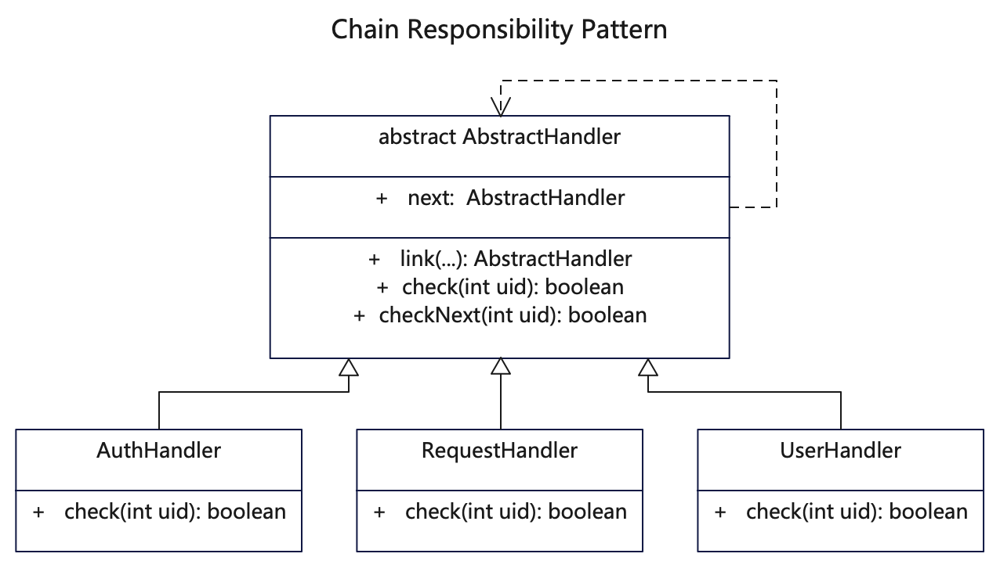

# 简介
责任链模式（Chain of Responsibility Pattern）是一种行为型设计模式，也叫职责链模式、命令链模式。这种模式为请求创建了一个接收者对象的链，允许你将请求沿着处理者链进行发送，每个处理者均可对请求进行处理，或将其传递给链上的下个处理者。

当程序需要使用不同方式来处理多种类请求，且请求类型和顺序不可知，或者当必须按顺序执行多个处理时，可以使用责任链模式。或者如果所需处理及其顺序必须在运行时进行改变，也可以使用该模式。

# 作用
1. 避免请求发送者与接收者耦合在一起，客户只需要将请求发送到链上，而无须关心请求的处理细节和请求的传递。
2. 通过改变链内的成员或者调动它们的次序，允许动态地新增或者删除责任。

# 实现步骤
1. 创建一个抽象处理器类，用来供处理器继承。
2. 抽象处理器类可将各子类按任意组织为链式，以便调用。
3. 创建多个互不干涉的处理器，实现抽象类的next方法，以便不断执行链式检查。

# UML



# 代码

## 抽象事件处理类
```java
// AbstractHandler.java 所有处理变成链式，可以互动干涉，动态组合
public abstract class AbstractHandler {
   // 形成职责链
   private AbstractHandler next;

   // 创建调用链，传入多个handler，按顺序形成链，返回第一个handler
   public static AbstractHandler link(AbstractHandler first, AbstractHandler... chain) {
      AbstractHandler head = first;
      for (AbstractHandler handler : chain) {
         head.next = handler;
         head = handler;
      }
      return first;
   }

   // 子类需要实现的检查方法
   public abstract boolean check(int uid);

   // 继续下一个检查
   protected boolean checkNext(int uid) {
      if (next == null) {
         return true;
      }
      return next.check(uid);
   }
}
```

## 不同事件，可以多个，互不关联
```java
// AuthHandler.java 权限检查类
public class AuthHandler extends AbstractHandler {
    // 如果检查不通过则返回失败，否则继续下一个检查
    public boolean check(int uid) {
      System.out.println(this.getClass().getName() + "::check() [uid = " + uid + "]");
      if (uid % 2 == 0) {
          return false;
      }
      return checkNext(uid);
  }
}
```

```java
// RequestHandler.java 请求是否安全合法检查
public class RequestHandler extends AbstractHandler {
    // 如果检查不通过则返回失败，否则继续下一个检查
    public boolean check(int uid) {
      System.out.println(this.getClass().getName() + "::check() [uid = " + uid + "]");
      if (uid % 1 != 0) {
          return false;
      }
      return checkNext(uid);
  }
}
```

```java
// UserHandler.java 用户基本信息检查类
public class UserHandler extends AbstractHandler {
    // 如果检查不通过则返回失败，否则继续下一个检查
    public boolean check(int uid) {
        System.out.println(this.getClass().getName() + "::check() [uid = " + uid + "]");
        if (uid % 3 == 0) {
            return false;
        }
        return checkNext(uid);
    }
}
```

## 测试调用
```java
    /**
     * 责任链模式核心是打造一个调用处理链，每个处理链都实现抽象类的next方法，从而可以任意组织各种检查行为。
     * 通过改变链内的成员或者调动它们的顺序，允许动态地新增或者删除职责，从而实现按需组织。
     */

    // 可以任意组织职责链，先后顺序根据需要来
    AbstractHandler handler1 = AbstractHandler.link(
        new RequestHandler(),
        new UserHandler(),
        new AuthHandler());

    System.out.println("handler1.check(1001)开始");
    handler1.check(1001);
    System.out.println("handler1.check(1002)开始");
    handler1.check(1002);

    // 可以任意组织职责链，先后顺序根据需要来
    AbstractHandler handler2 = AbstractHandler.link(
        new AuthHandler(),
        new RequestHandler(),
        new UserHandler());

    System.out.println("handler2.check(1001)开始");
    handler2.check(1001);
    System.out.println("handler2.check(1002)开始");
    handler2.check(1002);
```

## 更多语言版本
不同语言实现设计模式：[https://github.com/microwind/design-pattern](https://github.com/microwind/design-pattern)