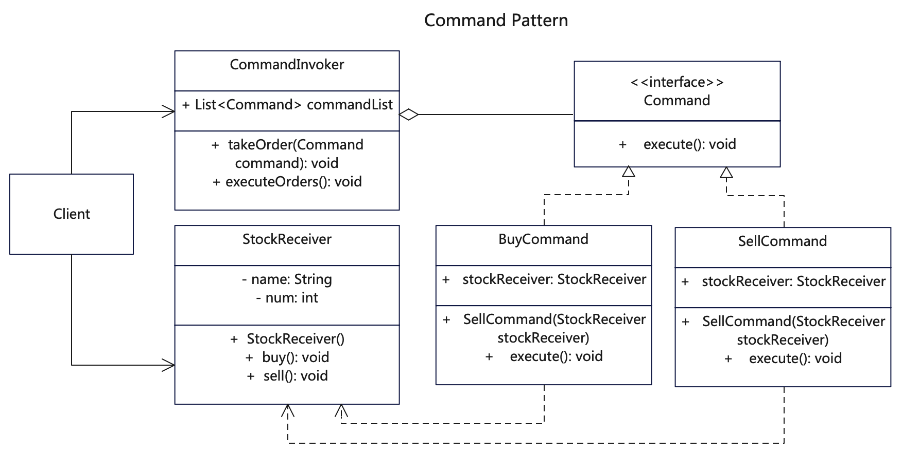

# 简介
命令模式（Command Pattern）是一种数据驱动的设计模式，也是一种行为型设计模式。这种模式的请求以命令的形式包裹在对象中，并传给调用对象。调用对象再寻找合适的对象，并把该命令传给相应的处理者。

如果你需要通过操作来参数化对象，可使用命令模式。如果你想要将操作放入队列中、操作的执行或者远程执行操作， 可使用命令模式。如果你想要实现操作回滚功能，可使用命令模式。

# 作用
1. 将不同命令按照抽象命令封装成不同的对象，将这些命令放到调用者里。
2. 客户通过调用者执行命令再去调用接受者的动作，顺序为：客户调用方->调用者->命令对象->接受者。
3. 同其他对象一样，命令也可以实现序列化，从而方便地写入文件或数据库中，实现延迟执行。

# 实现步骤
1. 创建一个抽象命令接口，实现基本的命令方法。
2. 创建多个具体命令类，实现抽象命令接口，以来命令接收者。
3. 创建命令接收者，也就是具体业务类，接受命令并执行动作。
4. 创建命令调用者，这是一个聚合命令的类，添加命令和执行命令。

# UML


# 代码

## 基础命令接口
```java
// Command.java 命令抽象接口
public interface Command {
   void execute();
}
```

## 具体命令类，可以多个命令
```java
// BuyCommand.java 购买命令，操作receiver，实现了抽象命令类
public class BuyCommand implements Command {
  private StockReceiver stockReceiver;

  public BuyCommand(StockReceiver stockReceiver) {
    this.stockReceiver = stockReceiver;
  }

  // 命令类调用执行者的实际动作
  public void execute() {
    System.out.println(this.getClass().getName() + "::execute() ");
    this.stockReceiver.buy();
  }
}
```

```java
// SellComman.java 出售命令，操作receiver，实现了抽象命令类
public class SellCommand implements Command {
  private StockReceiver stockReceiver;

  public SellCommand(StockReceiver stockReceiver) {
    this.stockReceiver = stockReceiver;
  }

  // 命令类调用执行者的实际动作
  public void execute() {
    System.out.println(this.getClass().getName() + "::execute() ");
    stockReceiver.sell();
  }
}
```

## 命令调用类
```java
// CommandInvoker.java 命令调用类，通过关联命令来执行命令的调用
public class CommandInvoker {

    private List<Command> commandList = new ArrayList<Command>();

    // 储存命令
    public void takeOrder(Command command) {
        System.out.println(this.getClass().getName() + "::takeOrder() " + command.getClass().getName());
        commandList.add(command);
    }

    // 统一执行
    public void executeOrders() {
        System.out.println(this.getClass().getName() + "::executeOrders() ");
        for (Command command : commandList) {
            command.execute();
        }
        commandList.clear();
    }
}
```

## 命令接收执行类
```java
// StockReceiver.java 命令模式真正的执行类，不直接对外，通过command来调用
public class StockReceiver {

   private String name;
   private int num;

   public StockReceiver(String name, int num) {
      this.name = name;
      this.num = num;
   }

   public void buy() {
      System.out.println(this.getClass().getName() + "::buy() [name=" + this.name + " num=" + this.num + "]");
   }

   public void sell() {
      System.out.println(this.getClass().getName() + "::sell() [name=" + this.name + " num=" + this.num + "]");
   }

   public void setName(String name) {
      this.setName(name);
   }

   public String getName() {
      return this.name;
   }

   public void setNum(int num) {
      this.num = num;
   }

   public int getNum() {
      return this.num;
   }
}
```

## 测试调用
```java

    /*
     * 命令模式是客户端通过一个命令执行者invoker，去执行某个命令command。
     * 而命令则调用了业务类receiver的具体动作，从而完成真正的执行。
     * 这种方式将命令和执行者进行了有效解耦。
     */

    // 先声明一个被操作对象，也就是接收者
    StockReceiver stock1 = new StockReceiver("Apple", 200);

    // 再声明具体的命令
    BuyCommand buyCommand = new BuyCommand(stock1);
    SellCommand sellCommand = new SellCommand(stock1);

    // 最后声明调用者，由调用者来执行具体命令
    CommandInvoker invoker = new CommandInvoker();
    invoker.takeOrder(buyCommand);
    invoker.takeOrder(sellCommand);
    invoker.executeOrders();

    // 再执行一只股票
    StockReceiver stock2 = new StockReceiver("Google", 100);
    BuyCommand buyCommand2 = new BuyCommand(stock2);
    invoker.takeOrder(buyCommand2);
    invoker.executeOrders();
```

## 更多语言版本
不同语言实现设计模式：[https://github.com/microwind/design-pattern](https://github.com/microwind/design-pattern)