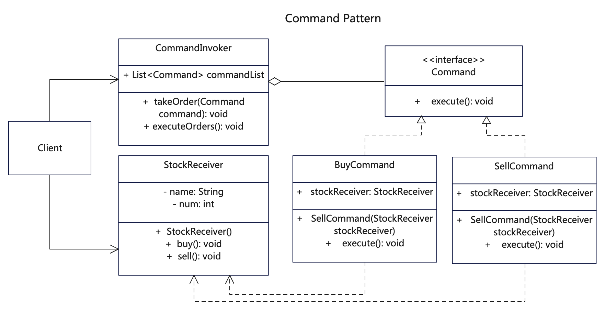

# 【命令设计模式详解】C/Java/JS/Go/Python/TS不同语言实现

# 简介
命令模式（Command Pattern）是一种数据驱动的设计模式，也是一种行为型设计模式。这种模式的请求以命令的形式包裹在对象中，并传给调用对象。调用对象再寻找合适的对象，并把该命令传给相应的处理者。即把请求或操作封装成单个对象，并使其可以被参数化和延迟执行，这种方式将命令和执行者进行了有效解耦。

如果你需要通过操作来参数化对象，可使用命令模式。如果你想要将操作放入队列中、操作的执行或者远程执行操作， 可使用命令模式。如果你想要实现操作回滚功能，可使用命令模式。

# 作用
1. 将不同命令按照抽象命令封装成不同的对象，将这些命令放到调用者里。
2. 客户通过调用者执行命令再去调用接受者的动作，顺序为：客户调用方->调用者->命令对象->接受者。
3. 同其他对象一样，命令也可以实现序列化，从而方便地写入文件或数据库中，实现延迟执行。

# 实现步骤
1. 创建一个抽象命令接口，实现基本的命令方法。
2. 创建多个具体命令类，实现抽象命令接口，以来命令接收者。
3. 创建命令接收者，也就是具体业务类，接受命令并执行动作。
4. 创建命令调用者，这是一个聚合命令的类，添加命令和执行命令。

# UML


# Java代码

## 基础命令接口
```java
// Command.java 命令抽象接口
public interface Command {
   void execute();
}
```

## 具体命令类，可以多个命令
```java
// BuyCommand.java 购买命令，操作receiver，实现了抽象命令类
public class BuyCommand implements Command {
  private StockReceiver stockReceiver;

  public BuyCommand(StockReceiver stockReceiver) {
    this.stockReceiver = stockReceiver;
  }

  // 命令类调用执行者的实际动作
  public void execute() {
    System.out.println(this.getClass().getName() + "::execute() ");
    this.stockReceiver.buy();
  }
}
```

```java
// SellCommand.java 出售命令，操作receiver，实现了抽象命令类
public class SellCommand implements Command {
  private StockReceiver stockReceiver;

  public SellCommand(StockReceiver stockReceiver) {
    this.stockReceiver = stockReceiver;
  }

  // 命令类调用执行者的实际动作
  public void execute() {
    System.out.println(this.getClass().getName() + "::execute() ");
    stockReceiver.sell();
  }
}
```

## 命令调用类
```java
// CommandInvoker.java 命令调用类，通过关联命令来执行命令的调用
public class CommandInvoker {

    private List<Command> commandList = new ArrayList<Command>();

    // 储存命令
    public void takeOrder(Command command) {
        System.out.println(this.getClass().getName() + "::takeOrder() " + command.getClass().getName());
        commandList.add(command);
    }

    // 统一执行
    public void executeOrders() {
        System.out.println(this.getClass().getName() + "::executeOrders() ");
        for (Command command : commandList) {
            command.execute();
        }
        commandList.clear();
    }
}
```

## 命令接收执行类
```java
// StockReceiver.java 命令模式真正的执行类，不直接对外，通过command来调用
public class StockReceiver {

   private String name;
   private int num;

   public StockReceiver(String name, int num) {
      this.name = name;
      this.num = num;
   }

   public void buy() {
      System.out.println(this.getClass().getName() + "::buy() [name=" + this.name + " num=" + this.num + "]");
   }

   public void sell() {
      System.out.println(this.getClass().getName() + "::sell() [name=" + this.name + " num=" + this.num + "]");
   }

   public void setName(String name) {
      this.setName(name);
   }

   public String getName() {
      return this.name;
   }

   public void setNum(int num) {
      this.num = num;
   }

   public int getNum() {
      return this.num;
   }
}
```

## 测试调用
```java

    /*
     * 命令模式是客户端通过一个命令执行者invoker，去执行某个命令command。
     * 而命令则调用了业务类receiver的具体动作，从而完成真正的执行。
     * 这种方式将命令和执行者进行了有效解耦。
     */

    // 先声明一个被操作对象，也就是接收者
    StockReceiver stock1 = new StockReceiver("Apple", 200);

    // 再声明具体的命令
    BuyCommand buyCommand = new BuyCommand(stock1);
    SellCommand sellCommand = new SellCommand(stock1);

    // 最后声明调用者，由调用者来执行具体命令
    CommandInvoker invoker = new CommandInvoker();
    invoker.takeOrder(buyCommand);
    invoker.takeOrder(sellCommand);
    invoker.executeOrders();

    // 再执行一只股票
    StockReceiver stock2 = new StockReceiver("Google", 100);
    BuyCommand buyCommand2 = new BuyCommand(stock2);
    invoker.takeOrder(buyCommand2);
    invoker.executeOrders();
```

# Go代码

## 基础命令接口
```go
// Command.go 命令抽象接口
type Command interface {
  GetName() string
  SetStockReceiver(stockReceiver *StockReceiver)
  Execute()
}
```

## 具体命令类，可以多个命令
```go
// BuyCommand.go 购买命令，操作receiver，实现了抽象命令类
type BuyCommand struct {
  Name          string `default:"BuyCommand"`
  stockReceiver *StockReceiver
}

func (c *BuyCommand) GetName() string {
  return c.Name
}

func (c *BuyCommand) SetStockReceiver(stockReceiver *StockReceiver) {
  c.stockReceiver = stockReceiver
}

// 命令类调用执行者来自行真正的动作
func (c *BuyCommand) Execute() {
  fmt.Println("BuyCommand::Execute() ")
  c.stockReceiver.Buy()
}
```

```go
// SellCommand.go 出售命令，操作receiver，实现了抽象命令类
type SellCommand struct {
  Name          string `default:"BuyCommand"`
  stockReceiver *StockReceiver
}

func (s *SellCommand) GetName() string {
  return s.Name
}

func (s *SellCommand) SetStockReceiver(stockReceiver *StockReceiver) {
  s.stockReceiver = stockReceiver
}

// 命令类调用执行者来自行真正的动作
func (s *SellCommand) Execute() {
  fmt.Println("SellCommand::Execute() ")
  s.stockReceiver.Sell()
}
```

## 命令调用类
```go
// CommandInvoker.go 命令调用类，通过关联命令来执行命令的调用
type CommandInvoker struct {
  Name        string
  commandList []Command
}

func (c *CommandInvoker) GetName() string {
  return c.Name
}

// 储存命令
func (c *CommandInvoker) TakeOrder(command Command) {
  fmt.Println("CommandInvoker::TakeOrder() " + command.GetName())
  c.commandList = append(c.commandList, command)
}

// 统一执行
func (c *CommandInvoker) ExecuteOrders() {
  fmt.Println("CommandInvoker::ExecuteOrders() ")
  for _, command := range c.commandList {
    command.Execute()
  }
  // 命令执行后清除
  c.commandList = c.commandList[:0]
}
```

## 命令接收执行类
```go
// StockReceiver.go 命令模式真正的执行类，不直接对外，通过command来调用
type StockReceiver struct {
  Name string
  Num  int
}

func (s *StockReceiver) Buy() {
  fmt.Println("StockReceiver::Buy() [Name=" +
    s.Name + " Num=" + strconv.Itoa(s.Num) + "]")
}

func (s *StockReceiver) Sell() {
  fmt.Println("StockReceiver::Sell() [Name=" +
    s.Name + " Num=" + strconv.Itoa(s.Num) + "]")
}
```

## 测试调用
```go
// main包下的main入口方法
func main() {
  fmt.Println("test start:")
  /*
   * 命令模式是客户端通过一个命令执行者invoker，去执行某个命令command
   * 而命令则调用了业务类receiver的具体动作，从而完成真正的执行
   * 这种方式将命令和执行者进行了有效解耦。
   */

  // 先声明一个被操作对象，也就是接收者
  var stock1 = &src.StockReceiver{
    Name: "Apple",
    Num:  200,
  }

  // 再声明具体的命令
  var buyCommand = &src.BuyCommand{
    Name: "buyCommand",
  }
  buyCommand.SetStockReceiver(stock1)
  var sellCommand = &src.SellCommand{
    Name: "sellCommand",
  }
  sellCommand.SetStockReceiver(stock1)

  // 最后声明调用者，由调用者来执行具体命令
  var invoker = &src.CommandInvoker{
    Name: "invoker",
  }
  invoker.TakeOrder(buyCommand)
  invoker.TakeOrder(sellCommand)
  invoker.ExecuteOrders()

  // 再执行一只股票
  var stock2 = &src.StockReceiver{
    Name: "Google",
    Num:  100,
  }
  var buyCommand2 = &src.BuyCommand{
    Name: "buyCommand2",
  }
  buyCommand2.SetStockReceiver(stock2)
  invoker.TakeOrder(buyCommand2)
  invoker.ExecuteOrders()
}
```

# C语言代码

## 基础对象定义
```c
// func.h，基础命令结构体head
#include <stdio.h>
#include <stdlib.h>
#include <stdbool.h>
#include <string.h>

// 基础命令结构体
typedef struct Command
{
    char name[50];
    struct StockReceiver *stock_receiver;
    void (*set_stock_receiver)(struct Command *command, struct StockReceiver *);
    void (*execute)(struct Command *);
} Command;

// 接受者对象
typedef struct StockReceiver
{
    char name[50];
    int num;
    void (*buy)(struct StockReceiver *);
    void (*sell)(struct StockReceiver *);
} StockReceiver;
StockReceiver *stock_receiver_constructor(char *name, int num);

// 继承命令结构体
typedef struct BuyCommand
{
    char name[50];
    struct StockReceiver *stock_receiver;
    void (*set_stock_receiver)(struct BuyCommand *command, struct StockReceiver *);
    void (*execute)(struct Command *);
} BuyCommand;
BuyCommand *buy_command_constructor(char *name);

// 继承命令结构体
typedef struct SellCommand
{
    char name[50];
    struct StockReceiver *stock_receiver;
    void (*set_stock_receiver)(struct SellCommand *command, struct StockReceiver *);
    void (*execute)(struct Command *);
} SellCommand;
SellCommand *sell_command_constructor(char *name);

// 命令执行者
typedef struct CommandInvoker
{
    char name[50];
    void (*take_order)(struct CommandInvoker *invoker, Command *command);
    void (*execute_orders)(struct CommandInvoker *invoker);
    // 数组命令列表，记录待执行的命令对象
    struct Command **command_list;
    // 数组长度记录
    int command_list_size;
    // 若是柔性数组，则放在结构体最后，可以动态追加内容
    // struct Command *command_list[];
} CommandInvoker;
CommandInvoker *command_invoker_constructor(char *name);
```

## 具体命令类，可以多个命令
```c
// buy_command.c 购买命令，操作receiver，实现了抽象命令类
#include "func.h"

// 购买命令，操作receiver，实现了抽象命令类

void set_buy_stock_receiver(BuyCommand *command, StockReceiver *receiver)
{
  command->stock_receiver = receiver;
}

// 命令类调用执行者来自行真正的动作
void buy_command_execute(Command *command)
{
  printf("\r\n BuyCommand::execute() [command->name=%s]", command->name);
  command->stock_receiver->buy(command->stock_receiver);
}

// 创建Buy命令对象
BuyCommand *buy_command_constructor(char *name)
{
  Command *command = (Command *)malloc(sizeof(Command));
  strncpy(command->name, name, 50);
  command->execute = &buy_command_execute;
  // 转为BuyCommand
  BuyCommand *buy_command = (BuyCommand *)command;
  buy_command->set_stock_receiver = &set_buy_stock_receiver;
  return buy_command;
}
```

```c
// sell_command.c 出售命令，操作receiver，实现了抽象命令类
#include "func.h"

// 出售命令，操作receiver，实现了抽象命令类

void set_sell_stock_receiver(SellCommand *command, StockReceiver *receiver) {
  command->stock_receiver = receiver;
}

// 命令类调用执行者来自行真正的动作
void sell_command_execute(Command *command) {
  printf("\r\n SellCommand::execute() [command->name=%s]", command->name);
  command->stock_receiver->sell(command->stock_receiver);
}

// 创建Sell命令对象
SellCommand *sell_command_constructor(char *name)
{
  Command *command = (Command *)malloc(sizeof(Command));
  strncpy(command->name, name, 50);
  command->execute = &sell_command_execute;
  // 转为SellCommand
  SellCommand *buy_command = (SellCommand *)command;
  buy_command->set_stock_receiver = &set_sell_stock_receiver;
  return buy_command;
}
```

## 命令调用类
```c
// command_invoker.c 命令调用类，通过关联命令来执行命令的调用
#include "func.h"

/*
命令调用类，通过关联命令来实行命令的调用
在命令模式中，Invoker（调用者）是一个可选的组件，
它负责将Command对象传递给Receiver，
并调用Command对象的execute方法来执行命令。
Invoker在实现命令模式时可以有多种实现方式。
*/

void print_command_list(Command **list, int command_list_size)
{
  printf("\r\nThe current command_list:");
  for (int i = 0; i < command_list_size; i++)
  {
    printf("\r\n [i=%d, command->name=%s]", i, list[i]->name);
  }
}

// 把命令存储到调用者的命令列表
void invoker_take_order(CommandInvoker *invoker, Command *command)
{
  printf("\r\n CommandInvoker::take_order() [invoker->name=%s, command->name=%s, invoker->command_list_size=%d]", invoker->name, command->name, invoker->command_list_size);

  // 列表长度增加1位
  int new_command_list_size = invoker->command_list_size + 1;

  /* 如果采取柔性数组，则无需申请新空间和复制内容 */
  // 把原列表命令暂存下来
  Command **old_command_list = invoker->command_list;
  // 给命令列表申请新空间
  invoker->command_list = (Command **)calloc(new_command_list_size, sizeof(Command *));
  // 复制原有命令到命令列表，如果采取柔性数组则无需复制
  for (int i = 0; i < invoker->command_list_size; i++)
  {
    invoker->command_list[i] = old_command_list[i];
  }
  free(old_command_list);

  // 把新的命令添加列表最后
  invoker->command_list[new_command_list_size - 1] = command;
  invoker->command_list_size = new_command_list_size;
  
  // 打印当前有多少命令
  // print_command_list(invoker->command_list, invoker->command_list_size);
}

// 统一执行全部命令
void invoker_execute_orders(CommandInvoker *invoker)
{
  printf("\r\n CommandInvoker::execute_orders() ");
  int command_list_size = invoker->command_list_size;
  Command **command_list = invoker->command_list;
  for (int i = 0; i < command_list_size; i++)
  {
    Command *command = command_list[i];
    command->execute(command);
    command_list[i] = NULL;
  }
  // 命令执行完后清除命令列表
  invoker->command_list_size = 0;
  invoker->command_list = (Command **)calloc(0, sizeof(Command *));
}

// 初始化CommandInvoker命令对象
CommandInvoker *command_invoker_constructor(char *name)
{
  printf("\r\n command_invoker_constructor() [name=%s]", name);
  CommandInvoker *invoker = (CommandInvoker *)malloc(sizeof(CommandInvoker));
  strncpy(invoker->name, name, 50);
  invoker->command_list_size = 0;
  invoker->take_order = &invoker_take_order;
  invoker->execute_orders = &invoker_execute_orders;
  return invoker;
}
```

## 命令接收执行类
```c
// stock_receiver.c 命令模式真正的执行类，不直接对外，通过command来调用
#include "func.h"

/* 命令模式真正的执行类，不直接对外，通过command来调用 */

void stock_receiver_buy(StockReceiver *stock_receiver) {
  printf("\r\n StockReceiver::buy() [name=%s num=%d]", stock_receiver->name, stock_receiver->num);
}

void stock_receiver_sell(StockReceiver *stock_receiver) {
  printf("\r\n StockReceiver::sell() [name=%s num=%d]", stock_receiver->name, stock_receiver->num);
}

// 创建StockReceiver命令对象
StockReceiver *stock_receiver_constructor(char *name, int num)
{
  printf("\r\n stock_receiver_constructor() [name=%s, num=%d]", name, num);
  StockReceiver *receiver = (StockReceiver *)malloc(sizeof(StockReceiver));
  strncpy(receiver->name, name, 50);
  receiver->num = num;
  receiver->buy = &stock_receiver_buy;
  receiver->sell = &stock_receiver_sell;
  return receiver;
}
```

## 测试调用
```c
#include "../src/func.h"

int main(void)
{
    printf("test start:\r\n");
    /*
     * 命令模式是一种行为设计模式，它将请求或操作封装成单个对象，并使其可以被参数化和延迟执行。
     * 在命令模式中，客户端通过一个命令执行者invoker，去执行某个命令command
     * 而命令则调用了业务类receiver的具体动作，从而完成真正的执行
     * 这种方式将命令和执行者进行了有效解耦。
     */

    // 先声明一个被操作对象，也就是接收者
    StockReceiver *stocker_receiver1 = stock_receiver_constructor("Apple", 200);

    // 再声明具体的命令
    BuyCommand *buy_command = buy_command_constructor("buy_command");
    buy_command->set_stock_receiver(buy_command, stocker_receiver1);

    SellCommand *sell_command = sell_command_constructor("sell_command");
    sell_command->set_stock_receiver(sell_command, stocker_receiver1);

    // 最后声明调用者，由调用者来执行具体命令
    CommandInvoker *invoker = command_invoker_constructor("invoker");
    invoker->take_order(invoker, (Command *)buy_command);
    invoker->take_order(invoker, (Command *)sell_command);
    invoker->execute_orders(invoker);

    // 再执行一只股票，声明新的接受者
    StockReceiver *stock_receiver2 = stock_receiver_constructor("Google", 100);
    BuyCommand *buy_command2 = buy_command_constructor("buy_command2");
    // 这次只有buy命令
    buy_command2->set_stock_receiver(buy_command2, stock_receiver2);
    // 还用原来的invoker，或者新建invoker
    invoker->take_order(invoker, (Command *)buy_command2);
    invoker->execute_orders(invoker);

    return 0;
}
```

## 更多语言版本
不同语言设计模式源码源码：[https://github.com/microwind/design-pattern](https://github.com/microwind/design-pattern)