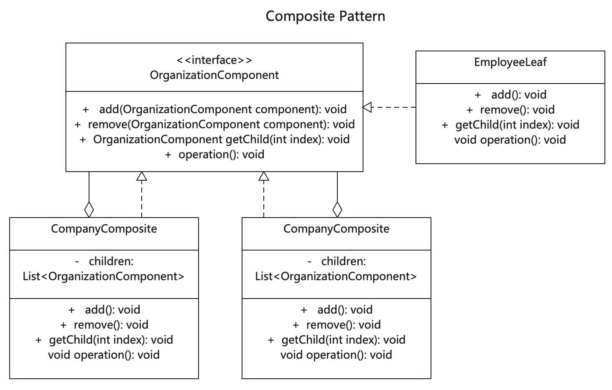

# 简介
组合模式（Composite Pattern），又叫部分整体模式是一种结构型设计模式。用于把一组类似的对象当作一个单一对象来看。组合模式依据树形结构来组合对象，用来构建某个部分或整体对象。

 如果你需要实现树状对象结构，可以使用组合模式。如果你希望客户端代码以相同方式处理简单和复杂元素，可以使用该模式。

# 作用
1. 符合开闭原则。无需更改现有代码，就可以在应用中添加新元素，使之成为对象树的一部分。
2. 模糊了简单元素和复杂元素的概念，程序可以像处理简单元素一样来处理复杂元素，从而使得程序与复杂元素的内部结构解耦。

# 实现步骤
1. 创建抽象构件（Component）接口，用于声明树叶构件和树枝构件的默认行为。
2. 创建树枝构件（Composite）角色 / 中间构件：是组合中的分支节点对象，它有子节点，用于继承和实现抽象构件。它的主要作用是存储和管理子部件，通常包含 Add()、Remove()、GetChild() 等方法。
3. 定义树叶构件（Leaf）角色：是组合中的叶子节点对象，它没有子节点，用于继承或实现抽象构件。

# UML
