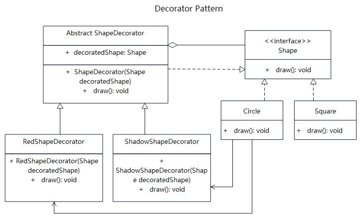

# 简介
装饰器模式（Decorator Pattern）是一种结构型设计模式。将对象放入到一个特殊封装的对象中，为这个对象绑定新的行为，具备新的能力，同时又不改变其原有结构。

如果你希望在无需修改代码的情况下即可使用对象，且希望在运行时为对象新增额外的行为，可以使用装饰模式。或者你用继承来扩展对象行为的方案难以实现或者根本不可行，你可以使用该模式。

# 作用
1. 动态地给一个对象添加一些额外的职责，相比生成子类更为灵活。
2. 在不想增加很多子类的情况下扩展类的能力，实现强大扩展能力。

# 实现步骤
1. 创建一个基础工具接口或抽象类，设定基本的方法。
2. 增加具体工具类实现基础接口，保持工具类的规范性。
3. 创建一个装饰器抽象类，用于装饰具体工具，聚合基础工具，同时也可以实现基础工具的接口。
4. 增加多个装饰器类，继承抽象类，根据需要设定装饰能力。

# UML
