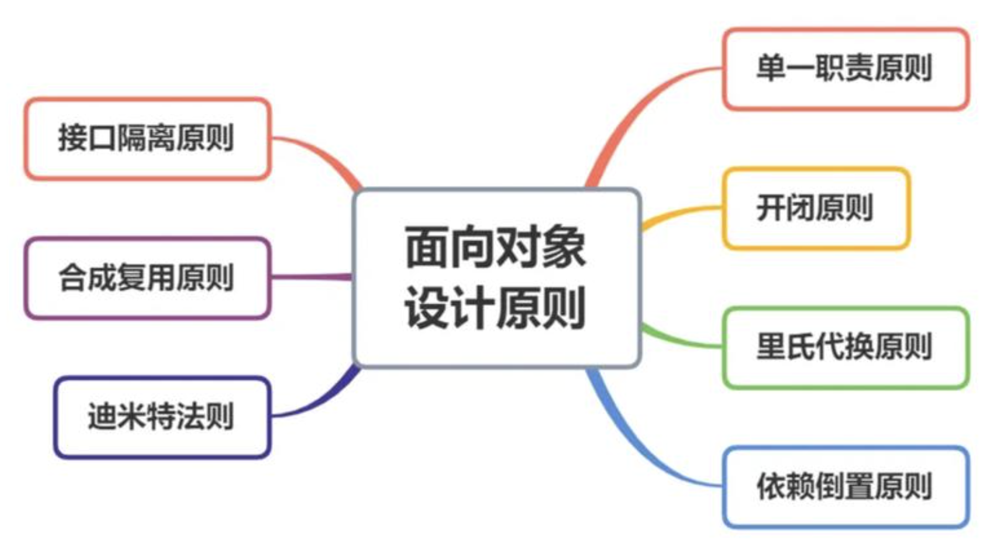

# 设计模式的7大原则

- 开闭原则，对扩展开放，对修改关闭。希望程序扩展功能的时候，通过开放的接口来实现，而不是修改代码。[查看例子](./open-closed/)
- 单一职责原则，对一个类来说的，职责应该单一，只做一件或一类具体的事情。[查看例子](./single-responsibility/)
- 依赖倒置原则，是开闭原则的基础。指针对接口编程，高层模块不应该依赖低层模块，二者都依赖于抽象而不依赖于具体实现编程。[查看例子](./dependency-inversion/)
- 接口隔离原则，一个类对另一个类的依赖应该建立在最小的接口上，不依赖不需要的接口。尽量强调降低依赖，降低耦合。[查看例子](./interface-segregation/)
- 合成复用原则，写代码会涉及到代码复用，尽量使用组合而少使用继承。大多数情况下组合可以替代继承。[查看例子](./composite-reuse/)
- 迪米特法则，又称最少知道原则，一个实体应当尽量少地与其他实体之间发生相互作用，使得系统功能模块相对独立。[查看例子](./law-of-demeter/)
- 里氏替换原则，任何父类出现的地方，子类也可以出现。子类可以实现父类的抽象方法，但不能覆盖父类的非抽象方法。[查看例子](./liskov-substitution/)

这几个原则也是面向对象编程原则，也有说6个的。总体上的意思是代码需要重用、要便于扩展，尽量通过抽象来解耦，尽量减少依赖关系。详细请看源码例子。
