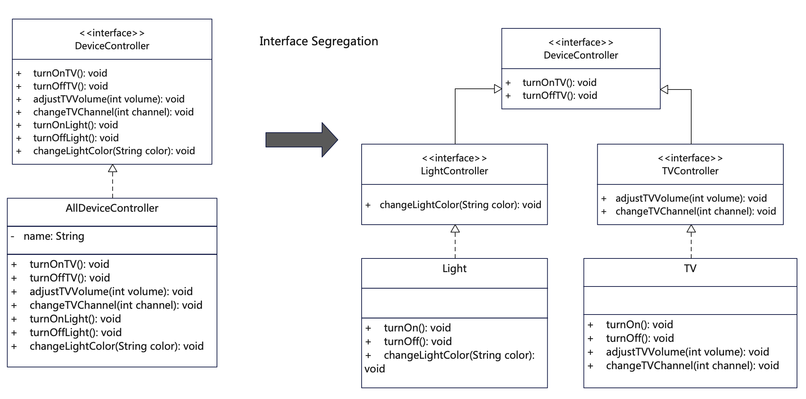

# 说明
接口隔离原则（Interface Segregation Principle, 简称ISP）原意是客户端不应该被强迫依赖它不需要的接口。有时客户端为了调用服务，被强迫实现一些使用不到的接口，这会导致代码的臃肿和对业务的污染。可以把复杂的接口中进行分组，将一个接口分解为多个接口，每个接口服务于一个子模块。简单地说，就是将单个庞大的接口改为多个小接口，接口之间相互隔离。

具体来讲，有以下两点：

1. 接口建立在最小化抽象上，接口功能单一明确，按照单一职责来建立接口，而不要将接口设计得过于复杂。

2. 客户端不依赖它不需要的接口方法，只依赖它必须的接口方法，也就是最小依赖原则，以此保证代码结构清晰与纯洁性。

过于臃肿的接口设计是对接口的污染，因此要尽可能简化，但也要避免接口过于原子化，从而导致数量过多。总之要恰如其分，刚刚好。
接口隔离和单一职责在概念上有点接近，相互交叉。接口隔离强调的是给客户端的接口越少越少，而不是越多，也就是职责清晰单一。

# UML


# 代码
```java
/**
 * 电器设备的基础控制接口，约定基本的一些控制方法【可选】
 */
public interface DeviceController {
    public void turnOn();
    public void turnOff();
}
```

```java
/**
 * Light控制接口，包括TV需要的控制方法，供Light具体对象实现
 * 每个具体控制对象有其自身的接口，不跟其他对象混在一起
 */
public interface LightController extends DeviceController {
    public void changeLightColor(String color);
}
```

```java
/**
 * TV控制接口，包括TV需要的控制方法，供TV具体对象实现
 * 每个具体控制对象有其自身的接口，不跟其他对象混在一起
 */
public interface TVController extends DeviceController {
  public void adjustTVVolume(int volume);

  public void changeTVChannel(int channel);
}
```

```java
/**
 * Light实现类，实现Light控制接口的全部方法
 */
public class Light implements LightController {
    @Override
    public void turnOn() {
        // 执行灯光打开操作
        System.out.println("Turn on Light");
    }

    @Override
    public void turnOff() {
        // 执行灯光关闭操作
        System.out.println("Turn off Light");
    }

    @Override
    public void changeLightColor(String color) {
        // 执行灯光颜色切换
        System.out.println("Change Light color to " + color);
    }
}
```

```java
/**
 * TV实现类，实现TV控制接口的全部方法
 */
public class TV implements TVController {
  @Override
  public void turnOn() {
    System.out.println("Turn on TV");
    // 执行电视打开操作
  }

  @Override
  public void turnOff() {
    System.out.println("Turn off TV");
    // 执行电视关闭操作
  }

  @Override
  public void adjustTVVolume(int volume) {
    // 执行调节音量操作
    System.out.println("Adjust TV volume to " + volume);
  }

  @Override
  public void changeTVChannel(int channel) {
    // 执行频道切换操作
    System.out.println("Change TV channel to " + channel);
  }

}
```

# 反例
```java
/**
 * 这个例子违反了接口隔离原则，为了方面理解，把全部类放在了一起。
 * 1. 接口过于庞大，比较臃肿，职责不单一。
 * 2. 实现对象依赖了并不需要的接口方法，在实现时浪费。
 */
public class InterfaceSegregation_counter {
    public InterfaceSegregation_counter() {
        return;
    }

    // 定义设备控制接口，把各种控制都汇总在一个大接口中
    public interface DeviceController {
        public void turnOnTV();

        public void turnOffTV();

        public void adjustTVVolume(int volume);

        public void changeTVChannel(int channel);

        public void turnOnLight();

        public void turnOffLight();

        public void changeLightColor(String color);
    }

    // 定义具体全部接口实现类，里面方法太多，将不同控制混杂在了一起
    // 如果按实体分为TV实现类和Light实现类，那么接口是一个，需要实现的方法又太多
    public class AllDeviceController implements DeviceController {
        @Override
        public void turnOnTV() {
            System.out.println("Turn on TV");
            // 执行电视打开操作
        }

        @Override
        public void turnOffTV() {
            System.out.println("Turn off TV");
            // 执行电视关闭操作
        }

        @Override
        public void adjustTVVolume(int volume) {
            // 执行调节音量操作
            System.out.println("Adjust TV volume to " + volume);
        }

        @Override
        public void changeTVChannel(int channel) {
            // 执行频道切换操作
            System.out.println("Change TV channel to " + channel);
        }

        @Override
        public void turnOnLight() {
            // 执行灯光打开操作
            System.out.println("Turn on Light");
        }

        @Override
        public void turnOffLight() {
            // 执行灯光关闭操作
            System.out.println("Turn off Light");
        }

        @Override
        public void changeLightColor(String color) {
            // 执行灯光颜色切换
            System.out.println("Change Light color to " + color);
        }
    }
}
```

## 更多语言版本
面向对象设计原则源码：[https://github.com/microwind/design-pattern/oop-principles](https://github.com/microwind/design-pattern/oop-principles)