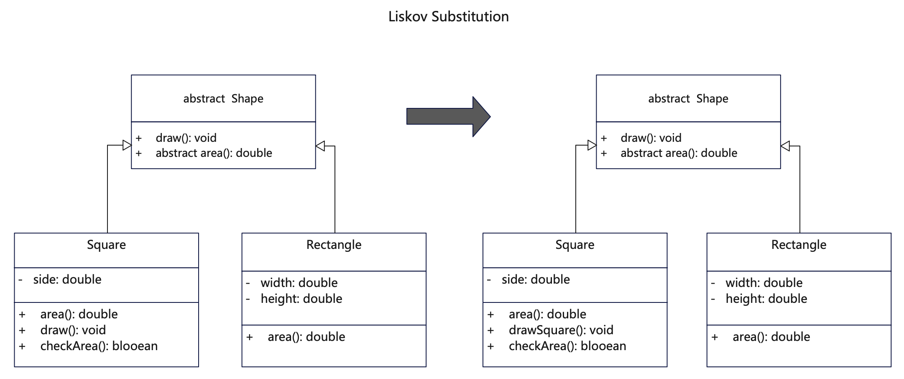

# 说明
里氏代换原则（Liskov Substitution Principle，LSP），由芭芭拉·利斯科夫（Barbara Liskov）提出。它强调子类对象（派生类）必须能够替换掉其父类对象（基类）而不影响程序的正确性。换句话说，所有引用基类的地方必须能透明地使用其子类的对象，简单说即一个地方使用了父类，那么也可以使用子类。这需要子类能够表现出与其父类一致的行为，而不去改变父类的预期行为。

子类为什么可以代换基类？
其实原因很简单，只要存在继承关系，基类的所有非私有属性或者方法，子类都可以通过继承获得，反过来则不成立，因为子类很有可能扩充自身的非私有属性或者方法，这个时候不能用基类获取子类新增的这些属性或者方法。

简单理解里氏代换原则：
1. 子类能够替换其父类：任何一个基类可以出现的地方，其子类就可以出现，并且替换掉基类时不会产生错误或异常。
2. 行为一致性：子类应该继承父类的行为，且子类在任何场景下都能表现出与父类对象一致的行为，不得改变父类已有的行为。
3. 尽量不强制重写父类方法：如果子类为了满足某种需求而修改了父类的行为，那么很可能违反了里氏代换原则。子类应该通过增加新的方法来扩展父类的功能，而不是通过重写父类的方法来改变其行为。

# UML


# 代码
```java
/**
 * 抽象图形父类，抽象方法供重写，非抽象方法尽量不去覆盖
 */
public abstract class Shape {
    public void draw() {
        System.out.println("Drawing Shape. area:" + this.area());
    }

    public abstract double area();
}
```

```java
/**
 * Square对象类，继承父类Shape
 */
public class Square extends Shape {
    private double side;

    public Square(double side) {
        this.side = side;
    }

    // 不重写父类的draw方法
    // 另外起名，或通过重载得到新方法
    // public void draw(int type) {
    public void drawSquare() {
        if (checkArea()) {
            System.out.println("Haha Drawing Square. area:" + this.area());
        } else {
            System.out.println("Don't draw square");
        }
    }

    public boolean checkArea() {
        if (this.area() > 100) {
            return false;
        }
        return true;
    }

    @Override
    public double area() {
        return side * side;
    }
}
```

```java
/**
 * Rectangle类，继承父类
 */
public class Rectangle extends Shape {
  private double width;
  private double height;

  public Rectangle(double width, double height) {
    this.width = width;
    this.height = height;
  }

  // 这里没有覆盖父类的draw()方法

  @Override
  public double area() {
    return width * height;
  }
}
```

# 反例
```java
/**
 * 这个例子违反了里氏代换原则，为了方面理解，把全部类放在了一起。
 * 1. 子类覆盖了父类的方法，改变了父类方法的意图。
 * 2. 因为子类改变了父类行为，如果用子类替换其父类可能会引起问题。
 */
public class LiskovSubstitution_counter {
    public LiskovSubstitution_counter() {
        return;
    }

    // 图形父类
    public abstract class Shape {
        public void draw() {
            System.out.println("Drawing Shape. area:" + this.area());
        }

        public abstract double area();
    }

    // 正方形子类，继承自图形类
    public class Square extends Shape {
        private double side;

        public Square(double side) {
            this.side = side;
        }

        // 重写父类的draw方法，同时改变了父类的行为
        @Override
        public void draw() {
            if (checkArea()) {
                System.out.println("Drawing Square. area:" + this.area());
            } else {
                // 这里存在子类其他的行为，与父类预期不一致
                System.out.println("Don't draw square");
            }
        }

        public boolean checkArea() {
            if (this.area() > 100) {
                return false;
            }
            return true;
        }

        @Override
        public double area() {
            return side * side;
        }
    }

    // 矩形类，继承自图形类
    public class Rectangle extends Shape {
        private double width;
        private double height;

        public Rectangle(double width, double height) {
            this.width = width;
            this.height = height;
        }

        // 这里没有覆盖父类的draw()方法

        @Override
        public double area() {
            return width * height;
        }
    }
}
```

## 更多语言版本
面向对象设计原则源码：[https://github.com/microwind/design-pattern/oop-principles](https://github.com/microwind/design-pattern/oop-principles)