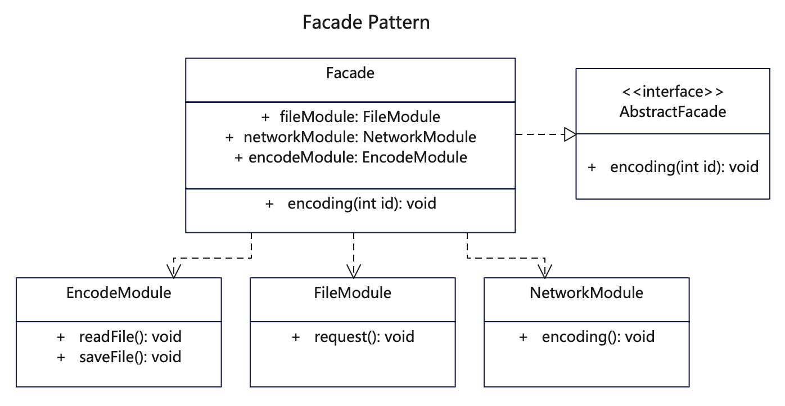

# 简介
外观模式（Facade Pattern），也叫门面模式，是一种结构型设计模式。它向现有的系统添加一个高层接口，隐藏子系统的复杂性，这个接口使得子系统更加容易使用。

如果你需要一个指向复杂子系统的直接接口，且该接口的功能有限，则可以使用外观模式。或者需要将子系统组织为多层结构，可以使用外观。

# 作用
1. 让业务代码通过统一接口与内部子系统隔离。
2. 降低访问内部子系统时的复杂度，简化客户端之间的接口。

# 实现步骤
1. 创建统一外观接口和实现类，用于衔接调用方与子系统。
2. 创建不同子模块/子模块，这些子模块可以共同实现某通用接口，也可以各自独立。
3. 通过统一外观接口来访问这些复杂子类。

# UML
