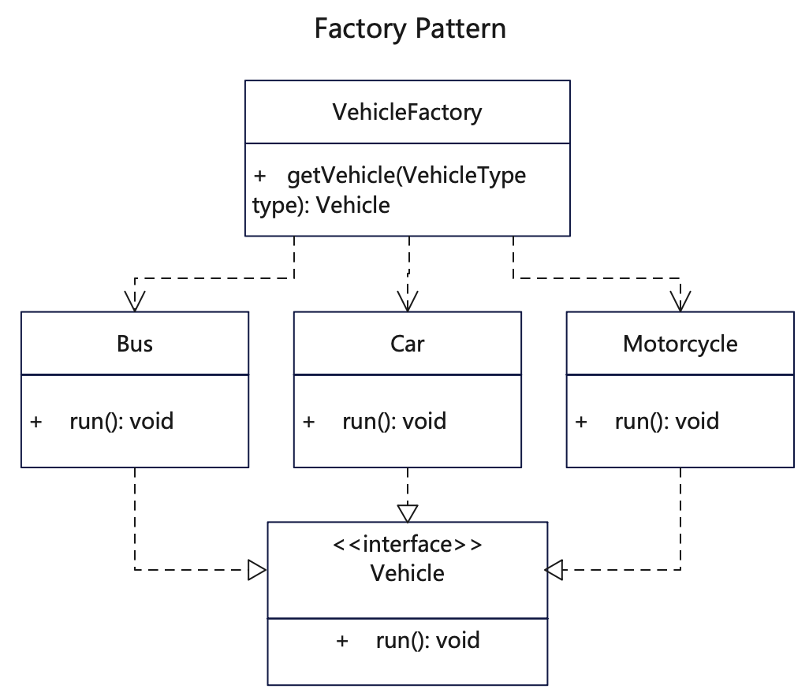

# 简介
工厂模式（Factory Pattern）是一种创建型设计模式， 由工厂类提供统一的创建对象的方法，允许子类决定实例化对象的类型。
，将对象实例化与使用分离开。

如果你希望开发者能扩展你的软件或框架的内部组件，可使用工厂方法。或者你希望复用现有对象来节省系统资源，而不是每次都重新创建对象， 可使用工厂方法。

简单对象，特别是只需要通过 new 就可以完成创建的对象，无需使用工厂模式。
# 作用
1. 对象创建和调用解耦，便于实例化时进行统一干预和修改。
2. 屏蔽复杂的对象创建逻辑，交由统一的工厂方法。
3. 采用统一的方式来实例化，还可以防止内存中实例对象不断增多。

# 实现步骤
1. 建立一个产品接口类或抽象类，添加一个空的工厂方法，该方法的返回类型必须遵循通用的产品接口。
2. 新建多个具体产品类，均实现该产品接口类。
3. 建立一个工厂类，提供按类型实例化具体产品类的方法，返回抽象接口类型。
4. 想要获取具体产品对象时，调用工厂方法来实例化，并由调用方来确定对象的类型。

# UML


# 代码

## 产品接口类
```java
// Vehicle.java 车辆基础类
public interface Vehicle {
  void run();
}
```

## 具体产品类，实现产品接口

```java
// Car.java 具体车辆
public class Car implements Vehicle {
 
  @Override
  public void run() {
     System.out.println("Car::run().");
  }
}
```

```java
// Bus.java 具体车辆
public class Bus implements Vehicle {
 
  @Override
  public void run() {
     System.out.println("Bus::run().");
  }
}
```

```java
// Motorcycle.java 具体车辆
public class Motorcycle implements Vehicle {
 
  @Override
  public void run() {
     System.out.println("Motorcycle::run().");
  }
}
```

```java
// Van.java 具体车辆
public class Van implements Vehicle {
 
  @Override
  public void run() {
     System.out.println("Van::run().");
  }
}
```

## 工厂类，创建具体产品
```java
// VehicleFactory.java 外观模式实现类，是外部调用与内部子系统的衔接层
public class VehicleFactory {
  public Vehicle getVehicle(VehicleType type) {
    switch (type) {
      case BUS:
        return new Bus();
      case CAR:
        return new Car();
      case MOTORCYCLE:
        return new Motorcycle();
      case VAN:
        return new Van();
      default:
        return null;
    }

  }
}
```

## 测试调用
```java
    /**
     * 工厂模式由工厂类提供统一的创建对象的方法，省去直接new，而是通过统一方法来创建。
     * 这样的好处就是让对象创建和调用解耦，便于在创建对象时统一干预。
     */
    VehicleFactory vehicleFactory = new VehicleFactory();

    // 获取Bus对象，并调用它的 run 方法
    Vehicle bus = vehicleFactory.getVehicle(VehicleType.BUS);
    bus.run();

    // 获取Car对象，并调用它的 run 方法
    Vehicle car = vehicleFactory.getVehicle(VehicleType.CAR);
    // 类型转为Car
    Car car1 = (Car) car;
    car1.run();

    // 获取Motorcycle对象，并调用它的 run 方法
    // 类型直接转为Motorcycle
    Motorcycle motorcycle = (Motorcycle) vehicleFactory.getVehicle(VehicleType.MOTORCYCLE);
    motorcycle.run();

    // 获取Motorcycle对象，并调用它的 run 方法
    Vehicle van = vehicleFactory.getVehicle(VehicleType.VAN);
    van.run();
```

## 更多语言版本
不同语言实现设计模式：[https://github.com/microwind/design-pattern](https://github.com/microwind/design-pattern)s