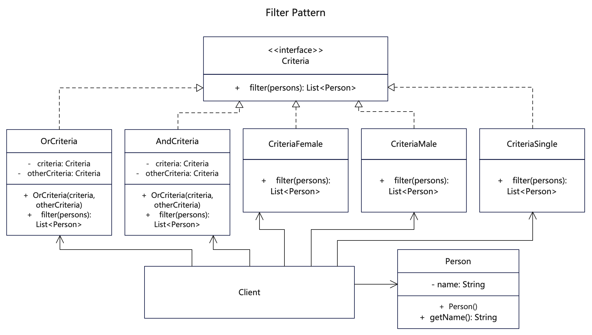

# 【过滤器设计模式详解】C/Java/JS/Go/Python/TS不同语言实现

# 简介
过滤器模式（Filter Pattern）或标准模式（Criteria Pattern），是一种结构型模式。这种模式允许使用不同的标准条件来过滤一组对象，并通过逻辑运算的方式把各条件连接起来，它结合多个标准来获得单一标准。

例子将创建一个 Person 对象、Criteria 接口和实现了该接口的实体类，来过滤 Person 对象的列表。Test 类使用 Criteria 对象，基于各种标准和它们的结合来过滤 Person 对象的列表。

# 作用
1. 可以通过层层筛选，过滤出自己想要的结果。
2. 面向接口编程，将对象过滤，接口不依赖对象；对象无入侵，每次只需要增加规则就行了，不用修改过滤对象类。

# 实现步骤
1. 创建Criteria基础接口，定义过滤方法。
2. 创建多个条件类，实现过滤逻辑。
3. 客户端调用时，通条件类过滤数据。

# UML


# Java代码

## 标准接口类
```java
// Criteria.java 定义抽象标准接口，聚合实体对象
public interface Criteria {
   public List<Person> filter(List<Person> persons);
}
```

## 具体标准实现类

```java
// AndCriteria.java 定义And过滤标准
public class AndCriteria implements Criteria {

   private Criteria criteria;
   private Criteria otherCriteria;

   public AndCriteria(Criteria criteria, Criteria otherCriteria) {
      this.criteria = criteria;
      this.otherCriteria = otherCriteria;
   }

   @Override
   public List<Person> filter(List<Person> persons) {
      List<Person> firstCriteriaPersons = criteria.filter(persons);
      return otherCriteria.filter(firstCriteriaPersons);
   }
}
```

```java
// OrCriteria.java 定义Or过滤标准
public class OrCriteria implements Criteria {

   private Criteria criteria;
   private Criteria otherCriteria;

   public OrCriteria(Criteria criteria, Criteria otherCriteria) {
      this.criteria = criteria;
      this.otherCriteria = otherCriteria;
   }

   @Override
   public List<Person> filter(List<Person> persons) {
      List<Person> firstCriteriaItems = criteria.filter(persons);
      List<Person> otherCriteriaItems = otherCriteria.filter(persons);

      for (Person person : otherCriteriaItems) {
         if (!firstCriteriaItems.contains(person)) {
            firstCriteriaItems.add(person);
         }
      }
      return firstCriteriaItems;
   }
}
```

```java
// CriteriaFemale.java 根据标准接口实现的过滤
public class CriteriaFemale implements Criteria {

  @Override
  public List<Person> filter(List<Person> persons) {
    List<Person> femalePersons = new ArrayList<Person>();
    for (Person person : persons) {
      if (person.getGender().equalsIgnoreCase("FEMALE")) {
        femalePersons.add(person);
      }
    }
    return femalePersons;
  }
}
```

```java
// CriteriaMale.java 根据标准接口实现的过滤
public class CriteriaMale implements Criteria {

   @Override
   public List<Person> filter(List<Person> persons) {
      List<Person> malePersons = new ArrayList<Person>();
      for (Person person : persons) {
         if (person.getGender().equalsIgnoreCase("MALE")) {
            malePersons.add(person);
         }
      }
      return malePersons;
   }
}
```

```java
// CriteriaSingle.java 根据标准接口实现按属性的过滤
public class CriteriaSingle implements Criteria {

   @Override
   public List<Person> filter(List<Person> persons) {
      List<Person> singlePersons = new ArrayList<Person>();
      for (Person person : persons) {
         if (person.getStatus().equalsIgnoreCase("SINGLE")) {
            singlePersons.add(person);
         }
      }
      return singlePersons;
   }
}
```

## 业务实体类
```java
// Person.java 定义一个实体类，用来过滤的对象
public class Person {

   private String name;
   private String gender;
   private String status;

   public Person(String name, String gender, String status) {
      this.name = name;
      this.gender = gender;
      this.status = status;
   }

   public String getName() {
      return name;
   }

   public String getGender() {
      return gender;
   }

   public String getStatus() {
      return status;
   }

   public String toString() {
      return "Person : [ Name : " + getName() + ", Gender : "
            + getGender() + ", Marital Status : " + getStatus() + " ]";
   }
}
```

## 测试调用
```java
    /**
     * 过滤器模式就是不断组合过滤条件，然后层层过滤的模式
     * 这里是简单演示，用List筛选来模拟过滤，实际例子有各种数据结构
     */
    List<Person> persons = new ArrayList<Person>();

    persons.add(new Person("王男单", "Male", "Single"));
    persons.add(new Person("李男婚", "Male", "Married"));
    persons.add(new Person("张女婚", "Female", "Married"));
    persons.add(new Person("赵女单", "Female", "Single"));
    persons.add(new Person("刘男单", "Male", "Single"));
    persons.add(new Person("杨男单", "Male", "Single"));

    Criteria male = new CriteriaMale();
    Criteria female = new CriteriaFemale();
    Criteria single = new CriteriaSingle();
    Criteria singleMale = new AndCriteria(single, male);
    Criteria singleOrFemale = new OrCriteria(single, female);

    // 查询男性
    System.out.println("Males: ");
    printPersons(male.filter(persons));

    // 查询女性
    System.out.println("\nFemales: ");
    printPersons(female.filter(persons));

    // 嵌套查询女性且单身
    System.out.println("\nFemales and Single: ");
    printPersons(single.filter(female.filter(persons)));

    // 查询男性男性单身
    System.out.println("\nSingle Males: ");
    printPersons(singleMale.filter(persons));

    // 查询女性或单身
    System.out.println("\nSingle Or Females: ");
    printPersons(singleOrFemale.filter(persons));
```

# C代码

## head文件
```c
// func.h文件
#include <stdio.h>
#include <ctype.h>
#include <stdlib.h>
#include <stdbool.h>
#include <string.h>

char *str_toupper(char str[]);
char *str_tolower(char str[]);

// 定义用于过滤的Person数组查询对象
// 因C语言无法定义动态数组，将数组长度存在此处
typedef struct FilterPersons
{
    int length;
    struct Person **persons;
} FilterPersons;

// 定义一个实体类，用来过滤的对象
typedef struct Person
{
    char name[50];
    char gender[20];
    char status[20];
    char *(*get_name)(struct Person *);
    char *(*to_string)(struct Person *);
    bool (*is_contained)(struct Person *, struct FilterPersons *);
} Person;
Person *person_constructor(char *name, char *gender, char *status);

// 定义抽象标准接口，聚合要过滤的对象集合
typedef struct Criteria
{
    struct Criteria *first_criteria;
    struct Criteria *other_criteria;
    FilterPersons *(*filter)(FilterPersons *, struct Criteria *);
} Criteria;

// 根据标准接口实现的过滤
typedef struct CriteriaFemale
{
    FilterPersons *(*filter)(FilterPersons *, struct Criteria *);
} CriteriaFemale;
CriteriaFemale *criteria_female_constructor();

// 根据标准接口实现的过滤
typedef struct CriteriaMale
{
    FilterPersons *(*filter)(FilterPersons *, struct Criteria *);
} CriteriaMale;
CriteriaMale *criteria_male_constructor();

// 根据标准接口实现的过滤
typedef struct CriteriaSingle
{
    FilterPersons *(*filter)(FilterPersons *, struct Criteria *);
} CriteriaSingle;
CriteriaSingle *criteria_single_constructor();

// 定义And过滤标准
typedef struct AndCriteria
{
    struct Criteria *first_criteria;
    struct Criteria *other_criteria;
    FilterPersons *(*filter)(FilterPersons *, struct Criteria *);
} AndCriteria;
AndCriteria *and_criteria_constructor(Criteria *, Criteria *);

// 定义Or过滤标准
typedef struct OrCriteria
{
    struct Criteria *first_criteria;
    struct Criteria *other_criteria;
    FilterPersons *(*filter)(FilterPersons *, struct Criteria *);
} OrCriteria;
OrCriteria *or_criteria_constructor(Criteria *, Criteria *);
```

## 条件接口类
```c
// criteria.c 定义抽象标准接口，聚合实体对象
#include "func.h"
// c语言没有抽象类或接口，Criterial作为基础struct定义在head， 这里放一些公共函数
char *str_toupper(char str[])
{
    int size = strlen(str);
    char *result = (char *)malloc(size * sizeof(char));
    int i = 0;
    while (str[i])
    {
        result[i] = toupper(str[i]);
        i++;
    }

    return result;
}

char *str_tolower(char str[])
{
    int size = strlen(str);
    char *result = (char *)malloc(size * sizeof(char));
    int i = 0;
    while (str[i])
    {
        result[i] = tolower(str[i]);
        i++;
    }

    return result;
}

```

## 具体标准实现类

```c
// and_criteria.c 定义And过滤标准
#include "func.h"
// 先过滤条件1，再把结果按照条件2进行过滤
FilterPersons *and_criteria_filter(FilterPersons *filter, Criteria *criteria)
{
  FilterPersons *first_filter = criteria->first_criteria->filter(filter, criteria);
  return criteria->other_criteria->filter(first_filter, criteria);
}

AndCriteria *and_criteria_constructor(Criteria *first_criteria, Criteria *other_criteria)
{
  Criteria *criteria = (Criteria *)malloc(sizeof(Criteria));
  criteria->filter = &and_criteria_filter;
  AndCriteria *and_criteria = (AndCriteria *)criteria;
  and_criteria->first_criteria = first_criteria;
  and_criteria->other_criteria = other_criteria;
  and_criteria->filter = &and_criteria_filter;
  return and_criteria;
}
```

```c
// or_criteria.c 定义Or过滤标准
#include "func.h"
// 先过滤条件1，再把结果按照条件2进行过滤
FilterPersons *or_criteria_filter(FilterPersons *filter, Criteria *criteria)
{
  FilterPersons *first_filter = criteria->first_criteria->filter(filter, criteria);
  FilterPersons *other_filter = criteria->other_criteria->filter(filter, criteria);

  int first_size = first_filter->length;
  int other_size = other_filter->length;

  for (int i = 0; i < other_size; i++)
  {
    Person *person = other_filter->persons[i];
    // 符合项如果不存在条件1里，则追加到条件1里去
    if (!person->is_contained(person, first_filter))
    {
      // 这里数组长度直接增加
      first_filter->persons[first_size++] = person;
    }
  }

  first_filter->length = first_size;

  return first_filter;
}

OrCriteria *or_criteria_constructor(Criteria *first_criteria, Criteria *other_criteria)
{
  Criteria *criteria = (Criteria *)malloc(sizeof(Criteria));
  criteria->filter = &or_criteria_filter;
  OrCriteria *or_criteria = (OrCriteria *)criteria;
  or_criteria->first_criteria = first_criteria;
  or_criteria->other_criteria = other_criteria;
  or_criteria->filter = &or_criteria_filter;
  return or_criteria;
}

```

```c
// ccriteria_female.c 根据标准接口实现的过滤
#include "func.h"
// 根据是否女性进行过滤
FilterPersons *criteria_female_filter(FilterPersons *filter, Criteria *criteria)
{
  int person_size = filter->length;
  int *female_index_list = (int *)malloc(person_size * sizeof(int));
  int count = 0;
  char *gender;
  for (int i = 0; i < person_size; i++)
  {
    if (filter->persons[i] == NULL)
    {
      break;
    }
    gender = str_toupper(filter->persons[i]->gender);
    if (strcmp(gender, "FEMALE") == 0)
    {
      // 记录下所有符合条件的person下标
      female_index_list[count] = i;
      count += 1;
    }
  }
  free(gender);
  free(female_index_list);

  // 将符合条件的person追加到新数组
  Person **female_persons = (Person **)calloc(count, sizeof(Person));
  for (int i = 0; i < count; i++)
  {
    female_persons[i] = filter->persons[female_index_list[i]];
  }
  FilterPersons *female_filter = (FilterPersons *)calloc(1, sizeof(FilterPersons));
  female_filter->length = count;
  female_filter->persons = female_persons;
  return female_filter;
}

CriteriaFemale *criteria_female_constructor()
{
  Criteria *criteria = (Criteria *)malloc(sizeof(Criteria));
  criteria->filter = &criteria_female_filter;
  CriteriaFemale *criteria_female = (CriteriaFemale *)criteria;
  criteria_female->filter = &criteria_female_filter;
  return criteria_female;
}

```

```c
// criteria_male.c 根据标准接口实现的过滤
#include "func.h"

// 根据是否男性进行过滤
FilterPersons *criteria_male_filter(FilterPersons *filter, Criteria *criteria)
{
  int person_size = filter->length;
  int *male_index_list = (int *)malloc(person_size * sizeof(int));
  int count = 0;
  char *gender;
  for (int i = 0; i < person_size; i++)
  {
    if (filter->persons[i] == NULL)
    {
      break;
    }
    gender = str_tolower(filter->persons[i]->gender);
    if (strcmp(gender, "male") == 0)
    {
      // 记录下所有符合条件的person下标
      male_index_list[count] = i;
      count += 1;
    }
  }
  free(gender);
  free(male_index_list);

  // 将符合条件的person追加到新数组
  Person **male_persons = (Person **)calloc(count, sizeof(Person));
  for (int i = 0; i < count; i++)
  {
    male_persons[i] = filter->persons[male_index_list[i]];
  }
  FilterPersons *male_filter = (FilterPersons *)calloc(1, sizeof(FilterPersons));
  male_filter->length = count;
  male_filter->persons = male_persons;
  return male_filter;
}

CriteriaMale *criteria_male_constructor()
{
  Criteria *criteria = (Criteria *)malloc(sizeof(Criteria));
  criteria->filter = &criteria_male_filter;
  CriteriaMale *criteria_male = (CriteriaMale *)criteria;
  criteria_male->filter = &criteria_male_filter;
  return criteria_male;
}
```

```c
// criteria_single.c 根据标准接口实现按属性的过滤
#include "func.h"

// 根据是否单身进行过滤
FilterPersons *criteria_single_filter(FilterPersons *filter, Criteria *criteria)
{
  int person_size = filter->length;
  int *single_index_list = (int *)malloc(person_size * sizeof(int));
  int count = 0;
  char *status;
  for (int i = 0; i < person_size; i++)
  {
    if (filter->persons[i] == NULL)
    {
      break;
    }
    status = str_tolower(filter->persons[i]->status);
    if (strcmp(status, "single") == 0)
    {
      // 记录下所有符合条件的person下标
      single_index_list[count] = i;
      count += 1;
    }
  }
  free(status);
  free(single_index_list);

  // 将符合条件的person追加到新数组
  Person **single_persons = (Person **)calloc(count, sizeof(Person));
  for (int i = 0; i < count; i++)
  {
    single_persons[i] = filter->persons[single_index_list[i]];
  }

  FilterPersons *single_filter = (FilterPersons *)calloc(1, sizeof(FilterPersons));
  single_filter->length = count;
  single_filter->persons = single_persons;
  return single_filter;
}

CriteriaSingle *criteria_single_constructor()
{
  Criteria *criteria = (Criteria *)malloc(sizeof(Criteria));
  criteria->filter = &criteria_single_filter;
  CriteriaSingle *criteria_single = (CriteriaSingle *)criteria;
  criteria_single->filter = &criteria_single_filter;
  return criteria_single;
}
```

## 业务实体类
```c
// person.c 定义一个实体类，用来过滤的对象
#include "func.h"
// 是否被包含在对象数组中
bool person_is_contained(Person *person, FilterPersons *filter)
{
  int persons_size = filter->length;
  for (int i = 0; i < persons_size; i++)
  {
    if (filter->persons[i] == person)
    {
      return true;
    }
  }
  return false;
}

char *person_get_name(Person *person)
{
  return person->name;
}

// 返回字符串
char *person_to_string(Person *person)
{
  char *result = (char *)malloc(500 * sizeof(char));
  strcat(result, "Person :[ name :");
  strcat(result, person->name);
  strcat(result, ", gender : ");
  strcat(result, person->gender);
  strcat(result, ", status : ");
  strcat(result, person->status);
  strcat(result, "]");
  return result;
}

Person *person_constructor(char *name, char *gender, char *status)
{
  Person *person = (Person *)malloc(sizeof(Person));
  strncpy(person->name, name, 50);
  strncpy(person->gender, gender, 20);
  strncpy(person->status, status, 20);
  person->get_name = &person_get_name;
  person->to_string = &person_to_string;
  person->is_contained = &person_is_contained;
  return person;
}
```

## 测试调用
```c
    /**
     * 过滤器模式就是不断组合过滤条件，然后层层过滤的模式
     * 这里是简单演示，用List筛选来模拟过滤，实际例子有各种数据结构。
     */

    int data_size = 6;
    // 定义一些数据
    char data[6][3][100] = {
        {"王男单", "Male", "Single"},
        {"李男婚", "Male", "Married"},
        {"张女婚", "Female", "Married"},
        {"赵女单", "Female", "Single"},
        {"刘男单", "Male", "Single"},
        {"杨男单", "Male", "Single"}};

    // 定义persons数组
    Person *persons[data_size];
    for (int i = 0; i < data_size; i++)
    {
        char *name = data[i][0];
        char *gender = data[i][1];
        char *status = data[i][2];
        Person *person = person_constructor(name, gender, status);
        persons[i] = person;
    }

    // 构建查询对象
    FilterPersons *filter_persons = (FilterPersons *)malloc(sizeof(FilterPersons *));
    filter_persons->length = data_size;
    filter_persons->persons = persons;

    // 声明属性过滤条件，可用Criteria或具体条件声明
    Criteria *criteria_male = (Criteria *)criteria_male_constructor();
    CriteriaFemale *criteria_female = criteria_female_constructor();
    Criteria *criteria_single = (Criteria *)criteria_single_constructor();

    // 声明逻辑条件，传入属性过滤条件
    Criteria *single_male = (Criteria *)and_criteria_constructor(criteria_single, criteria_male);
    OrCriteria *single_or_female = or_criteria_constructor(criteria_single, (Criteria *)criteria_female);

    // 查询男性
    printf("\n Males: ");
    print_persons(((CriteriaMale *)criteria_male)->filter(filter_persons, criteria_male));

    // 查询女性
    printf("\nFemales: ");
    print_persons(criteria_female->filter(filter_persons, (Criteria *)criteria_female));

    // 嵌套查询女性且单身
    printf("\nFemales and Single: ");
    FilterPersons *females = criteria_female->filter(filter_persons, (Criteria *)criteria_female);
    print_persons(((CriteriaSingle *)criteria_single)->filter(females, criteria_single));

    // 查询男性男性单身
    printf("\nSingle Males: ");
    // 逐个条件过滤，与下面AndCriteria效果相同
    FilterPersons *single_males = ((CriteriaMale *)criteria_male)->filter(filter_persons, criteria_male);
    print_persons(((CriteriaSingle *)criteria_single)->filter(single_males, criteria_single));
    printf("\nSingle Males: ");
    // 通过AndCriteria来过滤
    FilterPersons *single_males2 = ((AndCriteria *)single_male)->filter(filter_persons, single_male);
    print_persons(single_males2);

    // 查询女性或单身
    printf("\nSingle Or Females: ");
    print_persons(single_or_female->filter(filter_persons, (Criteria *)single_or_female));

    free(filter_persons);
    free(criteria_male);
    free(criteria_female);
    free(criteria_single);
    free(single_male);
    free(single_or_female);

    return 0;
```
## 更多语言版本
不同语言设计模式源码：[https://github.com/microwind/design-pattern](https://github.com/microwind/design-pattern)