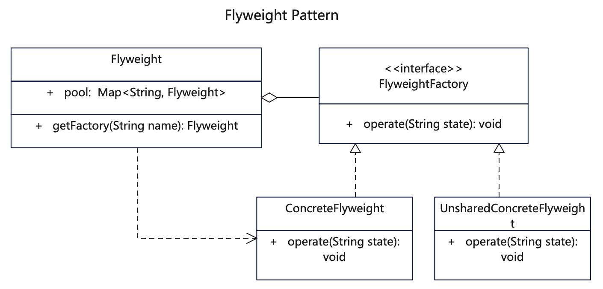

# 【享元设计模式详解】C/Java/JS/Go/Python/TS不同语言实现

# 简介
享元模式（Flyweight Pattern），是一种结构型设计模式。主要用于减少创建对象的数量，以减少内存占用和提高性能。它摒弃了在每个对象中保存所有数据的方式，通过共享多个对象所共有的相同状态，让你能在有限的内存容量中载入更多对象。

当程序需要生成数量巨大的相似对象时，可能对内存有大量损耗，而对象中包含可抽取且能在多个对象间共享的重复状态，您可以采取享元模式。

内部状态 vs. 外部状态
内部状态是存储在享元对象内部，一般在构造时确定或通过setter设置，并且不会随环境改变而改变的状态，因此内部状态可以共享。
外部状态是随环境改变而改变、不可以共享的状态。外部状态在需要使用时通过客户端传入享元对象。外部状态必须由客户端保存。

# 作用
1. 有相同的业务请求，直接返回在内存中已有的对象，避免重新创建。
2. 如果程序中有很多相似对象，可减少对象的创建，降低系统的内存，使效率提高。

# 实现步骤
1. 创建享元角色抽象接口，用于具体享元角色实现。
2. 创建具体享元角色，实现抽象方法。具体享元角色就是一般类，该类可以支持外部状态数据。
3. 创建享元工厂，里面建一个储存对象共享池，对已经实例化的对象直接取出返回。

# UML


# Java代码

## 享元抽象接口
```java
// Flyweight.java 享元角色抽象接口
public interface Flyweight {
   void operate(String state);
}
```

## 具体享元角色

```java
// ConcreteFlyweight.java 具体享元角色，实现抽象接口，用于共享状态，一个类被创建以后就不用重复创建了
public class ConcreteFlyweight implements Flyweight {
   private String name;
   private String type;

   public ConcreteFlyweight(String name) {
      // 内部状态，即不会随着环境的改变而改变的可共享部分
      // 这里的name也是对象保存的key
      this.name = name;
      this.type = "piano";
      System.out.println("ConcreteFlyweight::ConcreteFlyweight(name) [创建具体享元" + name + "]");
   }

  // 这里state属于外部状态，由外部调用时传入
  // 也可以把非共享的对象传入进来
   @Override
   public void operate(String state) {
      System.out.println(
            String.format("%s::operate() [%s %s %s]", this.getClass().getName(), this.getName(),
                  this.getType(), state));
   }

   public String getName() {
      return this.name;
   }

   public String getType() {
      return this.type;
   }
}
```

```java
// UnsharedConcreteFlyweight.java 无需共享的角色，每次都是新实例
public class UnsharedConcreteFlyweight implements Flyweight {
   private String name;
   private String type = "guitar";

   public UnsharedConcreteFlyweight(String name) {
      this.name = name;
      System.out.println("UnsharedConcreteFlyweight::UnsharedConcreteFlyweight(name) [创建非共享对象" + name + "]");
   }


   // 这里state属于外部状态，在调用时外部传入。
   @Override
   public void operate(String state) {
      System.out.println(
            String.format("%s::operate() [%s %s %s]", this.getClass().getName(), this.getName(),
                  this.getType(), state));
   }

   public String getName() {
      return this.name;
   }

   public String getType() {
      return this.type;
   }
}
```

## 享元工厂类
```java
// FlyweightFactory.java 享元工厂，储存一个对象共享池，已经生成过的对象直接取出
public class FlyweightFactory {
   public static Map<String, Flyweight> pool = new HashMap<String, Flyweight>();

   // 这里的name可以认为是内部状态，在构造时确定，具有唯一性。
   public static Flyweight getFactory(String name) {
      Flyweight flyweight = pool.get(name);
      if (flyweight == null) {
         // 如果对象不存在则创建新的对象放入到池子里，如果已经存在则复用前面的对象
         flyweight = new ConcreteFlyweight(name);
         pool.put(name, flyweight);
      } else {
         System.out.println("FlyweightFactory::getFactory(name) [成功获取具体享元" + name + "]");
       }
      return flyweight;
   }
}
```

## 测试调用
```java
    /**
     * 享元模式就是将已经声明过的实例或数据保存在内存里，需要使用时则取出来，无需再次实例化和声明。
     * 通过共享多个对象所共有的相同状态，以达到节省开销的目的。
     * 享元模式分为内部状态和外部状态，内部状态基于享元对象共享，外部状态则外部传入或使用非享元类。
     */

    // 假设有钢琴和吉他，钢琴使用者很多需要共享实例，而吉他每次创建新实例

    // 2个一样名称的为共享对象，只创建1个实例，后面的返回缓存实例
    Flyweight factory1 = FlyweightFactory.getFactory("piano1");
    // piano1已经声明过了，同名则共享前面的实例
    Flyweight factory2 = FlyweightFactory.getFactory("piano1");
    Flyweight factory3 = FlyweightFactory.getFactory("piano2");
    Flyweight factory4 = FlyweightFactory.getFactory("piano2");

    factory1.operate("factory1");
    factory2.operate("factory2");
    factory3.operate("factory3");
    factory4.operate("factory4");

    // 查看一共多少个对象
    for (Map.Entry<String, Flyweight> entry : FlyweightFactory.pool.entrySet()) {
      System.out.println("享元对象:" + entry.getKey());
      // entry.getValue().operate(null);
    }

    // 无需共享的，名字一样也是多个对象
    Flyweight factory5 = new UnsharedConcreteFlyweight("guitar1");
    Flyweight factory6 = new UnsharedConcreteFlyweight("guitar1");
    factory5.operate("factory5");
    factory6.operate("factory6");
```

# C代码

## 头文件
```c
// func.h 公共头文件
#include <stdio.h>
#include <stdlib.h>
#include <stdbool.h>
#include <string.h>

// 享元角色抽象接口
typedef struct Flyweight
{
    char name[50];
    char kind[50];
    void (*operate)(struct Flyweight *, char *);
} Flyweight;

// 享元工厂，储存一个对象共享池，已经生成过的对象直接取出
typedef struct FlyweightFactory
{
    char name[50];
    int (*get_pool_size)();
    Flyweight **(*get_pool)();
    Flyweight *(*get_factory)(char *name);
} FlyweightFactory;
FlyweightFactory *flyweight_factory_constructor(char *name);

// 具体享元角色，实现抽象接口，用于共享状态，一个类被创建以后就不用重复创建了
typedef struct ConcreteFlyweight
{
    // 内部状态，即不会随着环境的改变而改变的可共享部分
    // 这里的name也是对象保存的key
    char name[50];
    char kind[50];
    void (*operate)(struct ConcreteFlyweight *, char *);
} ConcreteFlyweight;
ConcreteFlyweight *concrete_flyweight_constructor(char *name);
ConcreteFlyweight *concrete_flyweight_init(char *name);

// 无需共享实例的角色，用于处理外部非共享状态
// 当不需要共享时用这样的类
typedef struct UnsharedConcreteFlyweight
{
    char name[50];
    char kind[50];
    void (*operate)(struct UnsharedConcreteFlyweight *, char *);
} UnsharedConcreteFlyweight;
UnsharedConcreteFlyweight *unshared_concrete_flyweight_constructor(char *name);
UnsharedConcreteFlyweight *unshared_concrete_flyweight_init(char *name);
```

## 享元抽象接口
```c
// flyweight.c 享元角色抽象接口
#include "func.h"

// 享元角色抽象基础struct，相关定义在head
```

## 具体享元角色

```c
// concrete_flyweight.c 具体享元角色，实现抽象接口，用于共享状态，一个类被创建以后就不用重复创建了
#include "func.h"

/* 具体享元角色，实现抽象接口，用于共享状态，一个类被创建以后就不用重复创建了 */

// 享元对象实例化函数，对象实例化后共享对象
// state属于外部状态，由外部调用时传入，也可以把非共享的对象传入进来
void concrete_flyweight_operate(ConcreteFlyweight *flyweight, char *state)
{
  printf("\r\n ConcreteFlyweight::operate() [name=%s kind=%s state=%s]", flyweight->name, flyweight->kind, state);
}

ConcreteFlyweight *concrete_flyweight_constructor(char *name)
{
  printf("\r\n ConcreteFlyweight::concrete_flyweight_constructor() 创建具体享元对象[name=%s]", name);
  Flyweight *flyweight = (Flyweight *)malloc(sizeof(Flyweight));
  strncpy(flyweight->name, name, 50);
  strncpy(flyweight->kind, "piano", 50);
  ConcreteFlyweight *concrete_flyweight = (ConcreteFlyweight *)flyweight;
  concrete_flyweight->operate = &concrete_flyweight_operate;
  return concrete_flyweight;
}
```

```c
// unshared_concrete_flyweight.c 无需共享的角色，每次都是新实例
#include "func.h"

/* 无需共享实例的角色，用于处理外部非共享状态 */

// 非共享对象的外部状态，这里state属于外部状态，在调用时外部传入。
void unshared_flyweight_operate(UnsharedConcreteFlyweight *flyweight, char *state)
{
  printf("\r\n UnsharedConcreteFlyweight::operate() [name=%s kind=%s state=%s]", flyweight->name, flyweight->kind, state);
}

// 无需共享的角色，每次都是新实例
UnsharedConcreteFlyweight *unshared_concrete_flyweight_constructor(char *name)
{
  printf("\r\n UnsharedConcreteFlyweight::unshared_concrete_flyweight_constructor() 创建非共享对象[name=%s]", name);
  Flyweight *flyweight = (Flyweight *)malloc(sizeof(Flyweight));
  strncpy(flyweight->name, name, 50);
  strncpy(flyweight->kind, "guitar", 50);
  UnsharedConcreteFlyweight *unshared_flyweight = (UnsharedConcreteFlyweight *)flyweight;
  unshared_flyweight->operate = &unshared_flyweight_operate;
  return unshared_flyweight;
}
```

## 享元工厂类
```c
// flyweight_factory.c 享元工厂，储存一个对象共享池，已经生成过的对象直接取出
#include "func.h"

/* 享元工厂，储存一个对象共享池，已经生成过的对象直接取出 */

// 全局用来记录Flyweight的对象数组
static Flyweight **flyweight_factory_member_pool;
// 全局用来记录Flyweight的名称数组
static char **flyweight_factory_name_pool;
// 全局记录flyweight_factory的数量
static int flyweight_factory_pool_size = 0;

// 这里的name可以认为是内部状态，在构造时确定，具有唯一性。
Flyweight *get_factory(char *name)
{

  // 定义公共map用作共享池子，全局共用
  if (flyweight_factory_member_pool == NULL)
  {
    flyweight_factory_member_pool = (Flyweight **)calloc(100, sizeof(Flyweight));
  }
  if (flyweight_factory_name_pool == NULL)
  {
    flyweight_factory_name_pool = (char **)calloc(100, sizeof(char));
  }

  Flyweight **flyweight_pool = flyweight_factory_member_pool;
  char **name_pool = flyweight_factory_name_pool;
  int length = flyweight_factory_pool_size;

  int flyweight_index = -1;
  for (int i = 0; i < length; i++)
  {
    if (name == name_pool[i])
    {
      flyweight_index = i;
      break;
    }
  }

  Flyweight *flyweight;

  // 如果已经存在则复用前面的对象
  if (flyweight_index >= 0)
  {
    flyweight = flyweight_pool[flyweight_index];
    printf("\r\n FlyweightFactory::get_factory() 成功获取具体享元[name=%s]", name);
  }
  else
  {
    // 不存在则创建新的对象放入到池子里
    flyweight = (Flyweight *)concrete_flyweight_constructor(name);
    flyweight_pool[length] = flyweight;
    name_pool[length] = name;
    flyweight_factory_pool_size += 1;
    printf("\r\n FlyweightFactory::get_factory() 成功创建具体享元[name=%s]", name);
  }
  return flyweight;
}

Flyweight **get_flyweight_pool()
{
  return flyweight_factory_member_pool;
}

int get_flyweight_pool_size()
{
  return flyweight_factory_pool_size;
}

FlyweightFactory *flyweight_factory_constructor(char *name)
{
  FlyweightFactory *factory = (FlyweightFactory *)malloc(sizeof(FlyweightFactory));
  strncpy(factory->name, name, 50);
  factory->get_factory = &get_factory;
  factory->get_pool = &get_flyweight_pool;
  factory->get_pool_size = &get_flyweight_pool_size;
  return factory;
}
```

## 测试调用
```c
   /**
   * 享元模式就是将已经声明过的实例或数据保存在内存里，需要使用时则取出来，无需再次实例化和声明。
   * 通过共享多个对象所共有的相同状态，以达到节省开销的目的。
   * 享元模式分为内部状态和外部状态，内部状态基于享元对象共享，外部状态则外部传入或使用非享元类。
   */

  FlyweightFactory *flyweight_factory = flyweight_factory_constructor("flyweight_factory");
  // 假设有钢琴和吉他，钢琴使用者很多需要共享实例，而吉他每次创建新实例
  // // 2个一样名称的为共享对象，只创建1个实例，后面的返回缓存实例
  Flyweight *factory1 = flyweight_factory->get_factory("piano1");
  Flyweight *factory2 = flyweight_factory->get_factory("piano1");
  // 转换类型测试
  ConcreteFlyweight *factory3 = (ConcreteFlyweight *)flyweight_factory->get_factory("piano2");
  Flyweight *factory4 = flyweight_factory->get_factory("piano2");

  factory1->operate(factory1, "factory1");
  factory2->operate(factory2, "factory2");
  factory3->operate(factory3, "factory3");
  factory4->operate(factory4, "factory4");

  // 打印全部共享对象
  Flyweight **flyweight_pool = flyweight_factory->get_pool();
  int pool_size = flyweight_factory->get_pool_size();
  for (int i = 0; i < pool_size; i++)
  {
    printf("\r\n 享元对象:%d %s", i, flyweight_pool[i]->name);
  }

  // 无需共享的对象，name虽然一样，是不同的实例
  Flyweight *factory5 = (Flyweight *)unshared_concrete_flyweight_constructor("guitar1");
  UnsharedConcreteFlyweight *factory6 = unshared_concrete_flyweight_constructor("guitar1");
  factory5->operate(factory5, "factory5");
  factory6->operate(factory6, "factory6");
```

## 更多语言版本
不同语言实现设计模式：[https://github.com/microwind/design-pattern](https://github.com/microwind/design-pattern)