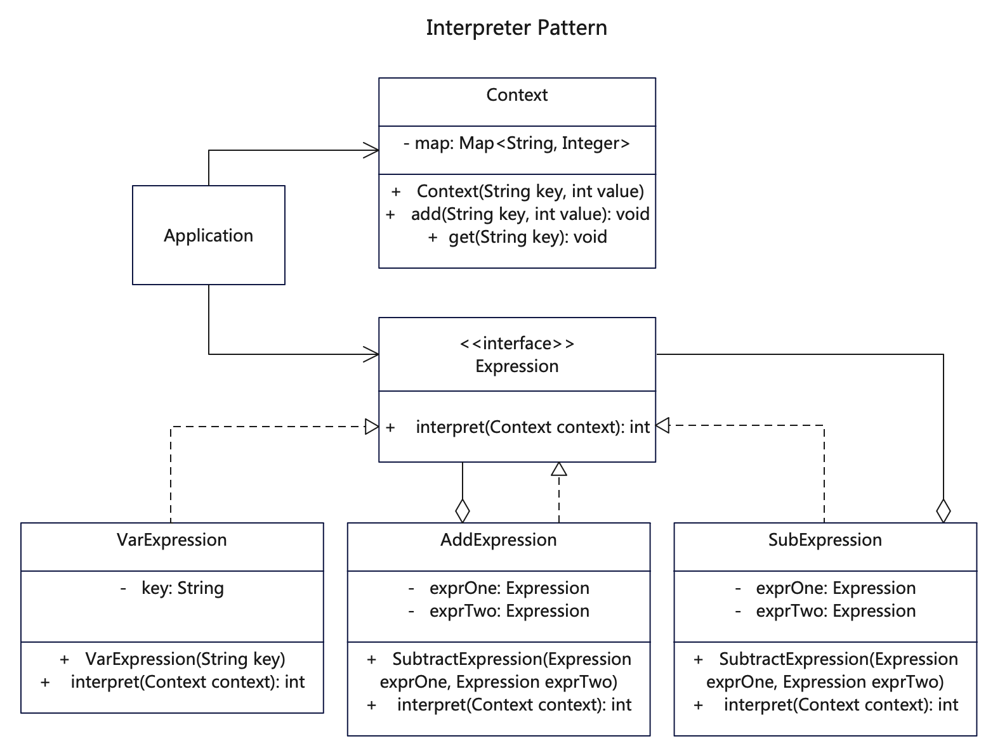

# 【解释器设计模式详解】C/Java/Go/JS/TS/Python不同语言实现

# 简介
解释器模式（Interpreter Pattern）是一种行为型设计模式。这种模式实现了一个表达式接口，该接口解释一个特定的上下文。这种模式常被用在 SQL 解析、符号处理引擎等。

解释器模式常用于对简单语言的编译或分析实例中，为了掌握好它的结构与实现，必须先了解编译原理中的“文法、句子、语法树”等相关概念。

# 作用
1. 可扩展性比较好，灵活，增加了新的解释表达式的方式，易于实现简单文法。
2. 在语法树中的每个表达式节点类都是相似的，所以实现其文法较为容易。

# 实现步骤
1. 创建抽象表达式接口（Expression），各种表达式都要实现该接口。
2. 分别创建最终表达式和非最终表达式。最终表达式（这里是VarExpression）没有子级，直接解释表达式。非最终表达式（这里是AddExpression和SubtractExpression）是维护子表达式的容器，并将解释请求转发给这些表达式。
3. 创建上下文环境类（这里是Context），用来表达式求值时构建执行环境。
4. 客户端调用时先建立执行上下文环境，然后声明变量，再进行计算。

# UML


# Java代码

## 抽象表达式接口
```java
// Expression.java 抽象表达式接口，根据业务场景规范表达式
public interface Expression {
  public int interpret(Context context);
}
```

## 具体表达式实现

```java
// AddExpression.java 具体表达式，实现了抽象表达式接口
public class AddExpression implements Expression {

    private Expression exprOne = null;
    private Expression exprTwo = null;

    public AddExpression(Expression exprOne, Expression exprTwo) {
        this.exprOne = exprOne;
        this.exprTwo = exprTwo;
    }

    // 覆盖表达式，执行context对象
    @Override
    public int interpret(Context context) {
        System.out.println(this.getClass().getName() + "::interpret() [context = " + context.getClass().getName() + "]");
        return exprOne.interpret(context) + exprTwo.interpret(context);
    }
}
```

```java
// SubtractExpression.java 具体表达式，实现了抽象表达式接口
public class SubtractExpression implements Expression {

  private Expression exprOne = null;
  private Expression exprTwo = null;

  public SubtractExpression(Expression exprOne, Expression exprTwo) {
    this.exprOne = exprOne;
    this.exprTwo = exprTwo;
  }

  // 覆盖表达式，执行context对象
  @Override
  public int interpret(Context context) {
    System.out.println(this.getClass().getName() + "::interpret() [context = " + context.getClass().getName() + "]");
    return exprOne.interpret(context) - exprTwo.interpret(context);
  }
}
```

```java
// VarExpression.java 变量表达式，或者叫终端表达式，其他表达式求值时通过层层追溯最后指向这里
// 变量与执行环境的Key对应，最终会通过key获取传入的值
public class VarExpression implements Expression {
  private String key;

  public VarExpression(String key) {
    this.key = key;
  }

  @Override
  // 覆盖表达式，根据key获取变量
  public int interpret(Context context) {
    return context.get(key);
  }
}
```

## 执行环境类
```java
// Context.java 构建可执行环境上下文
public class Context {

   private Map<String, Integer> map = new HashMap<>();

   public Context(String key, int value) {
      this.add(key, value);
   }

   public Context() {
   }

   public void add(String key, int value) {
      map.put(key, value);
   }

   public int get(String key) {
      return map.get(key);
   }
}
```

```java
// Application.java 调用程序，组织各种解释器
    /*
     * 解释器模式先构建执行上下文Context，然后构建一个最终的获取值的表达式VarExpression，这就构成了含上下文和变量-值的基本环境。
     * 再将基本环境放到工具表达式里AddExpression或SubtractExpreesion进行计算，最终得到结果。
     */

   // 构建两个数相加的例子
   public static int addTwo(int one, int two) {
      // 构建执行上下文环境
      Context context = new Context();
      context.add("one", one);
      context.add("two", two);

      // 构建表达式
      VarExpression varOne = new VarExpression("one");
      VarExpression varTwo = new VarExpression("two");

      // 再构建变量来进行计算，看起来啰嗦，但这样构建多种不同表达式计算就变得简单
      Expression result = new AddExpression(varOne, varTwo);
      return result.interpret(context);
   }

   // 构建连加计算的例子
   public static int addMore(int... numbers) {
      if (numbers.length <= 1) {
         return numbers[0];
      }

      Context context = new Context();
      // 构建执行环境
      for (int num : numbers) {
         context.add("num" + num, num);
      }

      // 先取出前两个作为计算基础
      VarExpression varOne = new VarExpression("num" + numbers[0]);
      VarExpression varTwo = new VarExpression("num" + numbers[1]);
      // 再构建表达式，先赋值前两个
      Expression expression = new AddExpression(varOne, varTwo);

      // 如果只有两个数则直接返回计算结果
      if (numbers.length == 2) {
         return expression.interpret(context);
      }

      // 如果数量超过两个则累加表达式再求值
      for (int i = 2; i < numbers.length; i++) {
         Expression nextExpression = new VarExpression("num" + numbers[i]);
         // 表达式不断累加
         expression = new AddExpression(expression, nextExpression);
      }

      return expression.interpret(context);
   }

   // 计算前两个数相加，再减去后一个数的计算例子
   public static int addAndSubtract(int one, int two, int three) {
      // 构建执行上下文环境，有3个可操作的域
      Context context = new Context();
      context.add("one", one);
      context.add("two", two);
      context.add("three", three);

      // 构建表达式，有3个变量
      VarExpression varOne = new VarExpression("one");
      VarExpression varTwo = new VarExpression("two");
      VarExpression varThree = new VarExpression("three");


      // 再构建计算步骤，前两个用加法
      Expression result = new AddExpression(varOne, varTwo);
      result = new SubtractExpression(result, varThree);
      // 第3个用减法
      return result.interpret(context);
   }
```

## 测试调用
```java
    /**
     * 解释器模式实现了一个表达式接口，该接口可以解释一个特定的上下文的变量和语句。
     * 也就是先定义上下文，然后定义变量，再使用表达式进行求值。相当可以构造一个简单的语法解析器。
     */

    int result1 = Application.addTwo(1, 2);
    System.out.println("result1: " + result1);

    int result2 = Application.addMore(1, 2, 3, 4, 5);
    System.out.println("result2: " + result2);

    int result3 = Application.addAndSubtract(3, 4, 5);
    System.out.println("result3: " + result3);
```

# Go代码

## 抽象表达式接口
```go
// Expression.go 抽象表达式接口，根据业务场景规范表达式
type Expression interface {
  Interpret(context Context) int
}

```

## 具体表达式实现

```go
// AddExpression.go 具体表达式，实现了抽象表达式接口
type AddExpression struct {
  exprOne Expression
  exprTwo Expression
}

func (a *AddExpression) Init(exprOne Expression, exprTwo Expression) {
  a.exprOne = exprOne
  a.exprTwo = exprTwo
}

// 覆盖表达式，执行context对象
func (a *AddExpression) Interpret(context Context) int {
  fmt.Println("AddExpression::interpret() [context = Context]")
  return a.exprOne.Interpret(context) + a.exprTwo.Interpret(context)
}

```

```go
// SubtractExpression.go 具体表达式，实现了抽象表达式接口
type SubtractExpression struct {
  exprOne Expression
  exprTwo Expression
}

func (s *SubtractExpression) Init(exprOne Expression, exprTwo Expression) {
  s.exprOne = exprOne
  s.exprTwo = exprTwo
}

// 覆盖表达式，执行context对象
func (s *SubtractExpression) Interpret(context Context) int {
  fmt.Println("SubtractExpression::Interpret() [context = Context]")
  return s.exprOne.Interpret(context) - s.exprTwo.Interpret(context)
}

```

```go
// VarExpression.go 变量表达式，或者叫终端表达式，其他表达式求值时通过层层追溯最后指向这里
// 变量与执行环境的Key对应，最终会通过key获取传入的值
type VarExpression struct {
  key string
}

// 覆盖表达式，根据key获取变量
func (v VarExpression) Interpret(context Context) int {
  return context.Get(v.key)
}
```

## 执行环境类
```go
// Context.go 构建可执行环境上下文
type Context struct {
  Map map[string]int
}

func (c *Context) Init(key string, value int) {
  c.Map = make(map[string]int)
  c.Add(key, value)
}

func (c *Context) Add(key string, value int) {
  if c.Map == nil {
    c.Map = make(map[string]int)
  }
  c.Map[key] = value
}

func (c *Context) Get(key string) int {
  return c.Map[key]
}
```

```go
// Application.go 调用程序，组织各种解释器
    /*
     * 解释器模式先构建执行上下文Context，然后构建一个最终的获取值的表达式VarExpression，这就构成了含上下文和变量-值的基本环境。
     * 再将基本环境放到工具表达式里AddExpression或SubtractExpreesion进行计算，最终得到结果。
     */

type Application struct {
}

// 构建两个数相加的例子
func (a *Application) AddTwo(one int, two int) int {
  // 构建执行上下文环境
  var context = new(Context)
  context.Add("one", one)
  context.Add("two", two)

  // 构建表达式
  var varOne = &VarExpression{key: "one"}
  var varTwo = &VarExpression{key: "two"}

  // 再构建变量来进行计算，看起来啰嗦，但这样构建多种不同表达式计算就变得简单
  var result = &AddExpression{
    exprOne: varOne,
    exprTwo: varTwo,
  }
  return result.Interpret(*context)
}

// 构建连加计算的例子
func (a *Application) AddMore(numbers ...int) int {
  if len(numbers) <= 1 {
    return numbers[0]
  }

  var context = new(Context)
  // 构建执行环境
  for _, num := range numbers {
    context.Add(""+strconv.Itoa(num), num)
  }

  // 先取出前两个作为计算基础
  var varOne = &VarExpression{key: "" + strconv.Itoa(numbers[0])}
  var varTwo = &VarExpression{key: "" + strconv.Itoa(numbers[1])}
  // 再构建表达式，先赋值前两个
  var expression = &AddExpression{
    exprOne: varOne,
    exprTwo: varTwo,
  }

  // 如果只有两个数则直接返回计算结果
  if len(numbers) == 2 {
    return expression.Interpret(*context)
  }

  // 如果数量超过两个则累加表达式再求值
  for i := 2; i < len(numbers); i++ {
    var nextExpression = &VarExpression{
      key: "" + strconv.Itoa(numbers[i]),
    }
    // 表达式不断累加
    expression = &AddExpression{
      exprOne: expression,
      exprTwo: nextExpression,
    }
  }

  return expression.Interpret(*context)
}

// 计算前两个数相加，再减去后一个数的计算例子
func (a *Application) AddAndSubtract(one int, two int, three int) int {
  // 构建执行上下文环境，有3个可操作的域
  var context = &Context{}
  context.Add("one", one)
  context.Add("two", two)
  context.Add("three", three)

  // 构建表达式，有3个变量
  var varOne = &VarExpression{key: "one"}
  var varTwo = &VarExpression{key: "two"}
  var varThree = &VarExpression{key: "three"}

  // 再构建计算步骤，前两个用加法
  var result Expression

  result = &AddExpression{
    exprOne: varOne,
    exprTwo: varTwo,
  }
  result = &SubtractExpression{
    exprOne: result,
    exprTwo: varThree,
  }
  // 第3个用减法
  return result.Interpret(*context)
}
```

## 测试调用
```go
    /*
     * 解释器模式先构建执行上下文Context，然后构建一个最终的获取值的表达式VarExpression，这就构成了含上下文和变量-值的基本环境。
     * 再将基本环境放到工具表达式里AddExpression或SubtractExpreesion进行计算，最终得到结果。
     */
    
  /**
   * 解释器模式实现了一个表达式接口，该接口可以解释一个特定的上下文的变量和语句。
   * 也就是先定义上下文，然后定义变量，再使用表达式进行求值。相当可以构造一个简单的语法解析器。
   */

  var application = &src.Application{}
  var result1 = application.AddTwo(1, 2)
  fmt.Println("result1: ", result1)

  var result2 = application.AddMore(1, 2, 3, 4, 5)
  fmt.Println("result2: ", result2)

  var result3 = application.AddAndSubtract(3, 4, 5)
  fmt.Println("result3: ", result3)
```

# C代码

## func.h head文件
```c
// 构建可执行环境上下文
typedef struct Context
{
    char **keys;
    int *values;
    int length;
    void (*add)(struct Context *, char *key, int value);
    int (*get)(struct Context *, char *key);
} Context;
Context *context_constructor();

// 抽象表达式接口，根据业务场景规范表达式
typedef struct Expression
{
    char name[50];
    char key[50];
    struct Expression *exp_one;
    struct Expression *exp_two;
    void (*set_key)(struct Expression *, char *);
    int (*interpret)(struct Expression *, Context *);
} Expression;

// 具体表达式，实现了抽象表达式接口
typedef struct AddExpression
{
    char name[50];
    char key[50];
    struct Expression *exp_one;
    struct Expression *exp_two;
    void (*set_key)(struct AddExpression *, char *);
    int (*interpret)(struct AddExpression *, Context *);
} AddExpression;
AddExpression *add_expression_constructor(Expression *exp_one, Expression *exp_two);

// 具体表达式，实现了抽象表达式接口
typedef struct SubtractExpression
{
    char name[50];
    char key[50];
    struct Expression *exp_one;
    struct Expression *exp_two;
    void (*set_key)(struct SubtractExpression *, char *);
    int (*interpret)(struct SubtractExpression *, Context *);
} SubtractExpression;
SubtractExpression *subtract_expression_constructor(Expression *exp_one, Expression *exp_two);

// 具体表达式，实现了抽象表达式接口
typedef struct VarExpression
{
    char name[50];
    char key[50];
    struct Expression *exp_one;
    struct Expression *exp_two;
    void (*set_key)(struct VarExpression *, char *);
    int (*interpret)(struct VarExpression *, Context *);
} VarExpression;
VarExpression *var_expression_constructor(char *key);

// application function list
// 将两个数值相加
int add_two(int one, int two);
// 将多个数字相加，第1个为数量，后面可以传入多个数字
int add_more(int count, ...);
// 计算前两个数相加，再减去后一个数的计算例子
int add_and_subtract(int one, int two, int three);
```

## 抽象表达式接口
```c
// expression.c 抽象表达式接口，根据业务场景规范表达式
// 抽象表达式接口，根据业务场景规范表达式，定义在head
```

## 具体表达式实现

```c
// add_expression.c 具体表达式，实现了抽象表达式接口
int add_expression_interpret(Expression *exp, Context *context)
{
  printf("\r\n AddExpression::interpret() [exp_one=%s, exp_two=%s]", exp->exp_one->key, exp->exp_two->key);
  int one_result = exp->exp_one->interpret(exp->exp_one, context);
  int two_result = exp->exp_two->interpret(exp->exp_two, context);
  return one_result + two_result;
}

AddExpression *add_expression_constructor(Expression *exp_one, Expression *exp_two)
{
  printf("\r\n add_expression_constructor() [exp_one=%s, exp_two=%s]", exp_one->key, exp_two->key);
  Expression *exp = (Expression *)malloc(sizeof(Expression));
  exp->interpret = &add_expression_interpret;
  exp->exp_one = exp_one;
  exp->exp_two = exp_two;
  AddExpression *add_expression = (AddExpression *)exp;
  return add_expression;
}
```

```c
// subtract_expression.c 具体表达式，实现了抽象表达式接口
int subtract_expression_interpret(Expression *exp, Context *context)
{
  printf("\r\n SubExpression::interpret() [exp_one=%s, exp_two=%s]", exp->exp_one->key, exp->exp_two->key);
  int one_result = exp->exp_one->interpret(exp->exp_one, context);
  int two_result = exp->exp_two->interpret(exp->exp_two, context);
  return one_result - two_result;
}

SubtractExpression *subtract_expression_constructor(Expression *exp_one, Expression *exp_two)
{
  printf("\r\n sub_expression_constructor() [exp_one=%s, exp_two=%s]", exp_one->key, exp_two->key);
  Expression *exp = (Expression *)malloc(sizeof(Expression));
  exp->interpret = &subtract_expression_interpret;
  exp->exp_one = exp_one;
  exp->exp_two = exp_two;
  SubtractExpression *sub_expression = (SubtractExpression *)exp;
  return sub_expression;
}
```

```c
// var_expression.c 变量表达式，或者叫终端表达式，其他表达式求值时通过层层追溯最后指向这里
// 变量与执行环境的Key对应，最终会通过key获取传入的值
int var_expression_interpret(Expression *exp, Context *context)
{
  int value = context->get(context, exp->key);
  printf("\r\n VarExpression::interpret() [key=%s, value=%d]", exp->key, value);
  return value;
}

void set_key(Expression *exp, char *key)
{
  strncpy(exp->key, key, 50);
}

VarExpression *var_expression_constructor(char *key)
{
  printf("\r\n var_expression_constructor() [key=%s]", key);
  Expression *exp = (Expression *)malloc(sizeof(Expression));
  strncpy(exp->key, key, 50);
  exp->interpret = &var_expression_interpret;
  exp->set_key = &set_key;
  VarExpression *var_expression = (VarExpression *)exp;
  return var_expression;
}
```

## 执行环境类
```c
// context.c 构建可执行环境上下文
void add(Context *context, char *key, int value)
{
  printf("\r\n Context::add() [key=%s, value=%d]", key, value);
  // 申请新的数组
  int new_len = context->length + 1;
  char **new_keys = (char **)calloc(new_len * 50, sizeof(char));
  int *new_values = (int *)malloc(new_len * sizeof(int));

  // 复制原来的数组内容
  for (int i = 0; i < context->length; i++)
  {
    new_keys[i] = context->keys[i];
    new_values[i] = context->values[i];
  }
  // 追加新的内容
  new_keys[context->length] = key;
  new_values[context->length] = value;
  // 指向新数组
  context->keys = new_keys;
  context->values = new_values;
  // 重设新的长度
  context->length = new_len;
}

int get(Context *context, char *key)
{
  int idx;
  for (int i = 0; i < context->length; i++)
  {
    if (strcmp(context->keys[i], key) == 0)
    {
      idx = i;
      break;
    }
  }
  return context->values[idx];
}

// 构建可执行环境上下文
Context *context_constructor()
{
  printf("\r\n context_constructor() 构建执行上下文");
  Context *context = (Context *)malloc(sizeof(Context));
  context->keys = NULL;
  context->values = NULL;
  context->length = 0;
  context->add = &add;
  context->get = &get;
  return context;
}
```

```c
// application.c 调用程序，组织各种解释器
/*
 * 解释器模式先构建执行上下文Context，然后构建一个最终的获取值的表达式VarExpression，这就构成了含上下文和变量-值的基本环境。
 * 再将基本环境放到工具表达式里AddExpression或SubtractExpreesion进行计算，最终得到结果。
 */

// 将int转str的简单实现，未处理越界等情况
char *itoa(int num)
{
  char *str = (char *)malloc(50 * sizeof(char));
  int sign = num;

  if (num < 0)
  {
    num = -num;
  }

  int i = 0;
  do
  { // 生成数字
    str[i++] = num % 10 + '0';
  } while ((num /= 10) > 0);

  // 处理负数
  if (sign < 0)
  {
    str[i++] = '-';
  }

  str[i] = '\0';
  // 翻转字符串
  for (int j = 0, k = i - 1; j < k; j++, k--)
  {
    char temp = str[j];
    str[j] = str[k];
    str[k] = temp;
  }
  return str;
}

// 构建两个数相加的例子
int add_two(int one, int two)
{
  // 构建执行上下文环境
  Context *context = context_constructor();
  context->add(context, "one", one);
  context->add(context, "two", two);

  // 构建表达式
  VarExpression *var_one = var_expression_constructor("one");
  Expression *var_two = (Expression *)var_expression_constructor("two");

  // 构建变量和多种不同表达式进行计算，使得计算就变得简单
  AddExpression *result = add_expression_constructor((Expression *)var_one, var_two);
  return result->interpret(result, context);
}

// 构建连加计算的例子，不定参数调用，第1参数是数量，后面是数字
int add_more(int count, ...)
{
  // 构建执行上下文环境
  Context *context = context_constructor();

  va_list args;
  va_start(args, count);
  for (int i = 0; i < count; i++)
  {
    int value = va_arg(args, int);
    // 构建执行环境，value直接作为key
    char *key_str = (char *)malloc(50 * sizeof(char));
    strcat(key_str, "key_");
    strcat(key_str, itoa(value));
    context->add(context, key_str, value);
  }
  va_end(args);

  // 先取出前两个作为计算基础
  // 构建执行环境，num直接作为key
  char key1_str[50] = "key_";
  strcat(key1_str, itoa(context->values[0]));
  VarExpression *var_one = var_expression_constructor(key1_str);
  char key2_str[50] = "key_";
  strcat(key2_str, itoa(context->values[1]));
  VarExpression *var_two = var_expression_constructor(key2_str);

  // 再构建表达式，先赋值前两个
  AddExpression *expression = add_expression_constructor((Expression *)var_one, (Expression *)var_two);
  // 如果只有两个数则直接返回计算结果
  if (count == 2)
  {
    return expression->interpret(expression, context);
  }

  // 如果数量超过两个则累加表达式再求值
  for (int i = 2; i < count; i++)
  {
    VarExpression *next_expression = var_expression_constructor(context->keys[i]);
    expression = add_expression_constructor((Expression *)expression, (Expression *)next_expression);
  }

  return expression->interpret(expression, context);
}

// 计算前两个数相加，再减去后一个数的计算例子
int add_and_subtract(int one, int two, int three)
{
  // 构建执行上下文环境，有3个可操作的域
  Context *context = context_constructor();
  context->add(context, "one", one);
  context->add(context, "two", two);
  context->add(context, "three", three);

  // 构建表达式，有3个变量
  VarExpression *var_one = var_expression_constructor("one");
  VarExpression *var_two = var_expression_constructor("two");
  VarExpression *var_three = var_expression_constructor("three");
  // 前两个用加法
  Expression *result = (Expression *)add_expression_constructor((Expression *)var_one, (Expression *)var_two);
  // 第3个用减法
  result = (Expression *)subtract_expression_constructor(result, (Expression *)var_three);
  return result->interpret(result, context);
}
```

## 测试调用
```c
   /**
   * 解释器模式实现了一个表达式接口，该接口可以解释一个特定的上下文的变量和语句。
   * 也就是先定义上下文，然后定义变量，再使用表达式进行求值。相当可以构造一个简单的语法解析器。
   */

  int result1 = add_two(1, 2);
  printf("\r\n result1:[1 + 2 = %d]", result1);

  // 计算多个数字，第1个为数量，后面是待计算的数字
  int result2 = add_more(5, 1, 2, 3, 4, 5);
  printf("\r\n result2: [1 + 2 + 3 + 4 + 5 = %d]", result2);

  int result3 = add_and_subtract(3, 4, 5);
  printf("\r\n result3: [3 + 4 - 5 = %d]", result3);
  return 0;
```

## 更多语言版本
不同语言设计模式源码，请关注：[https://github.com/microwind/design-pattern](https://github.com/microwind/design-pattern)