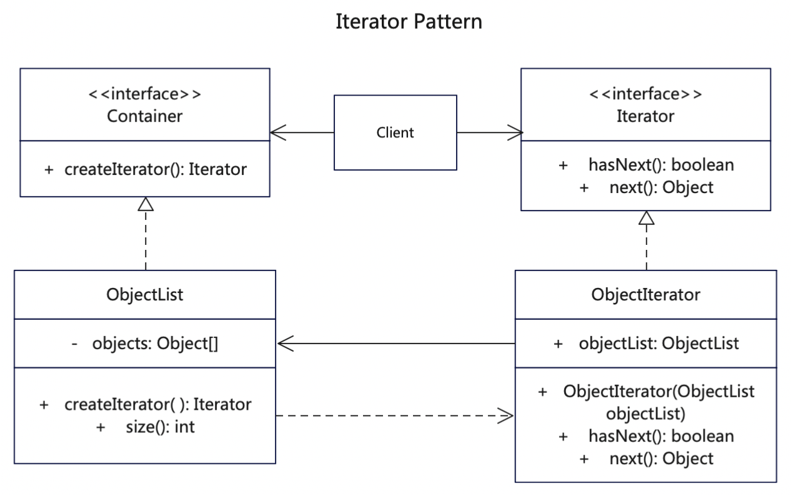

# 简介
迭代器模式（Iterator Pattern），是一种结构型设计模式。这种模式用于顺序访问集合对象的元素，不需要知道集合对象的底层表示。

迭代器模式是与集合共存的，我们只要实现一个集合，就需要同时提供这个集合的迭代器，就像Java中的Collection，List、Set、Map等，这些集合都有自己的迭代器。假如我们要实现一个这样的新的容器，就可以引入迭代器模式，给我们的容器实现一个迭代器。

# 作用
1. 可以提供多种遍历对象的方式，把元素之间查找调用的责任交给迭代器，而不是聚合对象。
2. 分离了集合对象的遍历行为，抽象出一个迭代器类来负责，这样既可以做到不暴露集合的内部结构，又可让外部代码透明地访问集合内部的数据。

# 实现步骤
1. 创建迭代器接口，定义hasNext()和next()方法
2. 创建数据容器接口，用来创建迭代器
3. 创建具体数据列表，实现数据容器接口，可以创建迭代器，内含数据列表对象
4. 创建某种数据对象的迭代器，实现hasNext()以及next()方法，并且关联上数据对象列表

# UML
