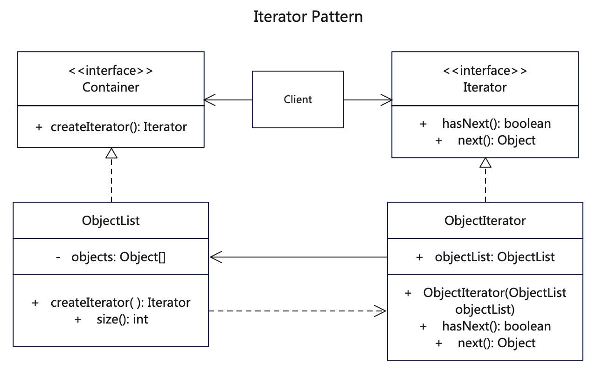

# 简介
迭代器模式（Iterator Pattern），是一种结构型设计模式。给数据对象构建一套按顺序访问集合对象元素的方式，而不需要知道数据对象的底层表示。

迭代器模式是与集合共存的，我们只要实现一个集合，就需要同时提供这个集合的迭代器，就像Java中的Collection，List、Set、Map等，这些集合都有自己的迭代器。假如我们要实现一个这样的新的容器，就可以引入迭代器模式，给我们的容器实现一个迭代器。

# 作用
1. 可以提供多种遍历对象的方式，把元素之间查找调用的责任交给迭代器，而不是聚合对象。
2. 分离了集合对象的遍历行为，抽象出一个迭代器类来负责，这样既可以做到不暴露集合的内部结构，又可让外部代码透明地访问集合内部的数据。

# 实现步骤
1. 创建迭代器接口，定义hasNext()和next()方法
2. 创建数据容器接口，用来创建迭代器
3. 创建具体数据列表，实现数据容器接口，可以创建迭代器，内含数据列表对象
4. 创建某种数据对象的迭代器，实现hasNext()以及next()方法，并且关联上数据对象列表

# UML


# 代码

## 迭代器抽象接口
```java
// Iterator.java 迭代器抽象接口，提供next和hasNext方法
public interface Iterator {
   public boolean hasNext();
   public Object next();
}
```

## 具体迭代器
```java
// ObjectIterator.java 对象迭代器，实现了抽象迭代器的方法，聚合了对象列表
public class ObjectIterator implements Iterator {

   private ObjectList objectList;

   int index;

   public ObjectIterator(ObjectList objectList) {
      this.objectList = objectList;
   }

   @Override
   public boolean hasNext() {
      if (index < objectList.size()) {
         return true;
      }
      return false;
   }

   @Override
   public Object next() {
      if (this.hasNext()) {
         // 返回数据对象提供的get方法，每访问一次则增加下标
         return objectList.get(index++);
      }
      return null;
   }
}
```

## 数据容器接口
```java
// 创建抽象容器接口，创建一个迭代器
public interface Container {
   public Iterator createIterator();
}
```

## 具体数据对象
```java
// ObjectList.java 对象列表，是一种数据容器，可以创建一个迭代器
public class ObjectList implements Container {
   private Object[] objects = { "Google", "Apple", "Amazon" };

   @Override
   public Iterator createIterator() {
      System.out.println(this.getClass().getName() + "::createIterator() [获取迭代器 ObjectIterator]");
      // 把当前对象传给迭代器
      return new ObjectIterator(this);
   }

   public void setObjects(Object[] objects) {
      this.objects = objects;
   }

   public int size() {
      return objects.length;
   }

   public Object get(int index) {
      return objects[index];
   }
}
```

## 测试调用
```java
    /*
     * 迭代器模式是给数据容器创建单独的迭代器，用来遍历里面的数据对象
     * 数据容器和迭代器相互关联，外部通过迭代器来访问数据容器
     * 通过这种方式由迭代器类来负责数据遍历，这样可以做到不暴露集合的内部结构
     */

    int i = 0;
    ObjectList objectList = new ObjectList();
    objectList.setObjects(new String[] { "Thomas", "Merry", "Jack", "Tony", "Jerry", "Joey" });
    // for循环迭代对象
    for (Iterator iter = objectList.createIterator(); iter.hasNext();) {
      String name = (String) iter.next();
      System.out.println("objectList[" + i + "] = " + name);
      i++;
    }

    // while循环迭代对象
    Iterator iter2 = objectList.createIterator();
    while (iter2.hasNext()) {
      System.out.println(iter2.next());
    }
```
## 更多语言版本
不同语言实现设计模式：[https://github.com/microwind/design-pattern](https://github.com/microwind/design-pattern)