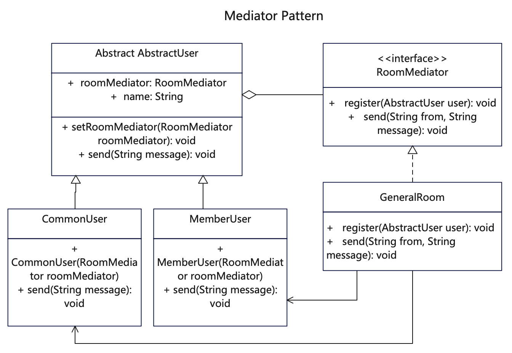

# 【中介者设计模式详解】Java/JS/Go/Python/TS不同语言实现

# 简介
中介者模式（Mediator Pattern）是一种行为型模式。它限制对象之间的直接交互，它用一个中介对象来封装一系列的动作，以让对象之间进行交流。中介者使各个对象不需要显式地相互引用，从而使其耦合松散，而且可以独立地改变它们之间的交互。

当一些对象和其他对象紧密耦合以致难以对其进行修改时，或当组件因过于依赖其他组件而无法在不同应用中复用时，可使用中介者模式。

# 作用
1. 用来降低多个对象和类之间的通信复杂性。
2. 对象之间不再显式地相互引用，但可以独立地改变它们之间的交互，从而保持松耦合。

# 实现步骤
1. 定义一个工具接口，供不同工具类来实现。建立多个具体工具类实现基础工具接口。
2. 定义一个基础抽象类，里面聚合了工具接口，相当于桥接。
3. 再重新定义一个新抽象类，继承自基础抽象类，并补充一些方法。
4. 建立具体对象类继承新抽象类，调用桥接接口里的方法来实现功能。

# UML


# 代码

## 中介者抽象接口
```java
// RoomMediator.java 定义中介者接口或抽象类
public interface RoomMediator {
   public void register(AbstractUser user);
   public void sendTo(String from, String to, String message);
   public void send(String from, String message);
}
```

## 通用中介者
```java
// GeneralRoom.java 中介者的具体实现类
public class GeneralRoom implements RoomMediator {
   public List<AbstractUser> users = new ArrayList<AbstractUser>();

   @Override
   public void register(AbstractUser user) {
      // 用户注册登记，追加用户列表
      user.setRoomMediator(this);
      users.add(user);
   }

   // 作为中介者通知给某个用户
   @Override
   public void sendTo(String from, String to, String message) {
      System.out.println(">>GeneralRoom:sendTo() [from: " + from + " message: " + message + " to: " + to + " ]");
      for (AbstractUser user : users) {
         // 定向发送
         if (user.getName().equals(to)) {
            user.recieve(from, message);
         }
      }
   }

   // 作为中介者通知给全体用户
   @Override
   public void send(String from, String message) {
      System.out.println(">>GeneralRoom:send() [from: " + from + " message: " + message + "]");
      for (AbstractUser user : users) {
         user.recieve(from, message);
      }
   }
}
```

## 抽象用户类
```java
// AbstractUser.java 定义抽象用户类，聚合中介者
public abstract class AbstractUser {

   private String name;
   public RoomMediator roomMediator;

   public AbstractUser(String name) {
      this.name = name;
   }

   public void setRoomMediator(RoomMediator roomMediator) {
      this.roomMediator = roomMediator;
   }

   public abstract void send(String message);

   public abstract void sendTo(String to, String message);

   public abstract void recieve(String from, String message);

   public String getName() {
      return this.name;
   }
}
```

## 具体用户对象
```java
// CommonUser.java 普通用户继承了抽象用户，实现了具体功能
public class CommonUser extends AbstractUser {

   public CommonUser(String name) {
      super(name);
   }

   @Override
   public void send(String message) {
      System.out.println("CommonUser:send() [user: " + this.getName() + " message:" + message + "]");
      // 通过中介者来中转消息
      this.roomMediator.send(this.getName(), message);
   }

   @Override
   public void sendTo(String to, String message) {
      System.out.println("CommonUser:sendTo() [user: " + this.getName() + " message:" + message + " to: " + to + "]");
      // 通过中介者来中转消息
      this.roomMediator.sendTo(this.getName(), to, message);
   }

   @Override
   public void recieve(String from, String message) {
      System.out.println("CommonUser:recieve() [user: " + this.getName() + " message: " + message + " from:" + from + "]");
   }

}
```

```java
// MemberUser.java 会员用户继承了抽象用户，实现了具体功能
public class MemberUser extends AbstractUser {
   public MemberUser(String name) {
      super(name);
   }

   @Override
   public void send(String message) {
      System.out.println("MemberUser:send() [user: " + this.getName() + " message:" + message + "]");
      // 通过中介者来中转消息
      this.roomMediator.send(this.getName(), message);
   }

   @Override
   public void sendTo(String to, String message) {
      System.out
            .println("MemberUser:sendTo() [user: " + this.getName() + " message:" + message + " to: " + to + "]");
      // 通过中介者来中转消息
      this.roomMediator.sendTo(this.getName(), to, message);
   }

   @Override
   public void recieve(String from, String message) {
      System.out.println("MemberUser:recieve() [user: " + this.getName() + " message: " + message
            + " from user:" + from + "]");
   }

}
```

## 测试调用
```java
  /**
   * 中介者模式用一个中介对象来封装一系列动作，让对象之间利用中介者来交流。
   * 这里聊天室就是一个中介者，用户和用户之间的消息传递，全部依靠聊天室来完成。
   * 先给聊天室注册用户，也给用户绑定上中介者，双方彼此持有关系。
   * 中介者的成员之间的消息传递通过中介者来代理传达。
   */

    // 声明一个聊天室
    GeneralRoom generalRoom = new GeneralRoom();
    // 给聊天室添加点不同的人
    AbstractUser user1 = new CommonUser("user1");
    generalRoom.register(user1);
    CommonUser user2 = new CommonUser("user2");
    generalRoom.register(user2);
    MemberUser user3 = new MemberUser("user3");
    generalRoom.register(user3);

    // user1 发送给全体
    user1.send("hi, I'm " + user1.getName() + ".");
    // user2 发送给 user3
    user2.sendTo(user3.getName(), "haha.");
```
## 更多语言版本
不同语言实现设计模式：[https://github.com/microwind/design-pattern](https://github.com/microwind/design-pattern)