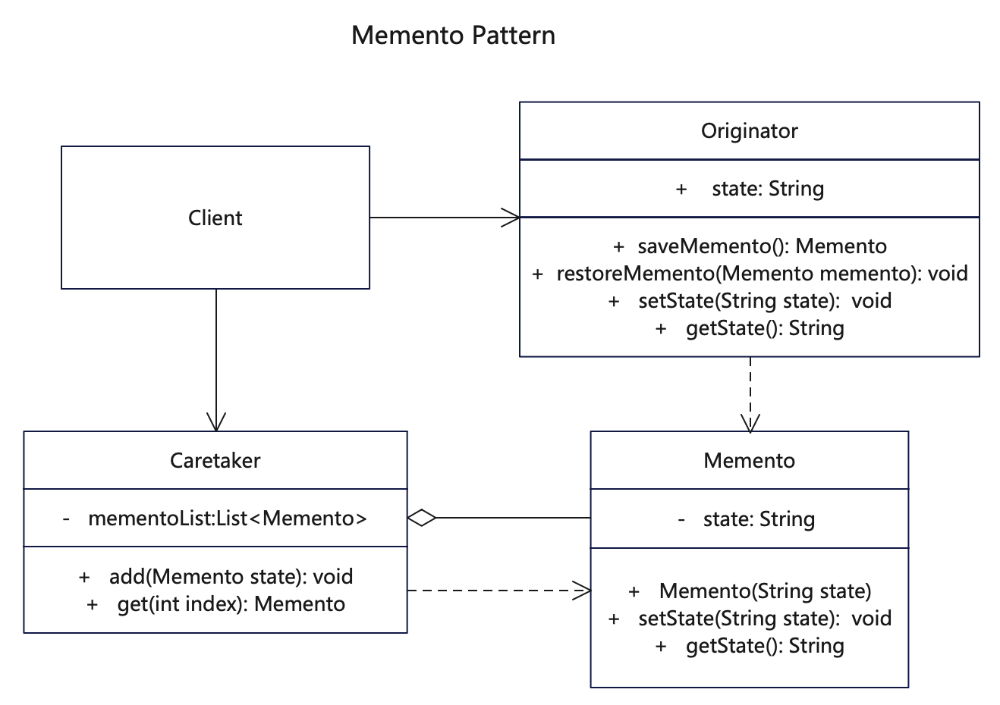

# 【备忘录设计模式详解】C/Java/JS/Go/Python/TS不同语言实现

# 简介
备忘录模式（Memento Pattern）是一种结构型设计模式。这种模式就是在不破坏封装的条件下，将一个对象的状态捕捉(Capture)住，并放在外部存储起来，从而可以在将来合适的时候把这个对象还原到存储起来的状态。备忘录模式常常与命令模式和迭代子模式一同使用。

备忘录模式的角色有三个：备忘录(Memento)角色、发起人(Originator)角色、负责人(Caretaker)角色

备忘录模式是由发起人（Originator）对象负责生成状态快照，其他对象不可修改状态。再将对象状态的副本存储在一个名为备忘录（Memento）的特殊对象中。除了创建备忘录的对象外，任何对象都不能访问备忘录的内容。其他对象必须使用指定接口与备忘录进行交互，它们可以获取快照的元数据（创建时间和操作名称等），但不能获取快照中原始对象的状态。

这种限制策略允许你将备忘录保存在通常被称为负责人（Caretakers）的对象历史中。由于负责人仅通过受限接口与备忘录互动，故其无法修改存储在备忘录内部的状态。同时，发起人拥有对备忘录所有成员的访问权限，从而能随时恢复其以前的某个状态。

# 作用
1. 给用户提供了一种可以恢复状态的机制，可以使用户能够比较方便地回到某个历史的状态。
2. 实现了内部状态的封装，除了创建它的发起人之外，其他对象都不能够访问这些状态信息，也不需要关心状态的保存细节。
3. 简化了发起人角色，发起人不需要管理和保存其内部状态的各个备份，所有状态信息都保存在备忘录中，并由负责人进行管理，符合单一职责原则。

# 实现步骤
1. 创建备忘录Memento，用来记录操作状态数据的实体类。
2. 创建发起人角色Originator，状态的制造者，也是备忘录的生成者，负责将状态写入到一个新备忘录。
3. 创建负责人角色Caretaker，用来保存和读取备忘录的历史记录，所有备忘录均可以保存在历史中，以便恢复。
4. 客户调用方通过Originator来生成备忘录，再通过Caretaker读取和恢复备忘录历史记录。

# UML


# Java代码

## 具体备忘录
```java
// Memento.java 备忘录(Memento)角色，负责存储发起人传入的状态
public class Memento {
   private String state;

   public Memento(String state) {
      System.out.println(this.getClass().getName() + "::Memento() [state = " + state + "]");
      this.state = state;
   }

   public String getState() {
      return state;
   }

   public void setState(String state) {
      this.state = state;
   }
}
```

## 发起人
```java
// Originator.java 发起人(Originator)负责生成状态快照，即利用一个新备忘录对象将自己的内部状态存储起来
public class Originator {

    private String state;

    // 每次创建一个新备忘录来保存状态
    public Memento saveMemento() {
        System.out.println(this.getClass().getName() + "::saveMemento() [state = " + state + "]");
        return new Memento(state);
    }

    // 从备忘录中恢复状态
    public void restoreMemento(Memento memento) {
        this.state = memento.getState();
    }

    public String getState() {
        return state;
    }

    public void setState(String state) {
        this.state = state;
    }
}
```

## 负责人类
```java
// Caretaker.java 负责人(Caretaker)角色，只负责保存备忘录记录，不能修改备忘录对象的内容
public class Caretaker {
    // 备忘录可以是一个记录，也可以就是一个对象，根据业务场景设置
    private List<Memento> mementoList = new ArrayList<Memento>();

    public void add(Memento memento) {
        System.out.println(this.getClass().getName() + "::add() [memento = " + memento.getClass().getName() + "]");
        mementoList.add(memento);
    }

    public Memento get(int index) {
        return mementoList.get(index);
    }

    public List<Memento> getMementoList() {
        return this.mementoList;
    }
}
```

## 测试调用
```java
    /*
     * 备忘录模式是在不暴露对象实现细节的情况下保存和恢复对象之前的状态。
     * 先声明发起人Originator，再声明负责人Caretaker，发起人生成备忘录Memento
     * 通过负责人则保存备忘录历史记录，读取备忘录由负责人来完成。
     */
    Originator originator = new Originator();
    Caretaker careTaker = new Caretaker();
    // 发起人产生一个状态
    originator.setState("state1");
    // 覆盖了状态，那么前面的状态未保存
    originator.setState("state2");
    // 发起人生成备忘录，一般添加时直接保存即可
    Memento memento = originator.saveMemento();
    // 负责人保添加备忘录历史记录
    careTaker.add(memento);

    // 直接生成备忘录并添加到负责人的备忘录列表
    originator.setState("state3");
    careTaker.add(originator.saveMemento());
    originator.setState("state4");
    careTaker.add(originator.saveMemento());

    System.out.println("发起人当前的状态: " + originator.getState());

    // 发起人通过负责人那里取出状态
    originator.restoreMemento(careTaker.get(0));
    System.out.println("第一个保存的状态: " + originator.getState());
    originator.restoreMemento(careTaker.get(1));
    System.out.println("第二个保存的状态: " + originator.getState());

    // 遍历全部备忘录
    for (int i = 0; i < careTaker.getMementoList().size(); i++) {
      // 外部一般不直接访问备忘录里面的状态，而是逐个恢复备忘录，再取出状态来
      originator.restoreMemento(careTaker.get(i));
      System.out.println("state: " + i + ")" + originator.getState());
    }
```

# JavaScript代码

## 具体备忘录
```js
// Memento.js 备忘录(Memento)角色，负责存储发起人传入的状态
// 备忘录(Memento)角色，负责存储发起人传入的状态
export class Memento {
  constructor(state) {
    console.log(this.constructor.name + '::Memento() [state = ' + state + ']')
    this.state = state
  }

  getState() {
    return this.state
  }

  setState(state) {
    this.state = state
  }
}

```

## 发起人
```js
// Originator.js 发起人(Originator)负责生成状态快照，即利用一个新备忘录对象将自己的内部状态存储起来
import { Memento } from './Memento.js'

export class Originator {
  constructor() {
    this.state = undefined
  }

  // 每次创建一个新备忘录来保存状态
  saveMemento() {
    console.log(
      this.constructor.name + '::saveMemento() [state = ' + this.state + ']'
    )
    return new Memento(this.state)
  }

  // 从备忘录中恢复状态
  restoreMemento(memento) {
    this.state = memento.getState()
  }

  getState() {
    return this.state
  }

  setState(state) {
    this.state = state
  }
}
```

## 负责人类
```js
// Caretaker.js 负责人(Caretaker)角色，只负责保存备忘录记录，不能修改备忘录对象的内容
export class Caretaker {
  constructor() {
    // 备忘录可以是一个记录，也可以就是一个对象，根据业务场景设置
    this.mementoList = []
  }

  add(memento) {
    console.log(
      this.constructor.name +
        '::add() [memento = ' +
        memento.constructor.name +
        ']'
    )
    this.mementoList.push(memento)
  }

  get(index) {
    return this.mementoList[index]
  }

  getMementoList() {
    return this.mementoList
  }
}
```

## 测试调用
```js
import { Originator } from '../src/Originator.js'
import { Caretaker } from '../src/Caretaker.js'

export function test() {
  /*
   * 备忘录模式是在不暴露对象实现细节的情况下保存和恢复对象之前的状态。
   * 先声明发起人Originator，再声明负责人Caretaker，发起人生成备忘录Memento
   * 通过负责人则保存备忘录历史记录，读取备忘录由负责人来完成。
   */
  const originator = new Originator()
  const careTaker = new Caretaker()
  // 发起人产生一个状态
  originator.setState('state1')
  // 覆盖了状态，那么前面的状态未保存
  originator.setState('state2')
  // 发起人生成备忘录，一般添加时直接保存即可
  const memento = originator.saveMemento()
  // 负责人保添加备忘录历史记录
  careTaker.add(memento)

  // 直接生成备忘录并添加到负责人的备忘录列表
  originator.setState('state3')
  careTaker.add(originator.saveMemento())
  originator.setState('state4')
  careTaker.add(originator.saveMemento())

  console.log('发起人当前的状态: ' + originator.getState())

  // 发起人通过负责人那里取出状态
  originator.restoreMemento(careTaker.get(0))
  console.log('第一个保存的状态: ' + originator.getState())
  originator.restoreMemento(careTaker.get(1))
  console.log('第二个保存的状态: ' + originator.getState())

  // 遍历全部备忘录
  for (let i = 0; i < careTaker.getMementoList().length; i++) {
    // 外部一般不直接访问备忘录里面的状态，而是逐个恢复备忘录，再取出状态来
    originator.restoreMemento(careTaker.get(i))
    console.log('state: ' + i + ')' + originator.getState())
  }
}

// 执行测试
;(function () {
  console.log('test start:')
  test()
})()
```

## 更多语言版本
不同语言设计模式源码：[https://github.com/microwind/design-pattern](https://github.com/microwind/design-pattern)