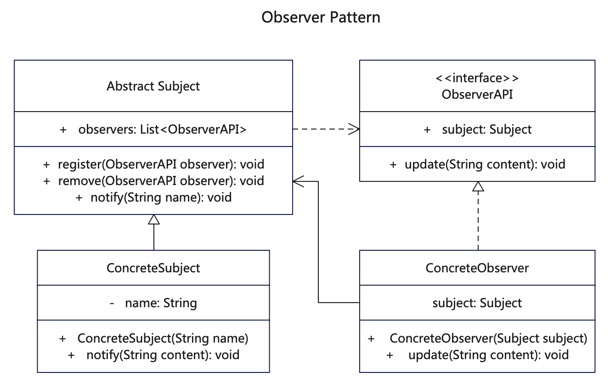

# 【观察者设计模式详解】C/Java/JS/Go/Python/TS不同语言实现

# 简介
观察者模式（Observer Pattern）是一种行为型模式。它定义对象间的一种一对多的依赖关系，当一个对象的状态发生改变时，所有依赖于它的对象都得到通知并被自动更新。

观察者模式使用三个类Subject、Observer和Client。Subject对象带有绑定观察者到Client对象和从Client对象解绑观察者的方法。我们创建Subject类、Observer抽象类和扩展了抽象类Observer的实体类。

# 作用
1. 一个对象状态更新，其他依赖对象收到通知和自动更新的机制。
2. 实现模块化分离，实现主题与观察者交互对象之间的松耦合。
  1）观察者定义了对象之间一对多的关系。
  2）被观察者(主题)用一个共同的接口来更新观察者。
  3）观察者和被观察者用松耦合方式结合，被观察者不知道观察者的细节，只知道观察者实现了观察者接口。

# 实现步骤
1. 创建观察者observer基础接口，包含主题和更新方法
2. 创建主题subject抽象类，包含observer列表以及添加和删除方法
3. 创建具体的主题类，实现通知方法，发布通知时轮询通知全部观察者
4. 创建多个具体观察者，与主题关联，并实现自己的更新方法
5. 客户调用时先声明主题，再将观察者分别添加到主题，当主题发布通知时，观察者自动更新

# UML



# Java代码

## 观察者接口
```java
// ObserverAPI.java 观察者接口，Java 9已经默认支持Observer接口
// 这里避免冲突采取ObserverAPI命名
public interface ObserverAPI {
   public Subject subject = null;
   public void update(String content);
}
```

## 具体观察者
```java
// ConcreteObserver.java 具体的观察者实现类，也可以看成订阅者，关联对应的主题类。
// 不同的观察者也可以对应多个主题
public class ConcreteObserver implements ObserverAPI {

   public Subject subject;

   // 给观察者绑定主题，同时把观察者添加到主题列表
   public ConcreteObserver(Subject subject) {
      this.subject = subject;
      this.subject.register((ObserverAPI) this);
   }

   // 观察者发出更新通知，不用单独告诉订阅者，由订阅者自行监听
   public void update(String content) {
      System.out.println(String.format("%s::update() [subject.name = %s content = %s]",
            this.getClass().getName(),
            this.subject.getName(), content));
   }
}
```

```java
// ConcreteObserver2.java 具体的观察者实现类，也可以看成订阅者，关联对应的主题类。
// 不同的观察者可以对应不同的主题。
public class ConcreteObserver2 implements ObserverAPI {

  // 这里没有在构造器就绑定某个主题，而是从客户角度去注册观察者
  public ConcreteObserver2() {
  }

  // 观察者发出更新通知，观察者自行监听
  public void update(String content) {
    System.out.println(String.format("%s::update() [content = %s]",
        this.getClass().getName(), content));
  }
}
```

## 抽象主题类
```java
// Subject.java 定义抽象主题类或者接口，供具体主题类继承
public abstract class Subject {
   private String name;
   // protected Set<ObserverAPI> observers = new HashSet<>();
   protected List<ObserverAPI> observers = new ArrayList<>();

   public String getName() {
      return name;
   }

   public void setName(String name) {
      this.name = name;
   }

   public void register(ObserverAPI observer) {
      System.out.println(this.getClass().getName() + "::register() [observer = " + observer.getClass().getSimpleName() + "]");
      observers.add(observer);
   }

   public void remove(ObserverAPI observer) {
      observers.remove(observer);
   }

   // 通知由具体类来实现逻辑
   public abstract void notify(String name);
}
```

## 具体主题类
```java
// ConcreteSubject.java 观察者主题类，也是发布者，重写具体的通知方法。不同主题可以关联不同的观察者。
public class ConcreteSubject extends Subject {

   public ConcreteSubject(String name) {
      this.setName(name);
   }

   // 不同的主题类有自己的通知方法，批量通知绑定的观察者
   @Override
   public void notify(String content) {
      System.out.println(this.getClass().getName() + "::notify() [content = " + content + "]");
      for (Object observer : this.observers) {
         ((ObserverAPI) observer).update(content);
      }

   }

}
```

## 测试调用
```java
    /**
     * 观察者模式应用非常广泛，主要是观察者提前绑定到发布者
     * 当发布者发布消息时，批量广播通知，而无需逐一通知
     * 观察者监听到消息后自己决定采取哪一种行为
     */

    // 定义一个主题，也就是发布者
    Subject concreteSubject = new ConcreteSubject("subject1");
    // 再声明观察者，通过构造器注册到主题上
    ObserverAPI observer1 = new ConcreteObserver(concreteSubject);

    // 也可以单独给主题注册一个新的观察者
    concreteSubject.register(new ConcreteObserver2());
    // 可以移除观察者对象，可以打开注释试下
    // concreteSubject.remove(observer1);

    // 主题开始发布新通知，各观察者自动更新
    concreteSubject.notify("hello, this is broadcast.");

```

# Python代码

## 观察者接口
```py
# ObserverAPI.py 观察者抽象父类，定义一些公共方法
class ObserverAPI:

    def __init__(self, name):
        self.name = name

    # 观察者发出更新通知，观察者自行监听
    def update(self, content):
        print(self.__class__.__name__ + '::update() [content = ' + content + ']')

    def set_name(self, name):
        self.name = name
```

## 具体观察者
```py
# ConcreteObserver.py 具体的观察者实现类，也可以看成订阅者，关联对应的主题类。
# 不同的观察者也可以对应多个主题
from src.ObserverAPI import ObserverAPI

# 具体的观察者实现类，也可以看成订阅者，关联对应的主题类。
# 不同的观察者也可以对应多个主题


class ConcreteObserver(ObserverAPI):
    # 给观察者绑定主题，同时把观察者添加到主题列表
    def __init__(self, subject, name):
        ObserverAPI.__init__(self, name)
        
        # python3支持的父类调用
        # super(ConcreteObserver, self).__init__(name)
        # super().__init__(name)

        self.subject = subject
        subject.register(self)

    # 观察者发出更新通知，不用单独告诉订阅者，由订阅者自行监听
    def update(self, content):
        print(self.__class__.__name__ + '::update() [subject.name = ' +
              self.subject.name + ' content = ' + content + ']')
```

```py
# ConcreteObserver2.py 具体的观察者实现类，也可以看成订阅者，关联对应的主题类。
# 不同的观察者可以对应不同的主题。
from src.ObserverAPI import ObserverAPI


# 具体的观察者实现类，也可以看成订阅者，关联对应的主题类。
# 不同的观察者可以对应不同的主题。
class ConcreteObserver2(ObserverAPI):
    # 这里没有在构造器就绑定某个主题，而是从客户角度去注册观察者
    # 观察者发出更新通知，观察者自行监听

    # def update(self, content):
    #     print(self.__class__.__name__ + '::update() [content = ' + content +']')
    
    pass
```

## 抽象主题类
```py
# Subject.py 定义抽象主题类或者接口，供具体主题类继承
class Subject:

    def __init__(self, name):
        self.name = name
        self.observers = []

    def get_name(self):
        return self.name

    def set_name(self, name):
        self.name = name

    def register(self, observer):
        print(self.__class__.__name__ + '::register() [observer = ' +
              observer.__class__.__name__ + ']')

        self.observers.append(observer)

    def remove(self, observer):
        self.observers.remove(observer)

    # 通知由具体类来实现逻辑
    def notify(self, name):
        pass
```

## 具体主题类
```py
// ConcreteSubject.py 观察者主题类，也是发布者，重写具体的通知方法。不同主题可以关联不同的观察者。
from src.Subject import Subject


# 观察者主题类，也是发布者，重写具体的通知方法。不同主题可以关联不同的观察者。
class ConcreteSubject(Subject):
    # 不同的主题类有自己的通知方法，批量通知绑定的观察者
    def notify(self, content):
        print(self.__class__.__name__ + '::notify() [content = ' + content +
              ']')
        for observer in self.observers:
            observer.update(content)
```

## 测试调用
```py
import sys
import os

os_path = os.getcwd()
sys.path.append(os_path)

from src.ConcreteSubject import ConcreteSubject
from src.ConcreteObserver import ConcreteObserver
from src.ConcreteObserver2 import ConcreteObserver2


def test():
    '''
    * 观察者模式应用非常广泛，主要是观察者提前绑定到发布者
    * 当发布者发布消息时，批量广播通知，而无需逐一通知
    * 观察者监听到消息后自己决定采取哪一种行为
    '''

    # 定义一个主题，也就是发布者
    concrete_subject = ConcreteSubject('subject1')
    # 再声明观察者，通过构造器注册到主题上
    observer1 = ConcreteObserver(concrete_subject, 'observer1')
    # 也可以单独给主题注册一个新的观察者
    observer2 = ConcreteObserver2('observer2')
    concrete_subject.register(observer2)
    # 可以移除观察者对象
    # concrete_subject.remove(observer1)

    # 主题开始发布新通知，各观察者自动更新
    concrete_subject.notify('hello, this is broadcast.')


if __name__ == '__main__':
    print(__file__)
    print("test start:")
    test()

```

## 更多语言版本
不同语言设计模式源码：[https://github.com/microwind/design-pattern](https://github.com/microwind/design-pattern)