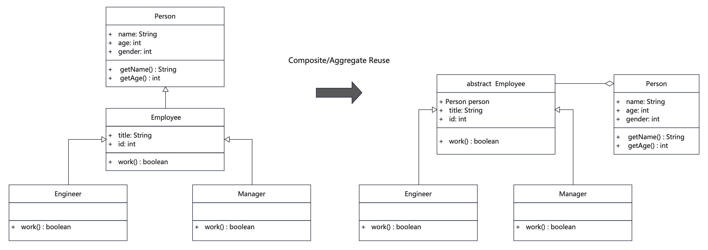

# 说明
组合/聚合复用原则（Composite/Aggregate Reuse Principle，CARP）也叫组合复用原则(Composite Reuse Principle, CRP)。其含义是：尽量使用组合或聚合，而不是通过继承达来达到复用的目的。组合/聚合相比继承来讲更具扩展性，松耦合性更好。也有将组合翻译为合成的。


组合/聚合指的是在一个新的类里面聚合其他已有的对象，使之成为新对象的一部分；新的对象通过向内部持有的这些对象的委派达到复用功能的目的，而不是通过单独继承来获得父类的功能。

聚合(Aggregate)的概念
聚合表示一个对象拥有另外的对象，一般表现为松散的整体和个体的关系，当然整体和个体也可以不相关。例如A对象持有B对象，B对象并不是A对象的一部分，A和B都可以独立运行和存在。聚合是一种相对较弱的拥有的关系，一般用在把一些有关联的事物放在一起，便于按照部件来统一处理业务逻辑。

组合(Composite)的概念
组合也表示一个对象拥有其他的对象，但这是一种较强的拥有关系，即整体和部分的关系。整体对象强依赖部分对象，缺乏组成的部分，整体类就无法独立运行。这一般用来将一个具体物体按照不同的部件拆分开来，最后组合在一起形成该物体。

# UML


# 代码
```java
/**
 * 组合/聚合复用用组合来替代继承，该类聚合到雇员类
 * 组合，相对紧密，表示为组成部件与物体的关系
 * 聚合，相对松散，表示为个体与整体/模块的关系
 */
public class Person {
    public String name;
    public int age;
    public int gender;

    public Person(String name, int age) {
        this.name = name;
        this.age = age;
    }

    public String getName() {
        return name;
    }

    public int getAge() {
        return age;
    }
}
```

```java
/**
 * 雇员抽象类，供其他角色继承
 * 聚合了人物类
 */
public abstract class Employee {
    // 聚合人物类，通过聚合方式更加松耦合，利于扩展
    Person person;
    public int id;
    public String title;

    public boolean work() {
        return true;
    }

}
```

```java
/**
 * 工程师类继承雇员类
 */
public class Engineer extends Employee {

  public Engineer(int id, String title, Person person) {
    this.id = id;
    this.title = title;
    this.person = person;
  }

  @Override
  public boolean work() {
    System.out.println("Engineer is working." + " id = " + this.id
        + ", title = " + this.title + " name = " + person.getName() + ", age = " + person.getAge());
    return true;
  }
}
```

```java
/**
 * 管理者类继承雇员类
 */
public class Manager extends Employee {

    public Manager(int id, String title, Person person) {
        this.id = id;
        this.title = title;
        this.person = person;
    }

    @Override
    public boolean work() {
        System.out.println("Manager is working." + " id = " + this.id
                + ", title = " + this.title + " name = " + person.getName() + ", age = " + person.getAge());
        return true;
    }
}
```

# 反例
```java
/**
 * 这个例子违反了组合复用原则，因为采用了继承而不是组合。
 * 1. 人的身份会有多重角色，不是适合继承人，如果是物种角度可以是继承，比如男、女继承人。
 * 2. 采用继承会使得不够灵活，修改起来很麻烦，例如一个人既是经理也是雇员。
 */
public class Employee_violate {
    public Employee_violate() {
        return;
    }

    // 顶级抽象父类
    public abstract class Person {
        public String name;
        public int age;
        public int gender;

        public String getName() {
            return name;
        }

        public int getAge() {
            return age;
        }
    }

    // 雇员父类继承了Person类，这里违反了组合复用原则，不利于扩展
    public class Employee extends Person {
        public int id;
        public String title;

        public boolean work() {
            return true;
        }
    }

    // 具体职位类
    public class Engineer extends Employee {
        public int id;
        public String title;

        public Engineer(String name, int age, int id, String title) {
            this.name = name;
            this.age = age;
            this.id = id;
            this.title = title;
        }

        @Override
        public boolean work() {
            System.out.println("Engineer is working." + " id = " + this.id
                    + ", title = " + this.title + " name = " + this.getName() + ", age = " + this.getAge());
            return true;
        }
    }

    // 具体职位类
    public class Manager extends Employee {
        public int id;
        public String title;

        public Manager(String name, int age, int id, String title) {
            this.name = name;
            this.age = age;
            this.id = id;
            this.title = title;
        }

        @Override
        public boolean work() {
            System.out.println("Manager is working." + " id = " + this.id
                    + ", title = " + this.title + " name = " + this.getName() + ", age = " + this.getAge());
            return true;
        }
    }
}
```

## 更多语言版本
面向对象设计原则源码：[https://github.com/microwind/design-pattern/oop-principles](https://github.com/microwind/design-pattern/oop-principles)