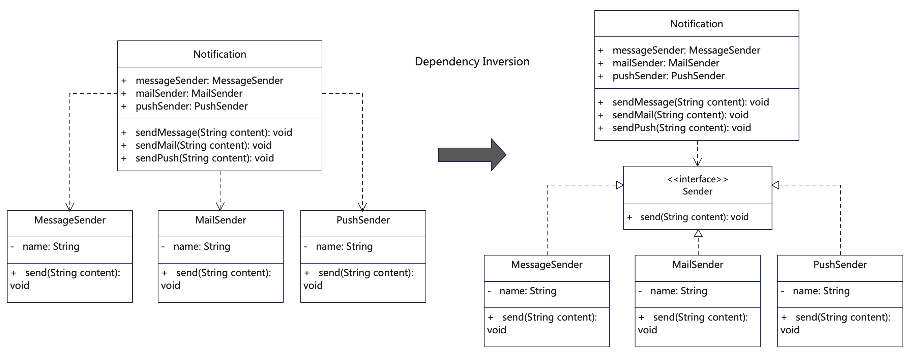

# 说明
依赖倒置（也叫依赖反转）原则（Dependency inversion principle，DIP）是指一种专门的分层解耦模式。传统的依赖关系中，高层依赖低层，外层依赖里层，这使得高层次的模块与低层次模块过度耦合，不便于模块的复用和扩展。依赖倒置就是将这种依赖关系颠倒（反转）过来，使得低层次模块依赖并实现高层次的抽象，而高层次的模块仅依赖于低层次的抽象（接口）。

具体来讲，有两点：

1. 高层次模块不依赖于低层的实现，而是依赖于低层的抽象。换言之，模块间的依赖是通过抽象发生，实现类之间不发生直接的依赖关系，其依赖关系是通过接口或抽象类产生的。

2. 接口和抽象类不应该依赖于具体实现类，而具体实现类依赖接口或抽象类。

如何区分高低层？
上层：表示层，业务层，要进行的操作，就是想要做什么，属于调用方。
低层：逻辑层，数据层，具体实现细节，就是怎么做的，属于被调用方。

如何区分依赖倒置、控制反转以及依赖注入？
依赖倒置是面向对象设计原则，它倡导高层不依赖于低层，抽象不依赖细节。控制反转（IoC）是一种设计模式，遵从了依赖倒置原则，它通过容器化来配置类的实例化和依赖关系。依赖注入(DI)是控制反转的一种具体实现，在Spring中发扬光大，即按需动态的实现类的注入，而不是直接依赖。

# UML


# 代码
```java
/**
 * 消息通知业务应用类，依赖低层模块的接口，而不是实现
 */
public class Notification {
    // 这里业务类依赖了发送者抽象接口
    // 这样即使增加再多Sender也不用修改
    public Sender sender;

    public Notification(Sender sender) {
        this.sender = sender;
    }

    // 依赖抽象发送方法，根据类型执行某个具体对象的方法
    public void send(String content) {
        System.out.println("send content by Notification.");
        this.sender.send(content);
    }

    public void setSender(Sender sender) {
        this.sender = sender;
    }
}
```

```java
/**
 * 发送者的接口或抽象类，供实际发送者对象实现
 */
public interface Sender {
  public void send(String content);
}
```

```java
/**
 * MessageSender实现了Sender接口
 */
public class MessageSender implements Sender {

    public String name = "message-sender";
    @Override
    public void send(String content) {
        // do Something
        System.out.println(this.name + " has sent: " + content);
    }
}
```

```java
/**
 * MailSender实现了Sender接口
 */
public class MailSender implements Sender {

    public String name = "mail-sender";
    @Override
    public void send(String content) {
        // do Something
        System.out.println(this.name + " has sent: " + content);
    }
}
```

```java
/**
 * PushSender实现了Sender接口
 */
public class PushSender implements Sender {

    public String name = "push-sender";
    @Override
    public void send(String content) {
        // do Something
        System.out.println(this.name + " has sent: " + content);
    }
}
```

# 反例
```java
/**
 * 这个例子违反了依赖反转原则，为了方面理解，把全部类放在了一起。
 * 1. 高层业务应用直接依赖了低层逻辑对象，过度耦合。
 * 2. 依赖的是实现对象而不是接口或抽象类，不便于扩展。
 */
public class DependencyInversion_counter {
    public DependencyInversion_counter() {
        return;
    }

    // 上层消息业务应用
    public class Notification {

        // 依赖低层模块具体的发送对象
        public MessageSender messageSender = new MessageSender();
        public MailSender mailSender = new MailSender();
        public PushSender pushSender = new PushSender();

        // 依赖发送短信方法
        public void sendMessage(String content) {
            System.out.println("send message by Notification.");
            messageSender.send(content);
        }

        // 依赖发送邮件方法
        public void sendEmail(String content) {
            System.out.println("send email by Notification.");
            mailSender.send(content);
        }

        // 依赖发送push方法
        public void sendPush(String content) {
            System.out.println("send push by Notification.");
            pushSender.send(content);
        }
    }

    public class MessageSender {
        public String name = "message-sender";

        public void send(String content) {
            // do Something
            System.out.println(this.name + " has sent: " + content);
        }
    }

    public class MailSender {
        public String name = "mail-sender";

        public void send(String content) {
            // do Something
            System.out.println(this.name + " has sent: " + content);
        }
    }

    public class PushSender {
        public String name = "push-sender";

        public void send(String content) {
            // do Something
            System.out.println(this.name + " has sent: " + content);
        }
    }
}
```

## 更多语言版本
面向对象设计原则源码：[https://github.com/microwind/design-pattern/oop-principles](https://github.com/microwind/design-pattern/oop-principles)