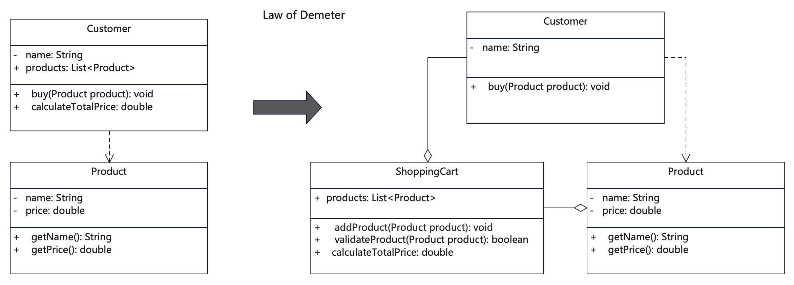

# 说明
迪米特法则（Law of Demeter，LoD），也叫最少知识原则（Principle of Least Knowledge）。即一个对象应当对其他对象尽可能少的了解，对象之间的耦合度应该尽可能低。这要求一个对象应该只与密切相关的朋友（直接的成员变量、方法参数、方法内部创建的对象以及静态方法等）交互，而不应该了解其朋友的关联对象。迪米特法则有助于降低系统的耦合度，提高代码的灵活性和可维护性。

迪米特法则的目的在于降低类之间的耦合，使得系统的功能模块功能独立，相互之间不存在（或很少有）依赖关系。

迪米特法则不希望类之间建立直接的联系。如果真的有需要建立联系，也希望能通过它的中介类来转达。因此，应用迪米特法则有可能造成的一个后果就是：系统中存在大量的中介类，这些类之所以存在完全是为了传递类之间的相互调用关系，这在一定程度上也增加了系统的复杂度。因此，恰如其分地使用迪米特法则很重要，而不是全盘采用。

要用好迪米特法则，注意以下几点：

1. 识别对象的朋友：在设计之初就明确定义对象的朋友是谁。朋友通常包括对象的成员变量、方法参数、方法内部创建的对象以及静态方法调用的方法。对象应该只与这些朋友进行直接交互，而不应该了解其朋友的朋友。

2. 封装对象的行为：可以通过封装对象的行为来降低对象之间的耦合度。将对象的行为封装在自身内部，对外界只暴露少量的接口，从而减少了对象之间的依赖关系。

3. 避免链式调用：尽量避免链式调用，链式调用即一个对象直接调用另一个对象的方法，而这个方法又调用了另一个对象的方法，依此类推。链式调用会增加对象之间的耦合度，使得代码更加脆弱和难以维护。当然这个也分情况。

4. 合理划分模块和类：在设计系统架构和类结构时，要合理划分模块和类，使得每个模块和类的职责清晰明确，每个模块和类只负责独立特定的任务，避免一个模块或类过于复杂，尽量按大多数人好理解的方式去设计。

5. 多用采用设计模式：大部分设计模式其实都遵循着迪米特法则。通过设计模式，可以将复杂系统进行合理的组织和清晰的划分，从而降低了对象之间的耦合度，提高了系统的灵活性和可维护性。

# UML


# 代码
```java
/**
 * Customer类，减轻逻辑，调用购物车来实现商品的购买，不直接跟商品交互。
 */
public class Customer {
    private String name;
    private ShoppingCart shoppingCart;

    public Customer(String name) {
        this.name = name;
        this.shoppingCart = new ShoppingCart();
    }

    public void buy(Product product) {
        // 只跟购物车打交道，且不用了解购物车实现细节，只是调用购物车方法
        if (shoppingCart.validateProduct(product)) {
            shoppingCart.addProduct(product);
            double totalPrice = shoppingCart.calculateTotalPrice();
            System.out.println(name + " purchased " + product.getName() + " for " + totalPrice);
        } else {
            System.out.println(product.getName() + "'s price exceeds range：" + product.getPrice());
        }
    }
}
```

```java
/**
 * ShoppingCart类，负责商品校验价格计算等逻辑，是顾客和商品之间的桥梁
 */
class ShoppingCart {
  private List<Product> products;

  public ShoppingCart() {
    this.products = new ArrayList<>();
  }

  public void addProduct(Product product) {
    products.add(product);
  }

  public double calculateTotalPrice() {
    double totalPrice = 0.0;
    for (Product product : products) {
      totalPrice += product.getPrice();
    }
    return totalPrice;
  }

  public boolean validateProduct(Product product) {
    double price = product.getPrice();
    return price > 1000;
  }
}
```

```java
/**
 * Product对象类，只有商品本身信息
 */
public class Product {
    private String name;
    private double price;

    public Product(String name, double price) {
        this.name = name;
        this.price = price;
    }

    public String getName() {
        return name;
    }

    public double getPrice() {
        return price;
    }
}
```

# 反例
```java
/**
 * 这个例子违反了迪米特原则，为了方面理解，把全部类放在了一起。
 * 1. 对象职责不清晰，不单一。顾客类下单购物，还实现了价格计算逻辑。
 * 2. 对象依赖了朋友的朋友。顾客类依赖了购买朋友的朋友商品。
 */
public class LawDemeter_counter {
    public LawDemeter_counter() {
        return;
    }

    // 定义一个顾客类，里面直接依赖了购买商品，且包含商品统计与价格计算逻辑
    public class Customer {
        private String name;
        private List<Product> products;

        public Customer(String name) {
            this.name = name;
            this.products = new ArrayList<>();
        }

        public void buy(Product product) {
            // 违反迪米特法则：顾客类只跟购物车打交道，而不应该直接与商品类交互
            if (product.getPrice() > 1000) {
                System.out.println(product.getName() + "'s price exceeds range：" + product.getPrice());
            } else {
                products.add(product);
                double totalPrice = calculateTotalPrice();
                System.out.println(name + " purchased " + product.getName() + " for " + product.getPrice());
                System.out.println("Total price: $" + totalPrice);
            }
        }

        private double calculateTotalPrice() {
            double totalPrice = 0.0;
            for (Product product : products) {
                totalPrice += product.getPrice();
            }
            return totalPrice;
        }
    }

    public class Product {
        private String name;
        private double price;

        public Product(String name, double price) {
            this.name = name;
            this.price = price;
        }

        public String getName() {
            return name;
        }

        public double getPrice() {
            return price;
        }
    }
}
```

## 更多语言版本
面向对象设计原则源码：[https://github.com/microwind/design-pattern/oop-principles](https://github.com/microwind/design-pattern/oop-principles)