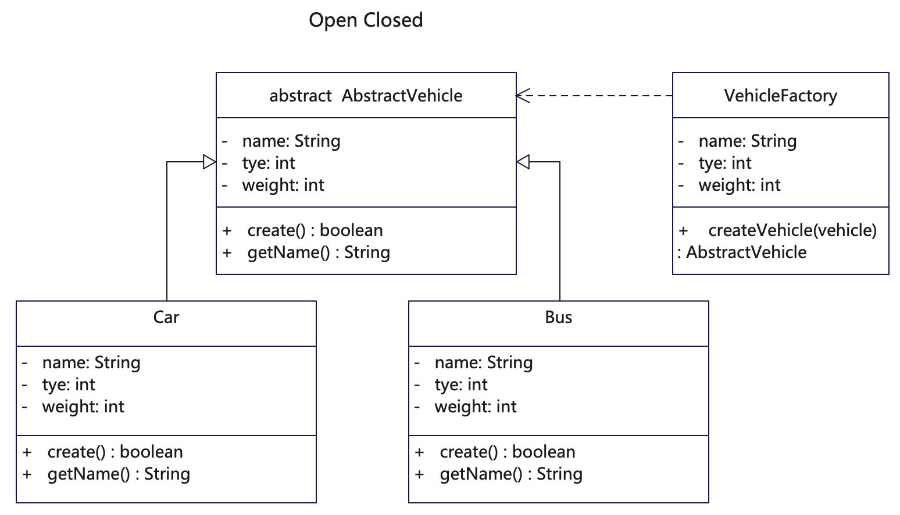

# 说明
开闭原则(Open Closed Principle，缩写为OCP)。是所有面向对象原则里最基础的原则，面向对象程序设计的精髓就在于将复杂问题抽象来看，提供可扩展的解决方案。软件设计本身所追求的目标就是封装变化、降低耦合，而开放封闭原则正是对这一目标的最直接体现。对扩展开放，即当有新的需求或变化时，可以对现有代码进行扩展，以适应新的情况。对修改封闭，则表示类一旦设计完成，就可以独立完成工作，而不要对已有代码进行反复修改。开闭原则与赖倒置原则（高层模块不应该依赖低层模块，两者都应该依赖其抽象）也很像，两者都是为了让代码保持更好的松耦合，从而使得代码更加具有可维护性。

# UML


# 代码
```java
/**
 * 车辆抽象类或者是接口，用于具体对象继承或实现，便于统一约束和扩展
 */
public abstract class AbstractVehicle {
    public String name;
    public int type;
    public int weight;
    protected abstract boolean create();
    public abstract String getName();
}
```

```java
/**
 * 汽车类继承自抽象机动车类
 */
public class Car extends AbstractVehicle {

    public String name = "car";
    private int type = 1;
    public int weight = 2500;

    public Car(String name) {
        this.name = name;
    }

    @Override
    public boolean create() {
        System.out.println("car has been produced: " + " " + this.type + " " + this.name + " " + this.weight);
        return true;
    }

    @Override
    public String getName() {
        return this.name;
    }
}
```

```java
/**
 * 巴士类继承自抽象机动车类
 */
public class Bus extends AbstractVehicle {

    public String name = "bus";
    private int type = 2;
    public int weight = 15000;

    public Bus(String name) {
        this.name = name;
    }

    @Override
    public boolean create() {
        System.out.println("bus has been produced: " + " " + this.type + " " + this.name + " " + this.weight);
        return true;
    }

    @Override
    public String getName() {
        return this.name;
    }
}
```

```java
/**
 * 车辆制造工厂，关联抽象汽车类，调用具体车辆的制造方法
 * 可以参照设计模式中的抽象工厂和工厂方法来获取具体工厂
 * 总之要将具体对象的方法与工厂调用逻辑区分开
 */
public class VehicleFactory {
    public static AbstractVehicle createVehicle(AbstractVehicle vehicle) {
        // 从工厂里调用具体对象的方法，避免通过if else 进行判断获取某个对象。
        // 当增加其他具体对象时不用修改这里的逻辑，
        // 而是通过扩展新增对象来实现。因此对修改关闭，对扩展开放。
        vehicle.create();
        // 可以返回具体对象或者调用基础方法
        return vehicle;
    }
}
```

# 反例
```java
/**
 * 这个例子违反了开闭原则，为了演示方便把其他类作为子类放在一起。
 * 1. 车辆制造类将具体创建方法放在了一起，不利于扩展。
 * 2. 一旦有新的车辆类型加入就需要不断修改车辆建造类。
 */
public class VehicleFactory_violate {
    public VehicleFactory_violate() {
        return;
    }

    public class Vehicle {
        public String name;
        public int type;
        public int weight;

        public String getName() {
            return this.name;
        }
    }

    public class Car extends Vehicle {
        public String name = "car";
        public int type = 1;
        public int weight = 2500;

        public Car(String name) {
            this.name = name;
            super.type = this.type;
        }

        @Override
        public String getName() {
            return this.name;
        }
    }

    public class Bus extends Vehicle {
        public String name = "bus";
        public int type = 2;
        public int weight = 15000;

        public Bus(String name) {
            this.name = name;
            super.type = this.type;
        }

        @Override
        public String getName() {
            return this.name;
        }
    }

    public class VehicleFactory {
        public VehicleFactory() {
            return;
        }

        public Vehicle createVehicle(Vehicle vehicle) {
            // 从工厂里调用具体对象的方法，避免通过if else/switch 判断来区分对象。
            // 当增加其他具体对象时就会需要修改这里的方法，这样就就违背了对修改关闭，对扩展开放原则。
            // 好的做法是这个方法里具体对象直接往下传递，不做逻辑处理，从而方便扩展。
            switch (vehicle.type) {
                case 1:
                    createCar(vehicle);
                    break;
                case 2:
                    createBus(vehicle);
                    break;
                // 如果新增其他对象则需要不断修改
                // case 3:
                //     createVan(vehicle);
                // break;
                default:
                    break;
            }
            // 可以返回具体对象或者调用基础方法
            return vehicle;
        }

        public Vehicle createCar(Vehicle vehicle) {
            // doSomething
            Car car = (Car) vehicle;
            System.out.println("car has been produced: " + " " + car.type + " " + car.name + " " + car.weight);
            return vehicle;
        }

        public Vehicle createBus(Vehicle vehicle) {
            // doSomething
            Bus bus = (Bus) vehicle;
            System.out.println("bus has been produced: " + " " + bus.type + " " + bus.name + " " + bus.weight);
            return vehicle;
        }

    }
}
```

## 更多语言版本
面向对象设计原则源码：[https://github.com/microwind/design-pattern/oop-principles](https://github.com/microwind/design-pattern/oop-principles)