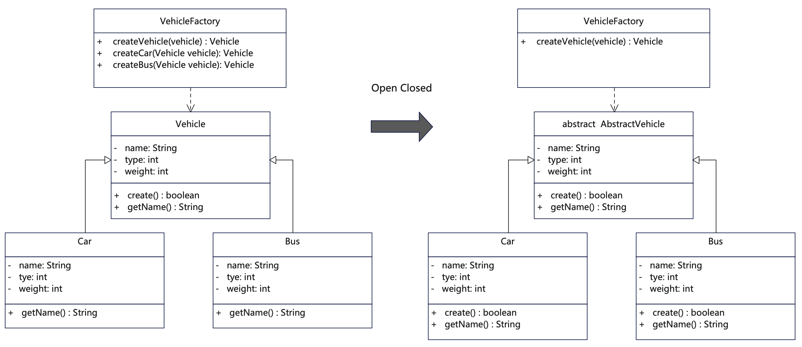

# 说明
开闭原则(Open Closed Principle，缩写为OCP)。是所有面向对象原则里最基础的原则，面向对象程序设计的精髓就在于将复杂问题进行抽象，提供可扩展的解决方案。软件设计本身所追求的目标就是封装变化、降低耦合，而开放封闭原则正是对这一目标的最直接体现。对扩展开放，即当有新的需求或变化时，可以对现有代码进行扩展，以适应新的情况。对修改封闭，则表示类一旦设计完成，就可以独立完成工作，而不要对已有代码进行反复修改。

要理解好开闭原则，注意以下3点：

1. 对扩展开放（Open for Extension）：尽量通过可扩展的方式来支持功能的增加，而不需要修改原有代码。这就需要在设计时尽量简单、清晰、抽象，做到各司其职。

2. 对修改关闭（Closed for Modification）：代码一旦经过测试，那就尽量少修改原有逻辑。在一般情况下优先通过扩展的方式来增添功能。这需要在代码设计之初想到日后可能的变动，一旦功能变动该如何来满足需求。

3. 多使用抽象类和接口，多使用多态：要实现开闭原则，通常需要使用抽象和多态。定义抽象接口或抽象类，让具体实现类实现或继承这些接口或抽象类，在声明和传递时尽量通过接口或抽象类型，这样我们可以轻松地做到功能扩展，而不必修改现有代码。

开闭原则常常与设计模式一起应用，像策略模式、工厂模式、观察者模式等设计模式都有助于实现开闭原则。这些设计模式通过将变化的部分封装起来，并且通过抽象来实现扩展，从而使系统更加灵活和可扩展。

开闭原则与赖倒置原则（高层模块不应该依赖低层模块，两者都应该依赖其抽象）也很像，两者都是为了让代码保持更好的松耦合，从而使得代码更加具有可维护性。

# UML


# 代码
```java
/**
 * 车辆抽象类或者是接口，用于具体对象继承或实现，便于统一约束和扩展
 */
public abstract class AbstractVehicle {
    public String name;
    public int type;
    public int weight;
    protected abstract boolean create();
    public abstract String getName();
}
```

```java
/**
 * 汽车类继承自抽象机动车类
 */
public class Car extends AbstractVehicle {

    public String name = "car";
    private int type = 1;
    public int weight = 2500;

    public Car(String name) {
        this.name = name;
    }

    @Override
    public boolean create() {
        System.out.println("car has been produced: " + " " + this.type + " " + this.name + " " + this.weight);
        return true;
    }

    @Override
    public String getName() {
        return this.name;
    }
}
```

```java
/**
 * 巴士类继承自抽象机动车类
 */
public class Bus extends AbstractVehicle {

    public String name = "bus";
    private int type = 2;
    public int weight = 15000;

    public Bus(String name) {
        this.name = name;
    }

    @Override
    public boolean create() {
        System.out.println("bus has been produced: " + " " + this.type + " " + this.name + " " + this.weight);
        return true;
    }

    @Override
    public String getName() {
        return this.name;
    }
}
```

```java
/**
 * 车辆制造工厂，关联抽象汽车类，调用具体车辆的制造方法
 * 可以参照设计模式中的抽象工厂和工厂方法来获取具体工厂
 * 总之要将具体对象的方法与工厂调用逻辑区分开
 */
public class VehicleFactory {
    public static AbstractVehicle createVehicle(AbstractVehicle vehicle) {
        // 从工厂里调用具体对象的方法，避免通过if else 进行判断获取某个对象。
        // 当增加其他具体对象时不用修改这里的逻辑，
        // 而是通过扩展新增对象来实现。因此对修改关闭，对扩展开放。
        vehicle.create();
        // 可以返回具体对象或者调用基础方法
        return vehicle;
    }
}
```

# 反例
```java
/**
 * 这个例子违反了开闭原则，为了演示方便把其他类作为子类放在一起。
 * 1. 车辆制造类将具体创建方法放在了一起，不利于扩展。
 * 2. 一旦有新的车辆类型加入就需要不断修改车辆建造类。
 */
public class OpenClosed_counter {
    public OpenClosed_counter() {
        return;
    }

    public class Vehicle {
        public String name;
        public int type;
        public int weight;

        public String getName() {
            return this.name;
        }
    }

    public class Car extends Vehicle {
        public String name = "car";
        public int type = 1;
        public int weight = 2500;

        public Car(String name) {
            this.name = name;
            super.type = this.type;
        }

        @Override
        public String getName() {
            return this.name;
        }
    }

    public class Bus extends Vehicle {
        public String name = "bus";
        public int type = 2;
        public int weight = 15000;

        public Bus(String name) {
            this.name = name;
            super.type = this.type;
        }

        @Override
        public String getName() {
            return this.name;
        }
    }

    public class VehicleFactory {
        public VehicleFactory() {
            return;
        }

        public Vehicle createVehicle(Vehicle vehicle) {
            // 从工厂里调用具体对象的方法，避免通过if else/switch 判断来区分对象。
            // 当增加其他具体对象时就会需要修改这里的方法，这样就就违背了对修改关闭，对扩展开放原则。
            // 好的做法是这个方法里具体对象直接往下传递，不做逻辑处理，从而方便扩展。
            switch (vehicle.type) {
                case 1:
                    createCar(vehicle);
                    break;
                case 2:
                    createBus(vehicle);
                    break;
                // 如果新增其他对象则需要不断修改
                // case 3:
                //     createVan(vehicle);
                // break;
                default:
                    break;
            }
            // 可以返回具体对象或者调用基础方法
            return vehicle;
        }

        public Vehicle createCar(Vehicle vehicle) {
            // doSomething
            Car car = (Car) vehicle;
            System.out.println("car has been produced: " + " " + car.type + " " + car.name + " " + car.weight);
            return vehicle;
        }

        public Vehicle createBus(Vehicle vehicle) {
            // doSomething
            Bus bus = (Bus) vehicle;
            System.out.println("bus has been produced: " + " " + bus.type + " " + bus.name + " " + bus.weight);
            return vehicle;
        }

    }
}
```

# 完整例子
```java
/**
 * 这个例子符合开闭原则，为了演示方便把其他类作为子类放在一起。
 * 1. 各品类有自己的折扣策略，而不是把策略都写在一个折扣策略里。
 * 2. 当有新的品类和折扣策略时，而无需修改现有代码，只需要扩展一个品类和折扣即可。
 */
public class OpenClosed_example {
  public OpenClosed_example() {
    return;
  }

  /*** 这是开闭原则的反例 ***/
  // 将各种折扣策略写在一个类里面，那么每次增加品类或者修改策略都涉及修改
  // 这样就不利于代码扩展和维护
  public class DiscountCalculator {

    // 这个方法逻辑复杂，先判断商品类型，在计算各种商品对应的打折策略
    public double applyDiscount(String itemType, double price, int quantity) {
      double totalPrice = price * quantity;
      if (itemType.equals("book")) {
        return totalPrice * 0.9; // 书籍打9折
      } else if (itemType.equals("clothing")) {
        if (quantity > 2) {
          return totalPrice * 0.8; // 超过两件衣服打8折
        } else {
          return totalPrice;
        }
      } else if (itemType.equals("electronic")) {
        if (quantity >= 5) {
          return totalPrice * 0.7; // 超过五件打7折
        } else {
          return totalPrice;
        }
      } else {
        return totalPrice; // 其他类型没有折扣
      }
    }
  }

  /*** 以下是开闭原则的正确例子 ***/

  // 先将折扣策略抽象为一个接口，不同品类实现自己的折扣策略
  // 当有新的品类增加时，不用修改原逻辑，只需扩展新的品类策略即可
  public interface DiscountStrategy {
    double applyDiscount(double price, int quantity);
  }

  public class BookDiscountStrategy implements DiscountStrategy {
    @Override
    public double applyDiscount(double price, int quantity) {
      // 书籍折扣逻辑
      return price * quantity * 0.9;
    }
  }

  public class ClothingDiscountStrategy implements DiscountStrategy {
    @Override
    public double applyDiscount(double price, int quantity) {
      // 衣物折扣逻辑
      if (quantity > 2) {
        return price * quantity * 0.8;
      } else {
        return price * quantity;
      }
    }
  }

  // 类似这样扩展，还可以扩展很多品类折扣策略来
  public class ElectronicsDiscountStrategy implements DiscountStrategy {
    @Override
    public double applyDiscount(double price, int quantity) {
      // 电子产品折扣逻辑
      if (quantity >= 5) {
        return price * quantity * 0.7;
      } else {
        return price * quantity;
      }
    }
  }

  public static void main(String[] args) {
    OpenClosed_example openClosed_example = new OpenClosed_example();

    // 书本单价与数量
    double bookPrice = 100.0; // 商品单价
    int bookQuantity = 3; // 购买数量

    // 衣物单价与数量
    double clothingPrice = 200.0; // 商品单价
    int clothingQuantity = 5; // 购买数量

    double electronicPrice = 800.0; // 商品单价
    int electronicQuantity = 2; // 购买数量

    /*** 先测试反例 ***/
    DiscountCalculator discountCalculator = openClosed_example.new DiscountCalculator();
    System.out.println("Book final price: " + discountCalculator.applyDiscount("book", bookPrice, bookQuantity));
    System.out.println(
        "Clothing final price: " + discountCalculator.applyDiscount("clothing", clothingPrice, clothingQuantity));
    System.out.println("Electronic final price: "
        + discountCalculator.applyDiscount("electronic", electronicPrice, electronicQuantity));

    // *********************** 分割线 ******************************************/
    System.out.println("***********************");
    /*** 再测试正确例子 ***/
    // 创建书本的折扣策略对象
    DiscountStrategy bookStrategy = openClosed_example.new BookDiscountStrategy();
    double bookFinalPrice = bookStrategy.applyDiscount(bookPrice, bookQuantity);
    System.out.println("Book final price: " + bookFinalPrice);

    // 创建衣物的折扣策略对象
    DiscountStrategy clothingStrategy = openClosed_example.new ClothingDiscountStrategy();
    double clothingFinalPrice = clothingStrategy.applyDiscount(clothingPrice, clothingQuantity);
    System.out.println("Clothing final price: " + clothingFinalPrice);

    // 创建电子产品的折扣策略对象
    DiscountStrategy electronicStrategy = openClosed_example.new ElectronicsDiscountStrategy();
    double electronicFinalPrice = electronicStrategy.applyDiscount(electronicPrice, electronicQuantity);
    System.out.println("Electronic final price: " + electronicFinalPrice);

  }
}
```

## 更多语言版本
面向对象设计原则源码：[https://github.com/microwind/design-pattern/oop-principles](https://github.com/microwind/design-pattern/oop-principles)