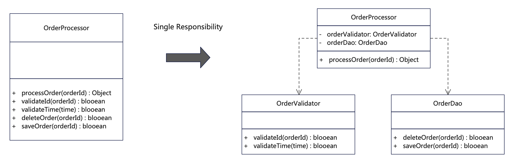

# 说明
单一职责原则(Single Responsibility Principle，缩写为SRP)。即一个类或者模块只负责完成一个职责或功能，而不是糅杂不同功能在一起。
当然单一职责原则并不是把类拆得越细越好，不是说每个类或者模块就只能完成最细粒度的事情，而是根据业务划分来讲，可以完成某一个具体单元或模块的事情。

可以这么来检验：
- 类修改是否只来自一个具体变化？
- 一个变化是否只影响一个类？
- 变化是否只影响其相应层次的类？
- 逻辑修改会否造成连锁反应，造成大面积修改？
- 类的代码行数过多（超过2000行）
- 类依赖的其他类过多（超过10个）
- 单个方法过长（超过150行）
- 私有方法过多（占比超过50%）
- 不容易给类起名字（类名过长，包含两个以上的名词）

# UML


# 代码
```java
/**
 * 这个例子符合单一职责原则。
 * 1.
 * 分别建立三个类，一个负责订单业务处理(OrderProcessor)，一个负责校验订单(OrderValidator)，一个负责保存数据(OrderDao)，各司其职。
 * 2. 由处理订单来负责调用工具类，订单业务逻辑修改不会影响到工具类。
 * 3. 工具类修改也不会影响到订单业务处理。
 * 4. 职责是否足够单一，要根据具体场景而异，不同情形下采用不同的设计，主要的目标是便于理解、扩展和维护。
 */
public class OrderProcessor {
    private OrderValidator orderValidator = new OrderValidator();
    private OrderDao orderDao = new OrderDao();

    public OrderProcessor() {
        return;
    }

    // 订单处理逻辑方法
    public Object processOrder(Long orderId) {
        System.out.println("oder ID：" + orderId);
        // 1. 先验证订单，调用校验类
        if (!orderValidator.validateId(orderId)) {
            System.out.println("order validate id failed.");
            return false;
        }

        if (!orderValidator.validateTime(System.currentTimeMillis())) {
            System.out.println("order validate time failed.");
            return false;
        }

        // 2. 订单数据其他逻辑处理
        if (orderId % 2 == 0) {
            System.out.println("order data processing.");
        }

        // 3. 再保存订单到数据库，调用数据库类
        System.out.println("order save to DB.");
        orderDao.saveOrder(orderId);
        // 或则删除订单
        // this.deleteOrder(orderId);

        return true;
    }
}
```

```java
/**
 * 订单校验类，校验订单的合法性和有效性等
 */
public class OrderValidator {

    // 校验订单逻辑，最好别放在订单处理类中
    public boolean validateId(Long orderId) {
        // doSomething
        if (orderId % 2 == 1) {
            return false;
        }
        return true;
    }

    public boolean validateTime(Long time) {
        // doSomething
        return true;
    }
}
```


```java
/**
 * Order数据库访问类，负责处理订单的CRUD操作
 */
public class OrderDao {

    // 删除订单
    protected boolean deleteOrder(Long orderId) {
        // doSomething
        return true;
    }

    // 保存订单到数据库
    protected boolean saveOrder(Long orderId) {
        if (orderId % 2 == 0) {
            System.out.println("data saving.");
        }
        System.out.println("data save done.");
        return true;
    }

}
```

# 反例
```java
/**
 * 这个例子违反了单一职责原则。
 * 1. 订单处理类实现了订单校验以及保存数据库的两种逻辑。
 * 2. 一旦订单条件有修改或保存数据库方式有变更都需要改动此类。
 */
public class SingleResponsibility_counter {
    public SingleResponsibility_counter() {
        return;
    }

    // 一个类负责订单处理、校验以及保存多重职责
    public class OrderProcessor {

        // 订单处理逻辑方法
        public Object processOrder(Long orderId) {
            System.out.println("oder ID：" + orderId);
            // 1. 先验证订单
            if (!this.validateId(orderId)) {
                System.out.println("order validate id failed.");
                return false;
            }

            if (!this.validateTime(System.currentTimeMillis())) {
                System.out.println("order validate time failed.");
                return false;
            }

            // 2. 订单数据其他逻辑处理
            if (orderId % 2 == 0) {
                System.out.println("order data processing.");
            }

            // 3. 再保存订单到数据库
            System.out.println("order save to DB.");
            this.saveOrder(orderId);
            // 或则删除订单
            // orderDao.deleteOrder(orderId);

            return true;
        }

        // 校验订单逻辑，最好别放在订单处理类中
        private boolean validateId(Long orderId) {
            // doSomething
            if (orderId % 2 == 1) {
                return false;
            }
            return true;
        }

        public boolean validateTime(Long time) {
            // doSomething
            return true;
        }

        // 保存订单到数据库逻辑，不应该放在订单处理类中
        private boolean saveOrder(Long orderId) {
            if (orderId % 2 == 0) {
                System.out.println("order saving.");
            }
            System.out.println("order save done.");
            return true;
        }

        // 删除订单，也不要直接放在订单处理类
        protected boolean deleteOrder(Long orderId) {
            // doSomething
            return true;
        }
    }
}
```

## 更多语言版本
面向对象设计原则源码：[https://github.com/microwind/design-pattern/oop-principles](https://github.com/microwind/design-pattern/oop-principles)
