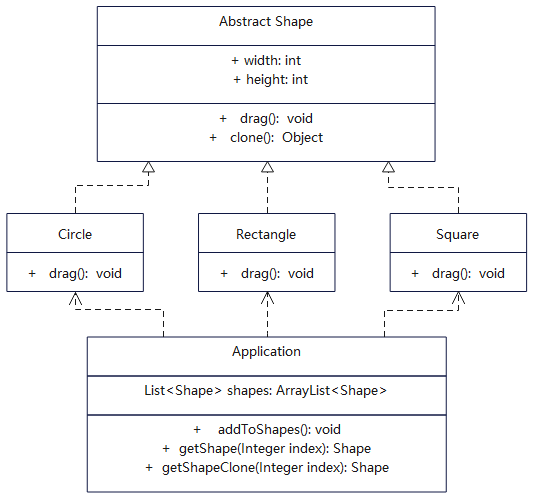

# 【原型设计模式详解】Java/JS/Go/Python/TS不同语言实现

# 简介
原型模式（Prototype Pattern）是一种创建型设计模式，使你能够复制已有对象，而无需使代码依赖它们所属的类，同时又能保证性能。

这种模式是实现了一个原型接口，该接口用于创建当前对象的克隆。当直接创建对象的代价比较大时，则采用这种模式。

如果你需要复制一些对象，同时又希望代码独立于这些对象所属的具体类，可以使用原型模式。

# 作用
1. 利用已有的一个原型对象，快速地生成和原型对象一样的实例。
2. 跳过构造函数的约束，便于提升性能。

# 实现步骤
1. 创建原型接口，并声明克隆方法。
2. 使用new运算符调用原型版本的构造函数。
3. 将子类构造函数的直接调用，替换为对原型工厂方法的调用。

# UML


# 代码

## 基础原型抽象类
```java
// Shape.java 基础抽象类
public abstract class Shape implements Cloneable {

  private int width;
  private int height;
  private String color = "";
  protected String type;

  public Shape() {

  }

  public String getType() {
    return type;
  }

  // 抽象方法，子类覆盖
  public abstract void draw();

  public void setWidth(int width) {
    this.width = width;
  }

  public int getWidth() {
    return this.width;
  }

  public int getHeight() {
    return this.height;
  }

  public void setHeight(int height) {
    this.height = height;
  }

  public void setColor(String color) {
    this.color = color;
  }

  public String getColor() {
    return this.color;
  }

  // 克隆方法
  public Object clone() {
    Object clone = null;
    try {
      clone = super.clone();
    } catch (CloneNotSupportedException e) {
      e.printStackTrace();
    }
    return clone;
  }

  @Override
  public String toString() {
    return String.format("{width = %s, height = %s, type = %s, color = %s }",
        this.width, this.height, this.type, this.color);
  }
}
```

## 具体原型者
```java
// Circle.java 具体原型类，克隆方法会创建一个新对象并将其传递给构造函数。
public class Circle extends Shape {
  public Circle() {
    super();
    type = "Circle";
  }

  @Override
  public void draw() {
    System.out.println("Circle::draw() method.");
  }
}
```

```java
// Rectangle.java 具体原型类，克隆方法会创建一个新对象并将其传递给构造函数。
public class Rectangle extends Shape {
  public Rectangle() {
    super();
    type = "Rectangle";
  }

  @Override
  public void draw() {
     System.out.println("Rectangle::draw() method.");
  }
}
```

```java
// 具体原型类，克隆方法会创建一个新对象并将其传递给构造函数。
public class Square extends Shape {
  public Square() {
    super();
    type = "Square";
  }

  @Override
  public void draw() {
    System.out.println("Square::draw() method.");
  }
}
```

## 客户使用类
```java
// Application.java 客户调用方
public class Application {

  public List<Shape> shapes = new ArrayList<Shape>();

  public Application() {
  }

  public void addToShapes() {
    Circle circle = new Circle();
    circle.setWidth(10);
    circle.setHeight(20);
    circle.setColor("red");
    shapes.add(circle);

    // 添加clone
    Circle anotherCircle = (Circle) circle.clone();
    anotherCircle.setColor("pink");
    shapes.add(anotherCircle);
    // 变量 `anotherCircle（另一个圆）`与 `circle（圆）`对象的内容完全一样。

    Rectangle rectangle = new Rectangle();
    rectangle.setWidth(99);
    rectangle.setHeight(69);
    rectangle.setColor("green");
    shapes.add(rectangle);
    // 添加clone
    shapes.add((Shape) rectangle.clone());
  }

  // 直接取出
  public Shape getShape(Integer index) {
    return this.shapes.get(index);
  }

  // 取出时候clone
  public Shape getShapeClone(Integer index) {
    Shape shape = this.shapes.get(index);
    return (Shape) shape.clone();
  }

  public void printShapes() {
    for (int i = 0; i < this.shapes.size(); i++) {
      Shape shape = this.shapes.get(i);
      System.out.println("shape " + i + " : " + shape.toString());
    }
  }

}
```

## 测试调用
```java
    /**
     * 原型模式主要就是复制已有的对象，而无需实例化类，从而提升实例化对象时的性能
     * 其实就是复制实例的属性到新对象上，减少了执行构造的步骤
     */
    Application application = new Application();
    application.addToShapes();
    Shape shapeClone = application.getShapeClone(1);
    // 更改clone
    shapeClone.setColor("gray");
    System.out.println("shapeClone : " + shapeClone.toString());
    // 直接更改
    application.getShape(3).setColor("yellow");
    application.printShapes();

    // /*********************** 分割线 ******************************************/
    application.shapes.add(new Square());
    for (Shape shape : application.shapes) {
      shape.draw();
      System.out.println(shape.toString());
    }
```
## 更多语言版本
不同语言实现设计模式：[https://github.com/microwind/design-pattern](https://github.com/microwind/design-pattern)