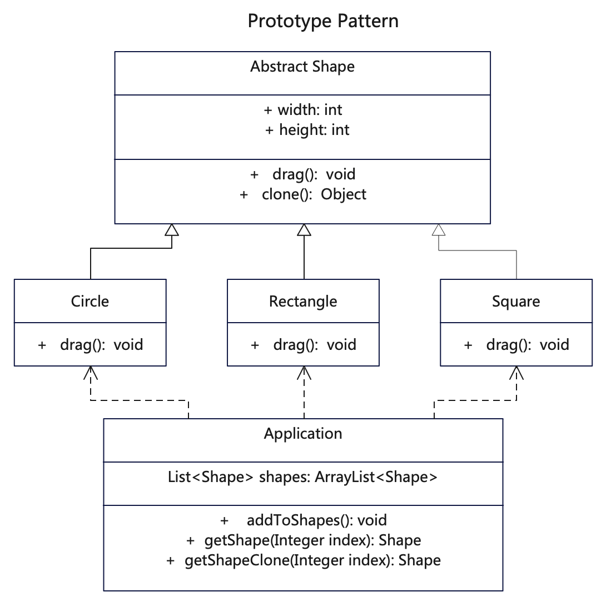

# 简介
原型模式（Prototype Pattern）是一种创建型设计模式，使你能够复制已有对象，而无需使代码依赖它们所属的类，同时又能保证性能。

这种模式是实现了一个原型接口，该接口用于创建当前对象的克隆。当直接创建对象的代价比较大时，则采用这种模式。

如果你需要复制一些对象，同时又希望代码独立于这些对象所属的具体类，可以使用原型模式。

# 作用
1. 利用已有的一个原型对象，快速地生成和原型对象一样的实例。
2. 跳过构造函数的约束，便于提升性能。

# 实现步骤
1. 创建原型接口，并声明克隆方法。
2. 使用new运算符调用原型版本的构造函数。
3. 将子类构造函数的直接调用，替换为对原型工厂方法的调用。

# UML

