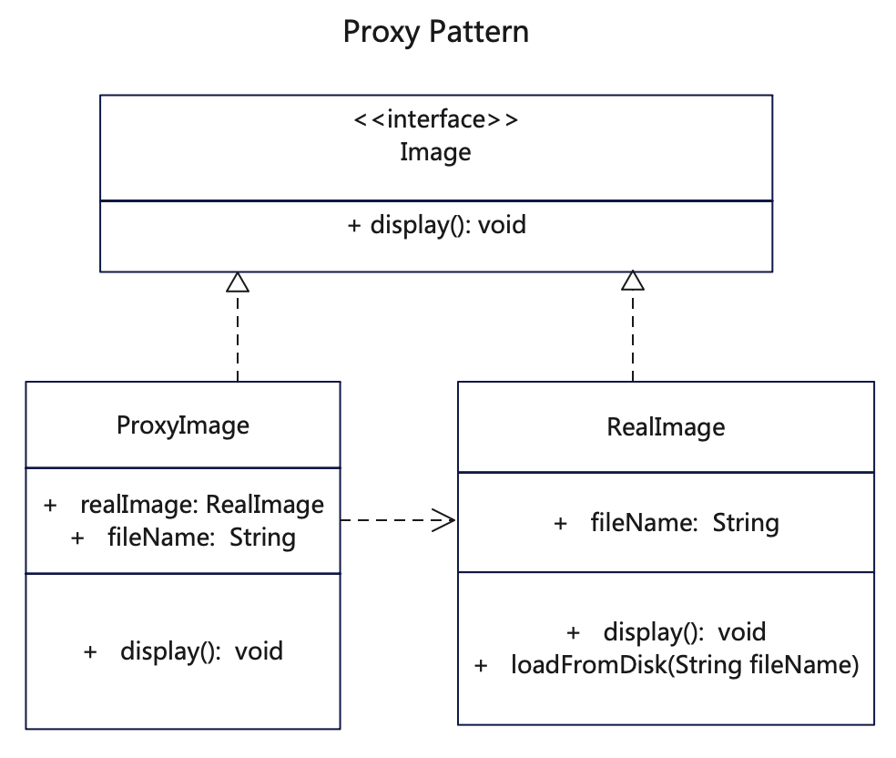

# 简介
代理模式（Proxy Pattern）是一种结构型设计模式，用一个类来代理另一个类或几个类的功能。

在代理模式中，我们创建具有现有对象的对象，以便向外界提供功能接口。

延迟初始化（虚拟代理）。如果你有一个偶尔使用的重量级服务对象，一直保持该对象运行会消耗系统资源时，可使用代理模式。

访问控制（保护代理）。如果你只希望特定客户端使用服务对象，这里的对象可以是操作系统中非常重要的部分，而客户端则是各种已启动的程序 （包括恶意程序）， 此时可使用代理模式。

# 作用
1. 为其他对象提供一种代理访问的方式。
2. 避免直接访问可能带来的问题，通过接口和代理来实现高扩展。

# 实现步骤
1. 定义一个基础接口，约定一些方法。
2. 建立原始类，实现接口方法。
3. 再建立代理类，也实现基础接口。代理类调用原始类来实现功能。

# UML



# 代码

## 代理接口类
```java
// Image.java 定义一个接口供代理和实际调用来使用
public interface Image {
  void display();
}
```

## 功能代理类
```java
// ProxyImage.java 代理类也实现了基础接口
public class ProxyImage implements Image {

  private RealImage realImage;
  private String fileName;

  public ProxyImage(String fileName) {
    this.fileName = fileName;
  }

  @Override
  public void display() {
    System.out.println("ProxyImage::display() " + fileName);
    if (realImage == null) {
      realImage = new RealImage(fileName);
    }
    // 代理类调用真实类的方法
    realImage.display();
  }
}
```

## 真实功能类
```java
// RealImage.java 真实类也实现基础代理接口
public class RealImage implements Image {

  private String fileName;

  public RealImage(String fileName) {
    // 在初始化时执行内部逻辑
    this.fileName = fileName;
    loadFromDisk(fileName);
  }

  @Override
  public void display() {
    System.out.println("RealImage::display() " + fileName);
  }

  // 这个方法只是内部使用
  private void loadFromDisk(String fileName) {
    System.out.println("RealImage::loadFromDisk()  " + fileName);
  }
}
```

## 测试调用
```java
  /**
   * 代理模式就是用一个类来代理另一个类或几个类的功能，以便隔绝外部客户和内部真实类
   * 这样真实类和调用方之间有一个代理屏障，保证了安全
   * 同时真实的类如果初始化过，就不再初始化，提升了性能
   */

    // 声明代理类来执行真实类的能力
    Image image = new ProxyImage("001.jpg");

    // 代理类执行真实类的能力
    image.display();

    // 再调用一次，不会重复实例化
    image.display();
```
## 更多语言版本
不同语言实现设计模式：[https://github.com/microwind/design-pattern](https://github.com/microwind/design-pattern)