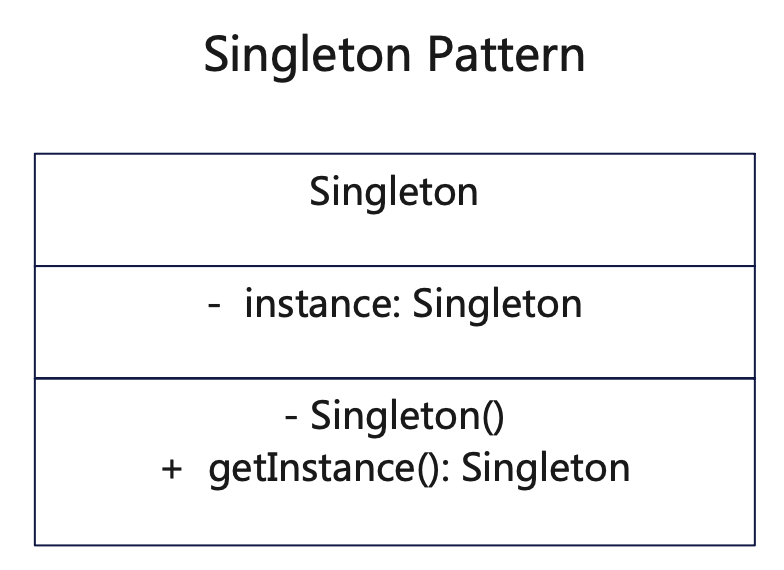

# 简介
单例模式（Singleton Pattern）属于创建型设计模式，这种模式只创建一个单一的类，保证一个类只有一个实例，并提供一个访问该实例的全局节点。

当您想控制实例数目，节省系统资源，并不想混用的时候，可以使用单例模式。

# 作用
1. 避免全局使用的类频繁地创建与销毁。
2. 保证一个类仅有一个实例，并提供一个访问它的全局访问点。

# 实现步骤
1. 创建单例类，注意线程安全
2. 返回全局唯一实例

# UML
