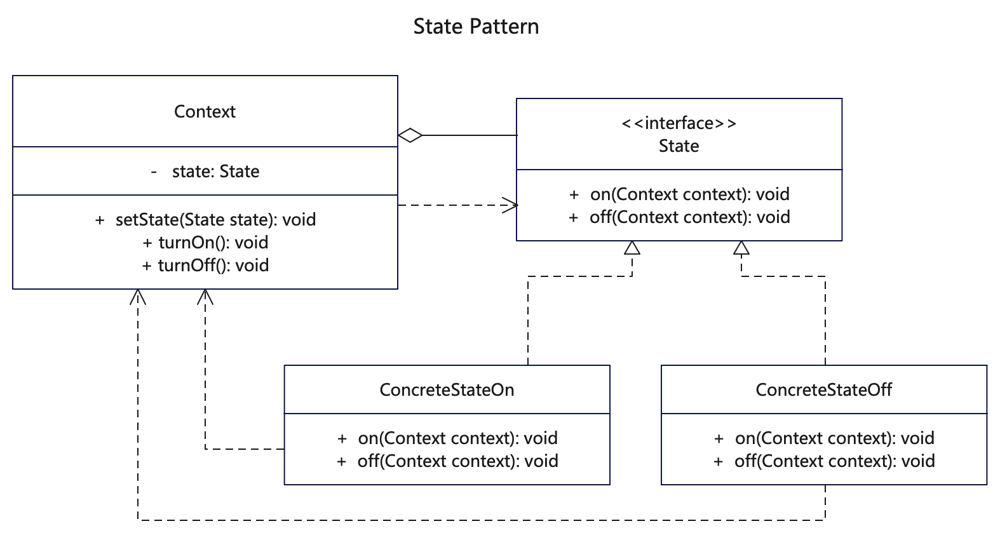

# 【状态设计模式详解】C/Java/JS/Go/Python/TS不同语言实现

# 简介
状态模式（State Pattern）是一种行为型模式，类的行为是基于它的状态改变的，不同的状态下有不同的行为。状态模式和策略模式相似，但是状态模式中的行为是平行的，不可替换的，策略模式中的行为是彼此独立的，可以相互替换，且提前预置到某个具体对象类Context中。状态模式将对象的行为封装在不同的状态对象中，将对象的状态从对象中分离出来，客户端无需关心对象的当前状态和状态的转换。

当一个对象在运行时根据状态来来改变他的行为，同时代码中包含了大量与对象状态有关的条件语句时，可以使用状态模式。

其中角色有：
Context：持有State实例，定义了对象当前的状态。
State：抽象状态类或者接口，定义一个或一组接口，表示该状态下的行为。
ConcreteStateA,ConcreteStateB: 具体的实现类，实现了State中定义的接口，不同状态有不同行为，设置Context的当前状态。

# 作用
1. 对象的行为依赖于它的状态，并且可以根据它的状态改变而改变它的相关行为。
2. 当控制一个对象状态转换的条件表达式过于复杂的情况，把状态的判断逻辑转移到不同的状态中，从而把复杂的判断逻辑简单化。

# 实现步骤
1. 创建State状态接口，包括全部动作状态。
2. 分别创建不同的状态类，实现State抽象接口，不同状态类的方法要实现不同类的切换。
3. 创建Context执行对象，关联到状态接口，允许状态切换。
4. 客户调用方通过初始化执行对象，设置初始状态，再调用执行对象动作的同时切换状态。

# UML


# Java代码

## 状态基础接口
```java
// State.java 定义状态接口和状态方法，当前context只有一种状态
public interface State {
  public void on(Context context);
  public void off(Context context);
}
```

## 状态实现类 
```java
// ConcreteStateOff.java 具体的状态实现者
public class ConcreteStateOff implements State {

  @Override
  public void on(Context context) {
    System.out.println(this.getClass().getSimpleName() + "::on() [turn ON ok!]");
    // 状态变为on后，状态类切换到ConcreteStateOn
    context.setState(new ConcreteStateOn());
  }

  @Override
  public void off(Context context) {
    // 当前是off状态，再点击off只是提示，不切换状态类
    System.out.println(this.getClass().getSimpleName() + "::off() [needn't switch, state is OFF.]");
  }

}
```

```java
// ConcreteStateOn.java 具体的状态实现者
public class ConcreteStateOn implements State {

  // 策略模式与状态模式都是将策略/状态绑定到执行对象(Context)上
  // 不同的是策略模式是客户可设定策略，而状态则是通过状态动作来实现改变
  @Override
  public void on(Context context) {
    // 当前是on状态，再点击on只是提示，不切换状态类
    System.out.println(this.getClass().getSimpleName() + "::on() [needn't switch, state is ON.]");
  }

  @Override
  public void off(Context context) {
    // 状态变为off后，状态类切换到ConcreteStateOff
    System.out.println(this.getClass().getSimpleName() + "::off() [turn OFF ok!]");
    context.setState(new ConcreteStateOff());
  }
}
```

## 业务状态类
```java
// Context.java 执行实体类，内部关联状态
public class Context {
  private State state;

  public Context(State state) {
    this.state = state;
  }

  public Context() {
  }

  public State getState() {
    return state;
  }

  public void setState(State state) {
    System.out
        .println(this.getClass().getSimpleName() + "::setState() [state = " + state.getClass().getSimpleName() + "]");
    this.state = state;
  }

  public void turnOn() {
    state.on(this);
  }

  public void turnOff() {
    state.off(this);
  }
}
```

## 测试调用
```java
    /**
     * 状态模式就是对象Context在不同行为下有不同的状态，当前只有一种状态。
     * 通过行为的改变，状态也随之自动发生了改变。
     * 策略模式与状态模式类似，但策略模式是可以重新设置策略，而状态则通过行为来切换状态。
     */

    Context context = new Context();
    // 初始状态是off
    context.setState(new ConcreteStateOff());
    // turn on
    context.turnOn();
    // 再次turn on
    context.turnOn();
    // turn off
    context.turnOff();
    // 再次turn off
    context.turnOff();
    System.out.println("context.state: " + context.getState().getClass().getSimpleName());
```

# Go代码

## 状态基础接口
```go
// State.go 定义状态接口和状态方法，当前context只有一种状态
type State interface {
  GetName() string
  On(context *Context)
  Off(context *Context)
}
```

## 状态实现类 
```go
// ConcreteStateOff.go 具体的状态实现者

type ConcreteStateOff struct {
  Name string
}

func (c *ConcreteStateOff) GetName() string {
  if c.Name == "" {
    c.Name = "ConcreteStateOff"
  }
  return c.Name
}

func (c *ConcreteStateOff) On(context *Context) {
  fmt.Println("ConcreteStateOff::On() [turn ON ok!]")
  // 状态变为on后，状态类切换到ConcreteStateOn
  context.SetState(&ConcreteStateOn{})
}

func (c *ConcreteStateOff) Off(context *Context) {
  // 当前是off状态，再点击off只是提示，不切换状态类
  fmt.Println("ConcreteStateOff::Off() [needn't switch, state is OFF.]")
}
```

```go
// ConcreteStateOn.go 具体的状态实现者
type ConcreteStateOn struct {
  Name string
}

func (c *ConcreteStateOn) GetName() string {
  if c.Name == "" {
    c.Name = "ConcreteStateOn"
  }
  return c.Name
}

func (c *ConcreteStateOn) On(context *Context) {
  // 当前是on状态，再点击on只是提示，不切换状态类
  fmt.Println("ConcreteStateOn::On() [needn't switch, state is ON.]")
}

func (c *ConcreteStateOn) Off(context *Context) {
  // 状态变为off后，状态类切换到ConcreteStateOff
  fmt.Println("ConcreteStateOn::Off() [turn OFF ok!]")
  // 此处状态对象可以每次是新实例，也可以外部传入
  context.SetState(&ConcreteStateOff{})
}
```

## 业务状态类
```go
// Context.go 执行实体类，内部关联状态
type Context struct {
  state State
}

func (c *Context) GetState() State {
  return c.state
}

func (c *Context) SetState(state State) {
  fmt.Println("Context::SetState() [state = " + state.GetName() + "]")
  c.state = state
}

func (c *Context) TurnOn() {
  c.state.On(c)
}

func (c *Context) TurnOff() {
  c.state.Off(c)
}
```

## 测试调用
```go
func main() {
  fmt.Println("test start:")

  /**
   * 状态模式就是对象Context在不同行为下有不同的状态，当前只有一种状态。
   * 通过行为的改变，状态也随之自动发生了改变。
   * 策略模式与状态模式类似，但策略模式是可以重新设置策略，而状态则通过行为来切换状态。
   */

  context := &src.Context{}
  // 初始状态是off
  context.SetState(&src.ConcreteStateOff{})
  // turn on
  context.TurnOn()
  // 再次turn on
  context.TurnOn()
  // turn off
  context.TurnOff()
  // 再次turn off
  context.TurnOff()
  fmt.Println("context.state: " + context.GetState().GetName())
}
```

# C语言简版
```c
#include <stdio.h>
// 状态模式将对象的行为封装在不同的状态对象中
// 将对象的状态从对象中分离出来，客户端无需关心对象的当前状态和状态的转换。
typedef struct Context Context;

// 执行对象
struct Context
{
    // 设置状态
    char name[50];
    void (*change_state)(Context *context);
};

// 定义不同状态函数
void state_A_change_state(Context *context);
void state_B_change_state(Context *context);
void state_C_change_state(Context *context);

void state_A_change_state(Context *context)
{
    printf("\r\n state_A_change_state() [context=%s change to=%s]", context->name, "state_B");
    // 切换到状态 B
    context->change_state = state_B_change_state;
}

void state_B_change_state(Context *context)
{
    printf("\r\n state_B_change_state() [context=%s change to=%s]", context->name, "state_C");
    // 切换到状态 C
    context->change_state = state_C_change_state;
}

void state_C_change_state(Context *context)
{
    printf("\r\n state_C_change_state() [context=%s change to=%s]", context->name, "state_A");
    // 切换到状态 A
    context->change_state = state_A_change_state;
}

int main()
{
    printf("test start:\r\n");
    Context context = {
        .name = "Context01",
        .change_state = state_A_change_state};

    // 当前只有一种状态
    for (int i = 0; i < 5; i++)
    {
        context.change_state(&context);
    }

    return 0;
}
```

## 更多语言版本
不同语言设计模式源码：[https://github.com/microwind/design-pattern](https://github.com/microwind/design-pattern)