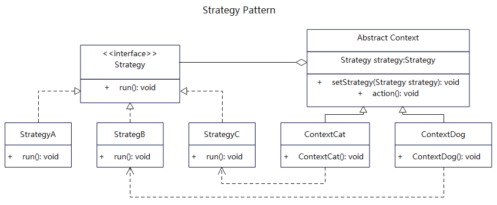

# 简介
策略模式（Strategy Pattern）属于行为型设计模式。将每一个算法封装到具有共同接口的独立类中，根据需要来绑定策略，使得具体实现和策略解耦。

当你想使用对象中各种不同的算法变体，使用if...else 所带来的复杂和难以维护，可使用策略模式。或者当有许多相同类，它们仅在执行某些行为时略有不同，可使用策略模式。

# 作用
1. 策略算法可以自由切换，保持策略与执行类的松耦合。 
2. 避免使用多重条件判断，不同环境角色可以组装多个策略。
3. 扩展性良好，可以随时增删策略行为。
4. 体现了多用组合，少用继承。

# 实现步骤
1. 建立一个策略接口。
2. 新建多个策略行为类，实现该策略接口。
3. 建立一个抽象环境角色类，并将策略接口组合进来。是否需要抽象类可选。
4. 建立多个环境角色类来继承该抽象类。
5. 可以动态改变环境角色的策略行为。

# UML


# 代码

## 状态基础接口
```java
// Strategy.java 基础策略接口
public interface Strategy {
  public void run();
}
```

## 策略实现类 
```java
// StrategyA.java 策略A
public class StrategyA implements Strategy {
 
  @Override
  public void run() {
     System.out.println("StrategyA::run().");
  }
}
```

```java
// StrategyB.java 策略B
public class StrategyB implements Strategy {
 
  @Override
  public void run() {
     System.out.println("StrategyB::run().");
  }
}
```

```java
// StrategyC.java 策略C
public class StrategyC implements Strategy {
 
  @Override
  public void run() {
     System.out.println("StrategyC::run().");
  }
}
```

## 抽象业务类
```java
// Context.java 抽象业务类，聚合策略对象
public abstract class Context {

  protected Strategy strategy;

  public void setStrategy(Strategy strategy) {
    this.strategy = strategy;
  }

  public void action() {
    this.strategy.run();
  }

}
```

## 具体业务类
```java
// ContextCat.java 业务类构造器聚合了某策略
public class ContextCat extends Context {
 
  public ContextCat() {
    // 使用某个策略
    System.out.println("ContextCat::setStrategy(StrategyC).");
    this.setStrategy(new StrategyC());
  }
}
```

```java
// ContextDog.java 业务类构造器聚合了某策略
public class ContextDog extends Context {
  public ContextDog() {
    // 使用某个策略
    System.out.println("ContextDog::setStrategy(StrategyB).");
    this.setStrategy(new StrategyB());
  }
}
```

## 测试调用
```java
  /**
   * 策略模式就是根据需要给对象绑定具体策略，使得具体实现和策略可以灵活搭配。
   * 先声明某个具体Context对象，该对象已经绑定了具体策略，同时还可以更改策略。
   */

    // 实例化某个内容，策略已经绑定上
    Context contextCat = new ContextCat();
    contextCat.action();

    // 重新设置策略
    System.out.println("reset contextCat'strategy to StrategyA.");
    contextCat.setStrategy(new StrategyA());
    contextCat.action();
    
    // 实例化某个内容，策略已经绑定上
    Context contextGog = new ContextDog();
    contextGog.action();
```
## 更多语言版本
不同语言实现设计模式：[https://github.com/microwind/design-pattern](https://github.com/microwind/design-pattern)