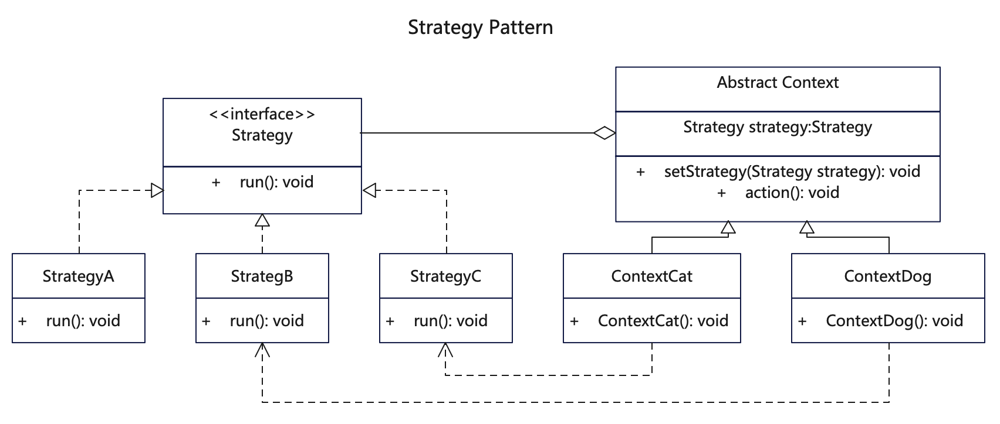

# 【策略设计模式详解】C/Java/JS/Go/Python/TS不同语言实现

# 简介
策略模式（Strategy Pattern）属于行为型设计模式。将每一个算法封装到具有共同接口的独立类中，根据需要来绑定策略，使得具体实现和策略解耦。

当你想使用对象中各种不同的算法变体，使用if...else 所带来的复杂和难以维护，可使用策略模式。或者当有许多相同类，它们仅在执行某些行为时略有不同，可使用策略模式。

# 作用
1. 策略算法可以自由切换，保持策略与执行类的松耦合。 
2. 避免使用多重条件判断，不同环境角色可以组装多个策略。
3. 扩展性良好，可以随时增删策略行为。
4. 体现了多用组合，少用继承。

# 实现步骤
1. 建立一个策略接口。
2. 新建多个策略行为类，实现该策略接口。
3. 建立一个抽象环境角色类，并将策略接口组合进来。是否需要抽象类可选。
4. 建立多个环境角色类来继承该抽象类。
5. 可以动态改变环境角色的策略行为。

# UML


# Java代码

## 状态基础接口
```java
// Strategy.java 基础策略接口
public interface Strategy {
  public void run();
}
```

## 策略实现类 
```java
// StrategyA.java 策略A
public class StrategyA implements Strategy {
 
  @Override
  public void run() {
     System.out.println("StrategyA::run().");
  }
}
```

```java
// StrategyB.java 策略B
public class StrategyB implements Strategy {
 
  @Override
  public void run() {
     System.out.println("StrategyB::run().");
  }
}
```

```java
// StrategyC.java 策略C
public class StrategyC implements Strategy {
 
  @Override
  public void run() {
     System.out.println("StrategyC::run().");
  }
}
```

## 抽象业务类
```java
// Context.java 抽象业务类，聚合策略对象
public abstract class Context {

  protected Strategy strategy;

  public void setStrategy(Strategy strategy) {
    this.strategy = strategy;
  }

  public void action() {
    this.strategy.run();
  }

}
```

## 具体业务类
```java
// ContextCat.java 业务类构造器聚合了某策略
public class ContextCat extends Context {
 
  public ContextCat() {
    // 使用某个策略
    System.out.println("ContextCat::setStrategy(StrategyC).");
    this.setStrategy(new StrategyC());
  }
}
```

```java
// ContextDog.java 业务类构造器聚合了某策略
public class ContextDog extends Context {
  public ContextDog() {
    // 使用某个策略
    System.out.println("ContextDog::setStrategy(StrategyB).");
    this.setStrategy(new StrategyB());
  }
}
```

## 测试调用
```java
  /**
   * 策略模式就是根据需要给对象绑定具体策略，使得具体实现和策略可以灵活搭配。
   * 先声明某个具体Context对象，该对象已经绑定了具体策略，同时还可以更改策略。
   */

    // 实例化某个内容，策略已经绑定上
    Context contextCat = new ContextCat();
    contextCat.action();

    // 重新设置策略
    System.out.println("reset contextCat'strategy to StrategyA.");
    contextCat.setStrategy(new StrategyA());
    contextCat.action();
    
    // 实例化某个内容，策略已经绑定上
    Context contextGog = new ContextDog();
    contextGog.action();
```

# Go代码

## 状态基础接口
```go
// Strategy.go 基础策略接口
// 定义一个策略接口，注意go语言数据类型即接口
type Strategy interface {
    Run()
}

// 写在接口文件的其他全局方法
func Init() {
    fmt.Println("strategy init!")
}
```

## 策略实现类 
```go
// StrategyA.go 策略A
type StrategyA struct {
}

// 实现策略接口的对应方法
func (s *StrategyA) Run() {
    fmt.Println("StrategyA::Run")
}
```

```go
// StrategyB.go 策略B
type StrategyB struct {
}

// 实现策略接口的对应方法
func (s *StrategyB) Run() {
    fmt.Println("StrategyB::Run")
}

```

```go
// StrategyC.go 策略C
type StrategyC struct {
}

// 实现策略接口的对应方法
func (s *StrategyC) Run() {
    fmt.Println("StrategyC::Run")
}
```

## 抽象业务类
```go
// Context.go 抽象业务类，聚合策略对象
type Context struct {
    strategy Strategy
}

// 设置不同strategy，方法名首字母大写
func (c *Context) SetStrategy(s Strategy) {
    c.strategy = s
}

// 执行策略接口里面的方法
func (c *Context) Run() {
    c.strategy.Run()
}
```

## 具体业务类
```go
// ContextCat.go 业务类构造器聚合了某策略
// 定义具体执行对象，Go没有继承，用聚合来调用Context里的函数
type ContextCat struct {
    context Context
}

// 可提前绑定具体的策略
func (c *ContextCat) Init() {
    c.context.SetStrategy(&StrategyC{})
    fmt.Println("ContextCat::init. setStrategy(StrategyC)")
}

// 调用策略方法
func (c *ContextCat) Run() {
    fmt.Println("ContextCat::run")
    c.context.Run()
}

```

```go
// ContextDog.go 业务类构造器聚合了某策略
type ContextDog struct {
    context Context
}

// 可提前绑定具体的策略
func (c *ContextDog) Init() {
    c.context.SetStrategy(&StrategyB{})
    fmt.Println("ContextDog::init. setStrategy(StrategyB)")
}

// 调用策略方法
func (c *ContextDog) Run() {
    fmt.Println("ContextDog::run")
    c.context.Run()
}
```

## 测试调用
```go
func main() {
    fmt.Println("test start:")
    // 这里src.Init来自strategy.go文件
    src.Init()

    /**
     * 策略模式就是根据需要给对象绑定具体策略，使得具体实现和策略可以灵活搭配。
     * 先声明某个具体Context对象，该对象已经绑定了具体策略，同时还可以更改策略。
     */

    // 声明策略执行对象
    context := src.Context{}

    // 设置策略A
    context.SetStrategy(&src.StrategyA{})

    // 执行策略A，打印StrategyA
    context.Run()

    // 设置策略B
    context.SetStrategy(&src.StrategyB{})
    // 执行策略B，打印StrategyB
    context.Run()

    // 执行策略C，打印StrategyC
    context.SetStrategy(&src.StrategyC{})
    context.Run()

    // /*********************** 分割线 ******************************************/

    // 直接实例化具体执行对象，策略已经绑定
    contextCat := src.ContextCat{}
    contextCat.Init()
    contextCat.Run()

    // 直接实例化具体执行对象，策略已经绑定
    contextDog := src.ContextDog{}
    contextDog.Init()
    contextDog.Run()
}
```

## 更多语言版本
不同语言设计模式源码：[https://github.com/microwind/design-pattern](https://github.com/microwind/design-pattern)