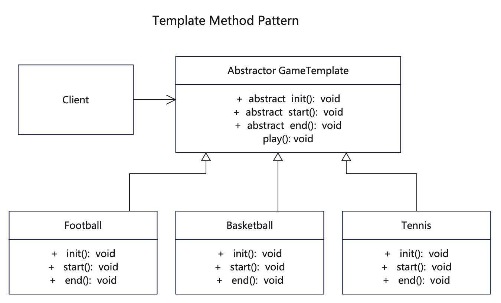

# 简介
模板方法模式（Template Method Pattern）也叫模板模式，是一种行为型模式。它定义了一个抽象公开类，包含基本的算法骨架，而将一些步骤延迟到子类中，模板方法使得子类可以不改变算法的结构，只是重定义该算法的某些特定步骤。不同的子类以不同的方式实现这些抽象方法，从而对剩余的逻辑有不同的实现。以此基于公共的模板，来实现实现不同的功能。

模板模式适用于一些复杂操作进行步骤分割、抽取公共部分由抽象父类实现、将不同的部分在父类中定义抽象实现、而将具体实现过程由子类完成。对于有多个子类具有共有的方法，且逻辑相同，可以考虑作为模板方法。

# 作用
1. 相同的部分父类给出统一的模板，子类大量复用，从而节省代码，复用逻辑。
2. 封装不变部分，扩展可变部分，行为由父类控制，子类灵活实现，便于维护和扩展。

# 实现步骤
1. 创建一个抽象的模板类，定义基本流程，同时定义一些基本方法供子类去实现。
2. 创建多个子类继承抽象模板，覆盖父类的相关动作和方法。

# UML


# 代码

## 抽象模板类
```java
// GameTemplate.java 定义抽象模板类，有抽象方法和具体方法
public abstract class GameTemplate {

   // 抽象方法待子类来实现
   abstract void init();

   abstract void start();

   abstract void end();

   // 可复用的算法流程
   public void play() {

      System.out.println(this.getClass().getSimpleName() + "::play()");

      // 初始化游戏
      init();

      // 开始游戏
      start();

      // 结束游戏
      end();
   }

}
```

## 具体业务类，继承抽象模板
```java
// Basketball.java  定义子类覆写父类抽象方法
public class Basketball extends GameTemplate {

   @Override
   void init() {
      System.out.println("Basketball::init() [Basketball Game Initialized! Start playing.]");
   }

   @Override
   void start() {
      System.out.println("Basketball::start() [Basketball Game Started. Enjoy the game!]");
   }

   @Override
   void end() {
      System.out.println("Basketball::end() [Basketball Game Finished!]");
   }

}
```

```java
// Football.java 定义子类覆写父类抽象方法
public class Football extends GameTemplate {

   @Override
   void init() {
      System.out.println("Football::init() [Football Game Initialized! Start playing.]");
   }

   @Override
   void start() {
      System.out.println("Football::start() [Football Game Started. Enjoy the game!]");
   }

   @Override
   void end() {
      System.out.println("Football::end() [Football Game Finished!]");
   }

}
```

```java
// Tennis.java 定义子类覆写父类抽象方法
public class Tennis extends GameTemplate {

   @Override
   void init() {
      System.out.println("Tennis::init() [Tennis Game Initialized! Start playing.]");
   }

   @Override
   void start() {
      System.out.println("Tennis::start() [Tennis Game Started. Enjoy the game!]");
   }

   @Override
   void end() {
      System.out.println("Tennis::end() [Tennis Game Finished!]");
   }

   // 在调用父类play之前，如果要执行自己的行为，也可以覆盖父类方法
   // 先执行自己的，再调用父类的方法
   @Override
   public void play() {
      System.out.println("Tennis::play() [Tennis Game play!]");
      super.play();
   }
}
```

## 测试调用
```java
    /**
     * 模板方法模式就是当子类具备类似行为的时候，让子类共用一套流程
     * 创建一个公共模板，确定公用流程和操作动作，子类覆盖具体的动作
     */
    GameTemplate football = new Football();
    football.play();

    System.out.println("===");
    GameTemplate basketball = new Basketball();
    basketball.play();

    System.out.println("===");
    GameTemplate tennis = new Tennis();
    tennis.play();
```
## 更多语言版本
不同语言实现设计模式：[https://github.com/microwind/design-pattern](https://github.com/microwind/design-pattern)