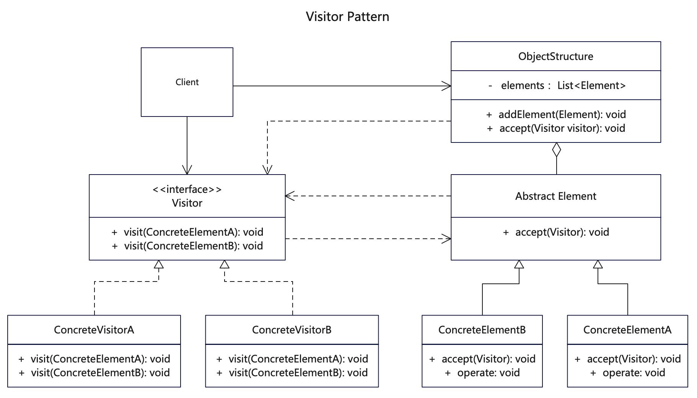

# 【访问者设计模式详解】C/Java/JS/Go/Python/TS不同语言实现

# 简介
访问者模式（Visitor Pattern）是一种行为型模式。它封装一个访问者类，把各元素类的操作集合起来，目的是将数据结构与数据操作分离。在不改变原有元素类数据结构的前提下，改变了元素类的执行算法。

当某些较为稳定的东西（数据结构或算法），不想直接被改变但又想扩展功能，这时候适合用访问者模式。访问者模式的使用频率并不是很高，大多数情况下，你并不需要使用访问者模式，但是当你一旦需要使用它时，那你就是需要使用它了。

访问者模式有以下几个角色：
- 结构对象(ObjectStructure)：结构对象角色，这是访问者模式的基础角色，包含多个类或者接口.
- 抽象元素(Element)：定义一个接受访问操作accept()，以一个访问者Visitor作为参数。
- 具体元素(ConcreteElement)：实现抽象节点的accept()方法和处理操作，调用Vistor的访问方法实现具体功能。
- 抽象访问者(Visitor)：定义一个抽象接口，声明一个或多个访问操作，使得所有具体访问者都必须实现。
- 具体访问者(ConcreteVisitor)：具体访问者角色，实现Visitor声明的接口。

# 作用
1. 在数据基础类里面有一个方法接受访问者，将自身引用传入访问者，从而把不变的固定起来，把变化的开放出去。
2. 通过隔离类中变化的东西，固定不变的东西，符合单一职责原则，同时具备较好的扩展性和灵活性。

# 实现步骤
1. 先创建基本元素抽象类Element，确定accept()抽象方法。
2. 分别创建几个具体的元素类，实现抽象元素的accept方法。
3. 在创建Visitor抽象接口，定义visit方法，调用具体元素。
4. 创建1个或多个Visitor类，继承抽象接口，客户将以此去访问具体元素。
5. 再创建对象结构类，这是核心入口类，负责组合各种元素，以及传递访问者Visitor。
6. 客户调用时先创建对象结构类，再指定访问者类，通过访问这类调用具体元素类

# UML


# 代码

## 结构对象
```java
// ObjectStructure.java 结构对象(ObjectStructure)
public class ObjectStructure {

  // 可以想象为一台电脑，聚合了各种设备元素
  private String name = "Computer Structure";
  private List<Element> elements = new ArrayList<Element>();

  // 结构对象初始化聚合了其他元素
  public ObjectStructure() {
    addElement(new ConcreteElementA());
    addElement(new ConcreteElementB());
  }

  public void addElement(Element element) {
    elements.add(element);
  }

  // 传入访问者分发给其他元素
  public void accept(Visitor visitor) {
    System.out
        .println("ObjectStructure::accept() [visitor.class = " + visitor.getClass().getSimpleName() + " visitor.name = "
            + visitor.getName() + "]");
    for (Element element : elements) {
      element.accept(visitor);
    }
  }

  public String getName() {
    return this.name;
  }

}
```

## 抽象访问者类
```java
// Visitor.java 访问者Visitor抽象接口，定义不同的visit方法
public interface Visitor {
  public void visit(ConcreteElementA concreteElementA);

  public void visit(ConcreteElementB concreteElementB);

  public String getName();
}
```

## 具体访问者
```java
// ConcreteVisitorA.java 具体访问者A
public class ConcreteVisitorA implements Visitor {

  // 假如由不同厂商是程序的访问者
  private String name = "Google Visitor";

  @Override
  public void visit(ConcreteElementA concreteElementA) {
    System.out.println(
        "ConcreteVisitorA::visit() [Element.class = " + concreteElementA.getClass().getSimpleName()
            + " Element.name = "
            + concreteElementA.getName() + "]");
    concreteElementA.operate();
  }

  @Override
  public void visit(ConcreteElementB concreteElementB) {
    System.out.println("ConcreteVisitorA::visit() [Element.class = " + concreteElementB.getClass().getSimpleName()
        + " Element.name = "
        + concreteElementB.getName() + "]");
    concreteElementB.operate();
  }

  public String getName() {
    return this.name;
  }
}
```

```java
// ConcreteVisitorB.java 具体访问者B
public class ConcreteVisitorB implements Visitor {

  // 假如由不同厂商是程序的访问者
  private String name = "Apple Visitor";

  @Override
  public void visit(ConcreteElementA concreteElementA) {
    System.out.println(
        "ConcreteVisitorB::visit() [Element.class = " + concreteElementA.getClass().getSimpleName()
            + " Element.name = "
            + concreteElementA.getName() + "]");
    concreteElementA.operate();
  }

  @Override
  public void visit(ConcreteElementB concreteElementB) {
    System.out.println(
        "ConcreteVisitorB::visit() [Element.class = " + concreteElementB.getClass().getSimpleName()
            + " Element.name = "
            + concreteElementB.getName() + "]");
    concreteElementB.operate();
  }

  public String getName() {
    return this.name;

  }
}
```

## 抽象元素类
```java
// Element.java 抽象元素(Element)，定义accept方法，传入抽象访问者
abstract class Element {
  public abstract void accept(Visitor visitor);
}
```

## 具体元素实现类
```java
// ConcreteElementA.java 具体的元素实现者A
public class ConcreteElementA extends Element {
  // 可以设想为显示器
  private String name = "Monitor Element";

  @Override
  public void accept(Visitor visitor) {
    System.out
        .println(
            "ConcreteElementA::accept() [visitor.class = " + visitor.getClass().getSimpleName() + " visitor.name = "
                + visitor.getName() + "]");
    visitor.visit(this);
  }

  public void operate() {
    System.out.println("ConcreteElementA::operate() [" + this.getName() + "]");
  }

  public String getName() {
    return this.name;
  }
}
```

```java
// ConcreteElementB.java 具体的元素实现者B
public class ConcreteElementB extends Element {
  private String name = "Keyboard Element";

  @Override
  public void accept(Visitor visitor) {
    System.out.println(
        "ConcreteElementB::accept() [visitor.class = " + visitor.getClass().getSimpleName() + " visitor.name = "
            + visitor.getName() + "]");
    visitor.visit(this);
  }

  public void operate() {
    System.out.println("ConcreteElementB::operate() [" + this.getName() + "]");
  }

  public String getName() {
    return this.name;
  }
}
```

## 测试调用
```java
  /**
   * 访问者模式是当客户需要访问具体各元素Element时，先建立一个访问者Visitor作为媒介
   * 客户基于对象结构ObjectStructure，调用accept()，接受传入的访问者
   * 对象结构向其他元素负责分发访问者，元素对象接受之后会将自己回传给访问者，从而访问者可以访问具体元素
   */
    ObjectStructure structure = new ObjectStructure();
    // 接受访问者A，把访问者传递给具体元素
    structure.accept(new ConcreteVisitorA());

    System.out.println("====");
    // 接受访问者B，把访问者传递给具体元素
    structure.accept(new ConcreteVisitorB());
```
## 更多语言版本
不同语言设计模式源码：[https://github.com/microwind/design-pattern](https://github.com/microwind/design-pattern)